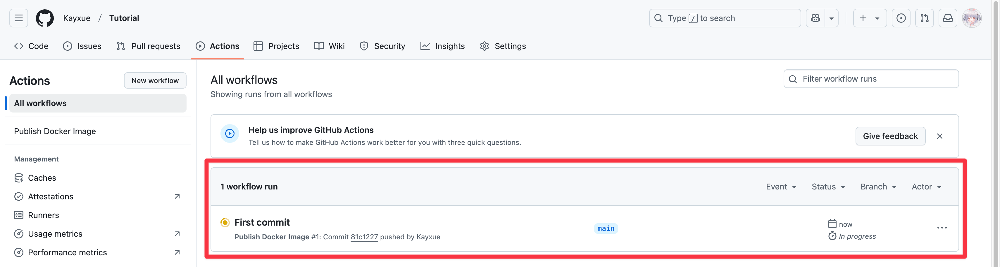
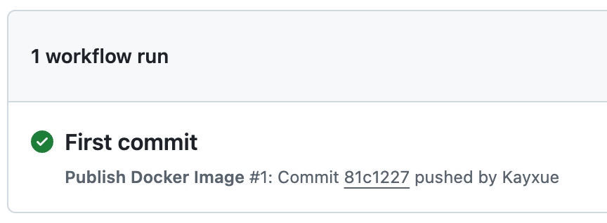

在[上一篇文章](/posts/actixstaticserve/)中，我大概介紹了本人製作的 ActixStatic Docker image 簡單的使用方法，但是在實務上，如果每次都要手動將網頁專案 build 好，再將靜態網站檔案放入資料夾，然後自己手動下指令 build image 將打包好的 image 上傳至 registry，這其實是非常麻煩的一件事，所以這次的文章將會以 Astro 靜態網站為例，介紹如何在使用前端框架的專案中，使用此 image 與使用 GitHub Actions 自動化 build image 流程，將 image 上傳至 registry，並在 SBC 上架設網站。
::github{repo="Kayxue/ActixStaticServe"}
## Preparation
首先，我們需要一個 Astro 靜態網站的專案，在此我以 [fuwari](https://github.com/saicaca/fuwari) 為例，打開 fuwari 的 GitHub 專案網頁後，點選右上角的 `Use this template` -> `Create repository from template`，以此 repo 為模板建立一個新的 repo。

進入建立新 repo 的介面後，先確認模板是否正確，然後寫上 repo 名稱等相關資訊，確認填寫的資訊 OK 後即可點選 `Create repository` 建立 repo。

建立完成後，請打開終端機，並且使用 `cd` 指令切換到你想存放此專案的資料夾，然後輸入以下指令，將剛剛建立的 repo 複製到資料夾下：
```bash title="Terminal"
git clone https://github.com/<your-username>/<repo-name>.git
```
以上指令中的 `<your-username>` 請替換成你的 GitHub 使用者名稱，`<repo-name>` 請替換成你剛剛建立的 repo 名稱。以我為例，我剛剛建立的 repo 名稱為 `Tutorial`，則指令如下：
```bash title="Terminal"
git clone https://github.com/Kayxue/Tutorial.git
```
複製完成後，請進入專案資料夾下，使用對應指令在編輯器中開啟專案：
```bash title="Terminal"
cd <project-folder> # <project-folder> 請替換成你的專案資料夾名稱
zed .
```
:::note
在此本人使用 [Zed](https://zed.dev/) 編輯器，故在編輯器中開啟專案的指令為 `zed .`，若您使用其他編輯器，請自行替換指令。指令舉例如下：
* [Visual Studio Code](https://code.visualstudio.com/)：`code .`
* [VScodium](https://vscodium.com/)：`codium .`
:::
在編輯器中開啟專案後，若您不是使用 pnpm 作為 package manager，請先打開 `package.json`，並進行修改：
```json title="package.json" {6-10,12} collapse={2-4,17-69} del={11,15,70}
{
  "name": "fuwari",
  "type": "module",
  "version": "0.0.1",
  "scripts": {
    "dev": "bunx --bun astro dev",
    "start": "bunx --bun astro dev",
    "build": "bunx --bun astro build && bunx --bun pagefind --site dist",
    "preview": "bunx --bun astro preview",
    "astro": "bunx --bun astro",
    "type-check": "tsc --noEmit --isolatedDeclarations",
    "new-post": "bun run --bun scripts/new-post.js",
    "format": "biome format --write ./src",
    "lint": "biome check --apply ./src",
    "preinstall": "npx only-allow pnpm"
  },
  "dependencies": {
    "@astrojs/check": "^0.9.4",
    "@astrojs/rss": "^4.0.11",
    "@astrojs/sitemap": "^3.2.1",
    "@astrojs/svelte": "7.0.3",
    "@astrojs/tailwind": "^5.1.4",
    "@fontsource-variable/jetbrains-mono": "^5.1.1",
    "@fontsource/roboto": "^5.1.0",
    "@iconify-json/fa6-brands": "^1.2.3",
    "@iconify-json/fa6-regular": "^1.2.2",
    "@iconify-json/fa6-solid": "^1.2.2",
    "@iconify-json/material-symbols": "^1.2.8",
    "@iconify/svelte": "^4.0.2",
    "@swup/astro": "^1.5.0",
    "@tailwindcss/typography": "^0.5.15",
    "astro": "5.1.6",
    "astro-compress": "^2.3.5",
    "astro-icon": "^1.1.4",
    "hastscript": "^9.0.0",
    "katex": "^0.16.19",
    "markdown-it": "^14.1.0",
    "mdast-util-to-string": "^4.0.0",
    "overlayscrollbars": "^2.10.1",
    "pagefind": "^1.2.0",
    "photoswipe": "^5.4.4",
    "reading-time": "^1.5.0",
    "rehype-autolink-headings": "^7.1.0",
    "rehype-components": "^0.3.0",
    "rehype-katex": "^7.0.1",
    "rehype-slug": "^6.0.0",
    "remark-directive": "^3.0.0",
    "remark-directive-rehype": "^0.4.2",
    "remark-github-admonitions-to-directives": "^1.0.5",
    "remark-math": "^6.0.0",
    "remark-sectionize": "^2.0.0",
    "sanitize-html": "^2.13.1",
    "sharp": "^0.33.5",
    "stylus": "^0.63.0",
    "svelte": "^5.5.3",
    "tailwindcss": "^3.4.16",
    "typescript": "^5.7.2",
    "unist-util-visit": "^5.0.0"
  },
  "devDependencies": {
    "@astrojs/ts-plugin": "^1.10.4",
    "@biomejs/biome": "1.8.3",
    "@rollup/plugin-yaml": "^4.1.2",
    "@types/markdown-it": "^14.1.2",
    "@types/mdast": "^4.0.4",
    "@types/sanitize-html": "^2.13.0",
    "postcss-import": "^16.1.0",
    "postcss-nesting": "^13.0.1"
  },
  "packageManager": "pnpm@9.14.4"
}
```
:::note
在此以 [Bun](https://bun.sh/) 為例，上方實際修改的地方與等一下輸入的指令皆依據您使用的 package manager 而定。
:::
接下來請輸入以下只令安裝專案所需的模組：
```bash title="Terminal"
bun install
```
待模組安裝完成後，即可輸入以下指令啟動 development server：
```bash title="Terminal"
bun run dev
```
確認執行起來沒有問題後，即可進行下一步。
:::note
* 礙於篇幅關係，此處就不提及修改模板設定與撰寫文章等其他部分了，若您有此部分的需求，請查看 `/src/config.ts` 與 `/src/content/posts` 資料夾下的檔案，裡面皆有相關內容與註解讓您參考。
* 若您不是使用 pnpm 作為 package manager，可刪除專案根目錄下的 `pnpm-lock.yaml` 檔案。
:::
## Writeing Dockerfile
接下來就是撰寫 Dockerfile 的部分，請在專案根目錄下建立 `dockerfile` 檔案，並輸入以下內容：
```dockerfile title="Dockerfile"
FROM oven/bun:alpine AS builder

WORKDIR /app
COPY . .

RUN bun install
RUN bun run build

FROM ghcr.io/kayxue/actixstaticserve:latest

WORKDIR /

COPY --from=builder /app/dist/ ./public/
```
:::note
* `1` 行：從 `oven/bun:alpine` image 開始一個新的階段，**image 部分依據您使用的 package manager 而定。** 本人使用 [Bun](https://bun.sh/)，所以使用 `oven/bun:alpine` 來進行建置，`alpine` 部分純屬個人喜好，您也可以使用其他 tag 的 image，**但切忌使用 distroless**。
* `3~4` 行：設定工作資料夾為 `/app`，並將專案複製至工作資料夾中。
* `6` 行：安裝專案所需的模組。
* `7` 行：執行專案的 build 指令，建置靜態網頁。
* `9` 行：從 `ghcr.io/kayxue/actixstaticserve:latest` image 開始另一個新的階段。
* `11` 行：設定工作資料夾為根目錄。
* `13` 行：將第一個階段建置好的靜態網頁複製至 `/public` 資料夾。
:::
:::warning
若您使用 pnpm 作為 package manager：
* 您可以使用與上方範例一樣邏輯進行處理，但是因為目前尚未有 pnpm 的 Docker image，所以請使用 [node](https://hub.docker.com/_/node) image 進行建置。
* 撰寫 dockerfile 時，請特別留意 pnpm 在 [node](https://hub.docker.com/_/node) image 中的使用方式，詳細請參考 pnpm 官方文件的 [Working with Docker](https://pnpm.io/docker)
:::
## Writeing GitHub Actions
再來就是撰寫 GitHub Actions 的部分，請在專案根目錄下建立 `.github/workflows` 資料夾，並在資料夾中建立 `publish.yml` 檔案，然後輸入以下內容：
```yaml title="publish.yml" {6,12-17,28}
name: Publish Docker Image
on: [push]

jobs:
  publish-docker-image:
    runs-on: ubuntu-24.04-arm
    permissions:
      contents: read
      packages: write
    steps:
      - uses: actions/checkout@v4
      - name: Login to GitHub Container Registry
        uses: docker/login-action@v3
        with:
          registry: ghcr.io
          username: ${{ github.actor }}
          password: ${{ secrets.GITHUB_TOKEN }}

      - name: Set up Docker Buildx
        uses: docker/setup-buildx-action@v3

      - name: Build and push
        uses: docker/build-push-action@v6
        with:
          platforms: linux/arm64
          push: true
          provenance: false
          tags: ghcr.io/<username>/<image-name>:latest
```
:::note
* `runs-on` 是指定您想在哪個環境下執行建置 image，因為本人是架在 SBC（單板電腦）上，而 SBC 多數 CPU 皆為 ARM64 架構，故這邊的環境選擇 `ubuntu-24.04-arm`。若您架設之機器的架構為 `x86_64`，請將上方第 6 行的 `ubuntu-24.04-arm` 改為 `ubuntu-latest`。若想同時支援多個 CPU Architecture，請參考 [Multi-platform image with GitHub Actions](https://docs.docker.com/build/ci/github-actions/multi-platform/)
* `12~17` 行的部分是執行登入 GitHub Container Registry 的動作，若您是想將 image 推上 Docker Hub，請將該段落修改成如下內容，並在專案 repo 設定處設定相關 secrets：
```yaml title="publish.yml" startLineNumber=12
      - name: Login to Docker Hub
        uses: docker/login-action@v3
        with:
          registry: docker.io
          username: ${{ secrets.DOCKER_USERNAME }}
          password: ${{ secrets.DOCKER_PASSWORD }}
```
* `28` 行的 `<username>` 與 `<image-name>` 請分別替換成您想推送到平台的使用者名稱與 image 名稱（若為 GitHub Container Registry，則 username 為 GitHub 使用者名稱）。若您想推送到 Docker Hub，請將 `ghcr.io` 改為 `docker.io`。
:::
修改完成後，即可在終端機中輸入以下指令將修改後的檔案推送至 GitHub：
```bash title="Terminal"
git add .
git commit -am "<your-commit>"
git push origin master
```
成功推送後，即可在 GitHub 專案頁面中的 `Actions` 頁面看到剛剛新增的 GitHub Actions，並且可以看到 Actions 的執行狀態。

稍等一下，即可看到 Actions 已經成功執行完畢。

如果推送至 GitHub Container Registry，您可以在專案的 code 頁面右下角看到 image 已經成功上傳至 registry。若您是推送至 Docker Hub，請至 Docker Hub 網站確認。

## Deployments
在 build 出 image 後，最後就是在 SBC 上拉取該 image，並且執行 image 了。在此假設您已經在目標裝置上安裝 Docker，並且已經設定好 Docker 的相關設定。
接下來請遠端連線至您的目標裝置，或者在您的目標裝置上開啟終端機，並輸入以下指令拉取 image：
```bash title="Terminal"
docker pull ghcr.io/<username>/<image-name>:latest
```

拉取完成後，即可輸入以下指令建立容器並執行 image：
```bash title="Terminal"
docker run -d --name <container-name> -p 3000:3000 --restart=unless-stopped ghcr.io/<username>/<image-name>:latest
```
:::note
* `<container-name>` 請替換成您想要設定的容器名稱。
* `-p 3000:3000` 的部分是設定容器的 port，左邊的 `3000` 是您想要設定的 port，右邊的 `3000` 是 image 內部的 port，若您的主機上的 `3000` port 已經被使用，請將左邊的 port 改為其他 port。若您使用 Cloudflare Tunnel，則可以省略此部分，在 Tunnel 設定時僅需 protocol 切換成 `http`，IP 直接輸入 `<container-IP>:3000` 即可，`<container-IP>` 可以使用 `docker inspect <container-name> | grep "IPAddress"` 指令查看。
:::
確定容器執行成功後，請進行端口映射或者 Cloudflare Tunnel 設定。在完成設定後，輸入域名或者 IP 即可看到您的網站。
## Wrapping Up
這次的文章雖然主要是以 Astro 靜態網站為例，但是其實只要是靜態網站專案，都可以使用此方法進行部署。雖然說目前沒有什麼自訂義可言，但是對於一般的靜態網站來說，這個 image 已經足夠使用了。並且打包方式也是非常的簡單，只要準備好靜態網站的檔案，然後撰寫好 Dockerfile，再透過 GitHub Actions 自動化 build image，即可輕鬆部署您的靜態網站，真的是相當方便呢！

如果您有任何問題或者建議，歡迎在下方留言，如果文章有任何錯誤，也請不吝指正，謝謝！
## GitHub Repo of This Tutorial
::github{repo="Kayxue/ActixStaticServeTutorial"}
