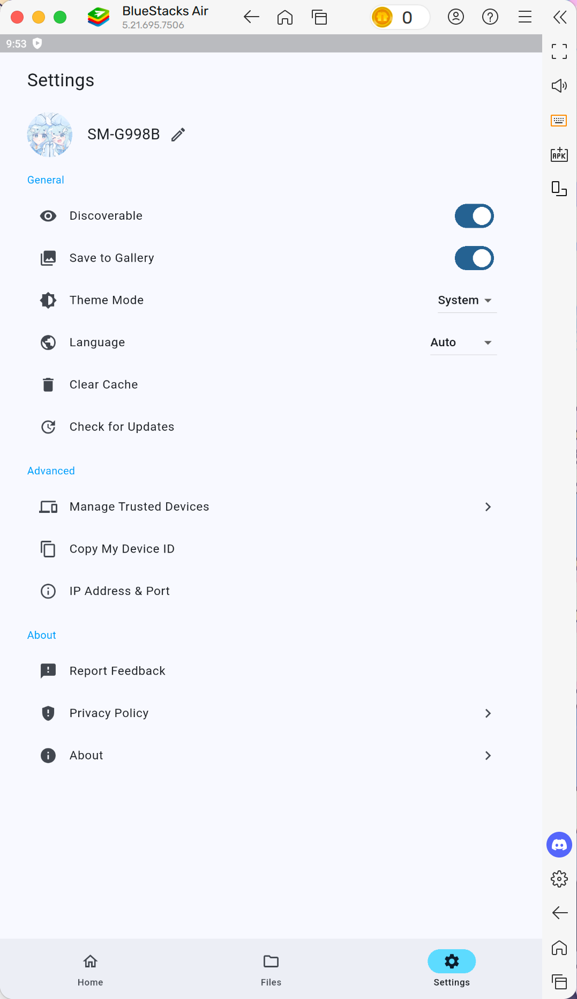
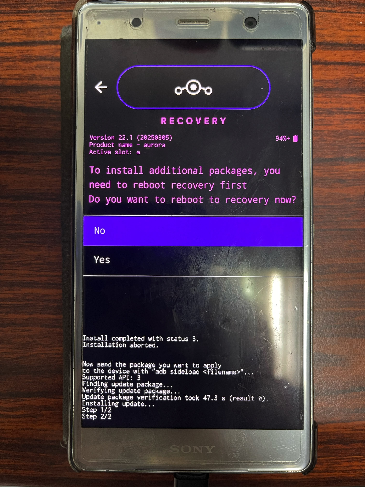

還記得從不知道什麼時候開始，改機風潮興起，不少人開始紛紛研究改機，並分享自己的改機心得與技巧，在那改機盛行的年代，不管是自訂系統主題，還是取得 root 權限，甚至刷系統，基本上網路上都可以找到不少資源。不過隨著時間推移，改機變得越來越困難，從需要解鎖 Bootloader 到解鎖 Bootloader 需要等待一週，甚至有些廠商還把 Bootloader 直接給徹底鎖起來，不讓別人解鎖了。雖然改機潮慢慢減退了，不過現在 Android Platform Tools 還是一個非常重要的工具，它可以幫助我們解鎖 Bootloader、刷入其他系統、取得 root 權限，甚至測試應用程式、更新系統等，讓我們可以更方便地管理自己的 Android 裝置。
## Download & Install
### Using Without Installation
可以直接從[這裡](https://developer.android.com/tools/releases/platform-tools)下載即可，下載完成後解壓即可使用
### Installation
#### Windows
可直接安裝 `ADB & Fastboot++`

https://xdaforums.com/t/tool-windows-adb-fastboot-march-2024.3944288/

#### macOS
可直接使用 Homebrew 進行安裝：
```bash
brew install android-platform-tools
```
#### Linux
依據發行版所使用的套件管理器而定，例如：
* Ubuntu：`sudo apt install android-sdk-platform-tools`
* Arch Linux：`sudo pacman -S android-tools`

安裝完成後即可輸入 `adb help` 和 `fastboot help` 即可看到 adb 和 fastboot 的指令清單：


指令整個可以說是非常的多，但是礙於篇幅的關係，在此不可能一個一個跟各位講說每一個指令要怎麼用，所以接下來就來舉一些情境來示範如何使用這些工具。

## Use Custom Simulator to Debug Your Application
這是一個再經典不過的狀況了，當你的電腦在使用 Android Studio 給的模擬器進行測試，結果卻發現應用程式執行速度非常慢、模擬器嚴重卡頓，不過你卻發現你電腦上裝的那些遊戲用的 Android 模擬器，效能卻非常好，這時你就可以在沒有其他額外需求下，考慮使用那種遊戲專用的 Android 模擬器來進行應用程式測試，以獲得更好地應用程式測試體驗。

:::note
在此使用 BlueStacks Air 來進行示範，不同模擬器步驟可能會有所不同
:::
### Steps
1. 啟動模擬器

2. 點選右下角齒輪開啟設定，接下來在左側列表前往進階設定，然後在右側啟用 Android Debug Bridge (ADB)

3. 開啟終端機，輸入以下指令連上模擬器
```bash title="Terminal"
adb connect 127.0.0.1:5555
```

看到以上畫面即成功連線，接下來就可以進行應用程式安裝與測試。

在此我以 Flutter 應用為例，首先我們先在編輯器或 IDE 中打開軟體專案：


啟動後即可開啟編輯器內建的終端機，輸入 `flutter run` 即可開始執行應用程式。在中途他會問你要在哪個裝置上執行，在列表中你即可看到 BlueStack Air 模擬器出現了，選擇後即可開始測試應用程式。


如果要終止測試的話請回到 IDE 點選停止按鈕停止執行，或者像剛剛 Flutter 的話可以直接按下 `Ctrl + C` 直接停止應用程式執行。

## Custom ROM Major Version Update
雖然說目前不少專案官方有提供支援的 ROM 都會提供 OTA 更新功能，讓使用者可以直接透過系統內建的系統更新功能進行系統更新，不過以 Lineage OS 為例，雖然官方有提供透過系統內建的更新功能進行更新的方式，但是該功能只能進行小版本的更新，如果是更大版本的話（例如 LineageOS 20 -> LineageOS 21），在系統更新頁面它會不讓你進行該版本的更新下載，只會在那些更新右下角放個資訊按鈕，點擊後只會寫說該更新他系統沒有辦法進行。這時，你就只能自行透過刷機的方式進行更新。


接下來我們就開始吧！首先，我們需要先前往對應 ROM 的官網下載對應裝置的最新版 ROM：


這次以防等一下在刷時會因為 recovery 而造成系統刷不進去，所以這裡兩個檔案都會下載，`lineage` 開頭的是 ROM，而 `boot.img` 則是 Recovery Image。
接下來就是下載一些其他需要刷的東西，例如 Magisk、Google Play 商店，最後大概下載了四個檔案

而接下來就是將手機連接電腦，並開啟 USB 偵錯：

確定檔案都下載完成後，接下來即可輸入指令啟動至 Bootloader：
```bash title="Terminal"
adb reboot bootloader
```
進入 Bootloader 後，手機正常來講會顯示燈號，如圖所示：

此時即可輸入以下指令刷入新的 Recovery：
```bash title="Terminal"
fastboot flash boot <boot-image-location>/boot.img
```
如果有刷成功的話如下圖所示：

此時請先將裝置中斷連線，螢幕上方指示燈會熄滅，然後按下 `音量下` + `電源` 鍵進入 Recovery。

接下來請將手機跟電腦連線，然後選擇 `Apply Update` -> `Apply from ADB`


之後請回到電腦上，輸入以下指令開始刷入新版 ROM：
```bash title="Terminal"
adb sideload <rom-image-location>/<rom-name>.zip
```
刷的中途中可能會出現如圖所示的畫面：

選擇 `Yes` 即可，終端機可能會出現錯誤，不過這是正常的，沒關係。
重新啟動至 Recovery 後，若您有想要再刷入其他的東西（例如 GApps、Magisk），可再次選擇 `Apply Update` -> `Apply from ADB` 繼續刷入其他東西。例如我想刷入 GApps 和 Magisk，則將剛剛下載到的 Magisk 安裝包副檔名改成 `.zip` 後，依序輸入以下兩個命令刷入，並且每刷完一個會重啟至 Recovery：
```bash title="Terminal"
adb sideload <gapps-image-location>/<gapps-name>.zip
adb sideload <magisk-image-location>/<magisk-installer-name>.zip
```
在確定所有東西都有刷成功後，即可選擇 `Reboot System now` 進行重新開機：

確認一切都沒問題後，整個過程就完成了
