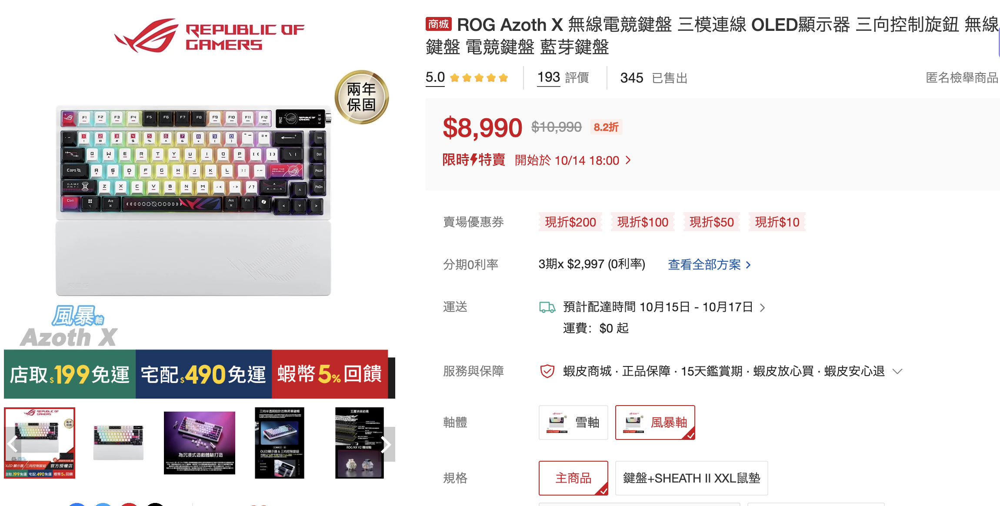
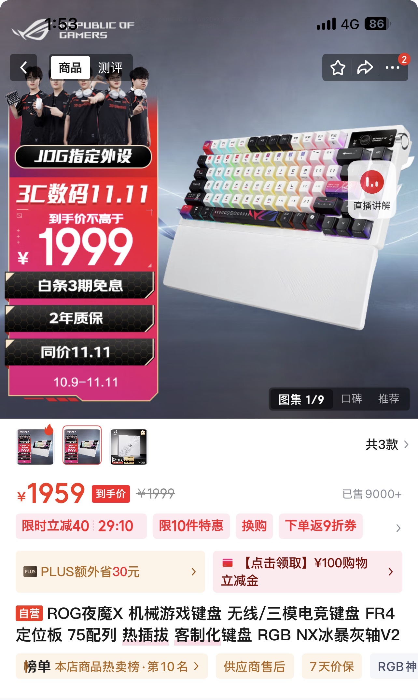
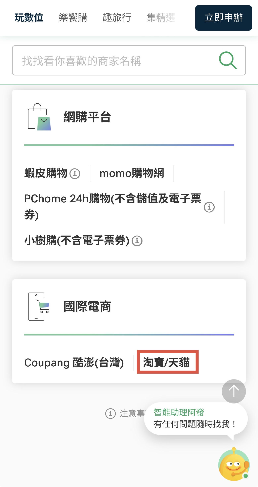
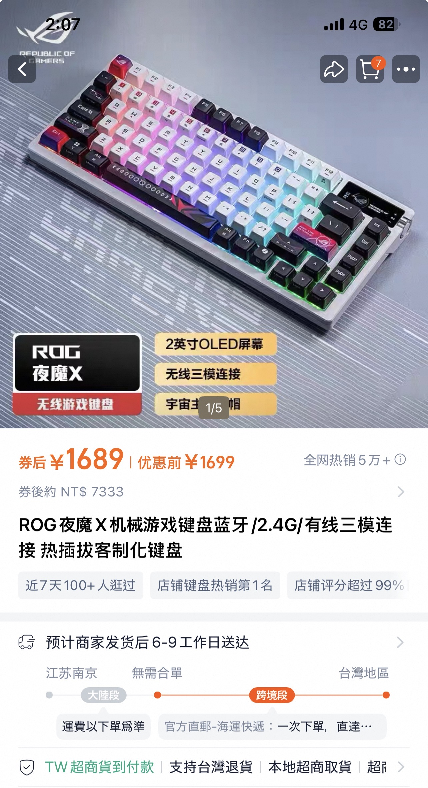
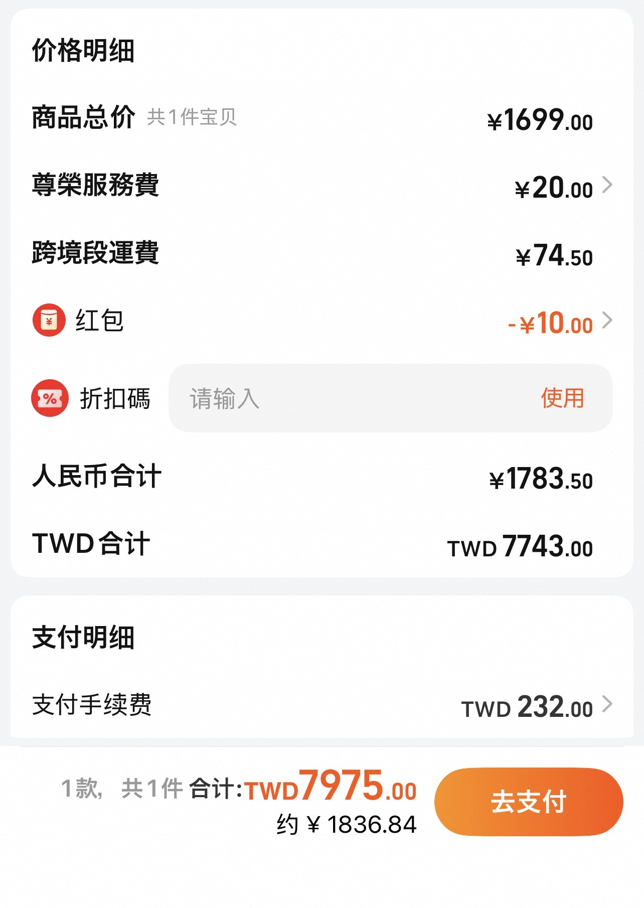

## 前言
其實我不久之前就已經被 ROG Azoth 鍵盤的外觀吸引，加上我有某個網友某天在聊天中上傳了一張照片，沒想到他居然在用那款鍵盤。問了對方打感跟好用程度，並且看了幾個開箱影片後，就決定想買了。

## 選擇的經過
只是我上蝦皮查看了新版 Azoth X......約 NT 9000，這價錢看都嚇死了。

那時要買時我其實也有點糾結，畢竟以前有在京東買過東西，所以其實我大概知道我有機會在京東上找到相同商品，並且價格更低，反正沒有注音刻字對我來說不是問題，所以我賭了一把，結果這價格沒意外......沒差多少（大約 NT 8500 左右）

最後只好轉向了淘寶，反正國泰剛好也有對在淘寶購物給比較高的回饋，這次就試試吧！希望不會有什麼問題。

之後在因緣際會下成功找到了一個七千三的，看到這價格真的感覺爽到一個可以，相較於蝦皮，這根本省下來整個超過 1500 了

即使最後為了能狀況比較穩定選了空運，但是這價錢還是省了一筆。雖然感覺他支付手續費是有點貴，但是其實加上了尊榮服務費之後，還是能省下 1000 左右，感覺真的算蠻值的，雖然說需要等比平常在蝦皮買時，再長一些的到貨時間，但是能省下一筆可觀的費用，這我願意忍。

## 到貨惹～～
最後運送的時間大概是七天，並且收到貨時也發現賣家包得很好，只是當時忘記拍了。
外盒上面可以明顯看到「夜魔 X」，其實它就是 Azoth X，只是在大陸的話他會寫中文罷了。

這次買的是風暴軸，因為個人比較喜歡有打感，且有聲音。除了在打音遊方面會比較有感之外，平常對我來說也可以減少一些孤獨感。

而這就是鍵盤本體，目前使用下來基本上沒有什麼問題，不得不說第二版風暴軸真的打起來非常舒服。

右上角的螢幕雖然還是黑白的，不過有個螢幕可以顯示自己喜歡的東西也是蠻有趣。而且旁邊的 knob 也是非常方便，在調整音量模式下按下去可以直接靜音，在多媒體的狀況下按下去可以暫停、播放音樂，感覺這樣操作也是一種蠻新奇的體驗。

## 總結
個人覺得這次算是一次蠻不錯的購物體驗。雖然說不是像京東的自營，由平台官方直接採購並進行銷售，關於保障部分確實沒有到那麼好，但是其實這次商品從某實體店下單買回來，基本上沒有遇到買到贗品之類的問題發生，寄送時間其實也還算可以接受。未來會不會再次嘗試淘寶的話就要看狀況了，畢竟能以合理的價格在當地買到還是最好，畢竟跨境購物確實需要不少時間。