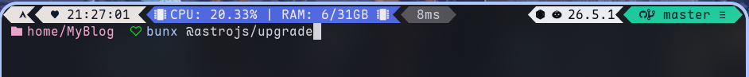
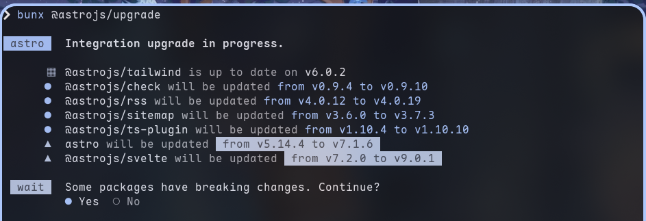
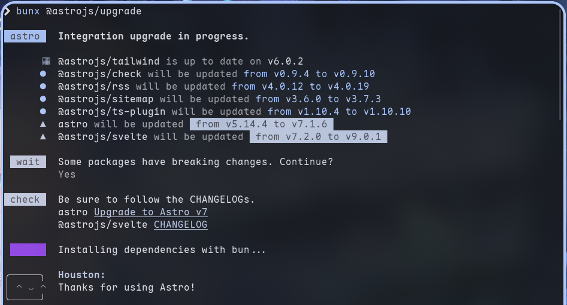
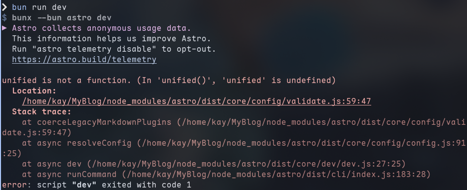
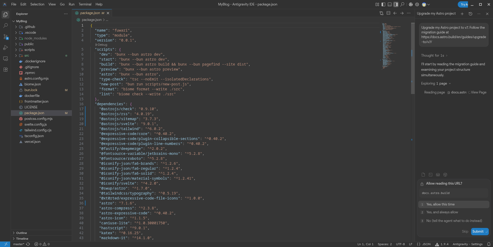
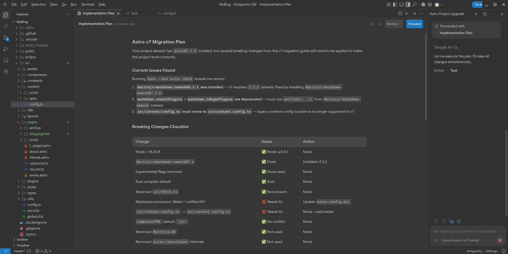
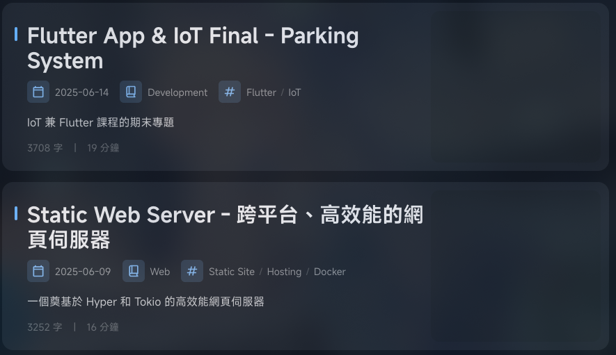
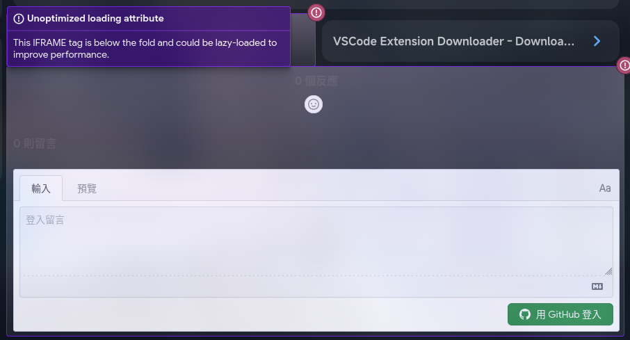
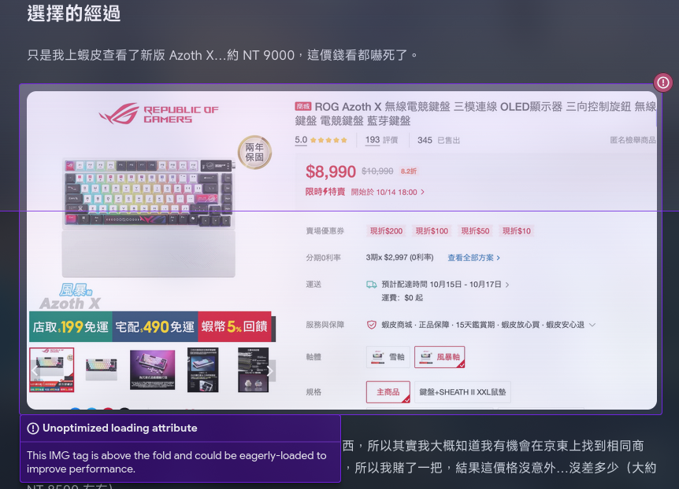
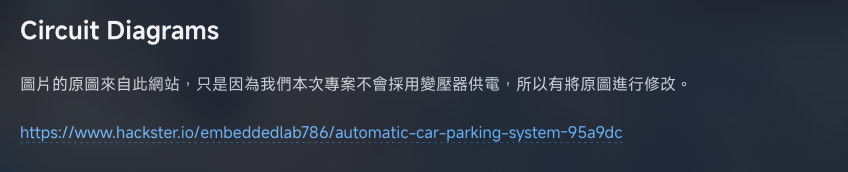

因為學校軟體工程課程，也因為想不太到什麼東西要寫，所以許久沒有更新了。

而轉眼間，不知道過了多久，而 Astro 目前也已經迎來了 7.1 版本。在這段期間 Astro 也迎來了非常多的升級，包括將編譯器遷移至 Rust、Markdown pipeline 遷移至 Rust 等，個人覺得算蠻好的大版本更新，個人目前感覺下來網頁載入速度似乎好像有變快？

那這次就來分享一下興及的過程吧！雖然不知道有在用 fuwari 的各位會不會升上去，但在這邊還是給各位一些參考。

:::warning
由於是跨大版本更新，若您的專案沒有做 version control，請先備份您的專案
:::

## Running Upgrade Script
首先，我們先執行以下指令進行版本更新
```bash
bunx @astrojs/upgrade
```


:::note
Package manager 相關指令請依據您專案使用的 package manager 進行適當變化。
:::

接下來會出現是否升級確認，選擇 `Yes`


之後等待升級即可


如果畫面如下圖所示，即升級完成



## Fixing Error Using AI

只是更新 dependencies 後，因為新版本用了新的工具，所以直接執行專案的話會發生錯誤



在此我下載了 Antigravity IDE，請 AI 幫我處理。

安裝好 Antigravity IDE、在該編輯器開啟專案並確認 agent 已就緒後，即可將以下 prompt 餵給 agent 讓它開始處理

```
Upgrade my Astro project to v7. Follow the migration guide at
https://docs.astro.build/en/guides/upgrade-to/v7/
```



之後它會產生一份報告告訴你接下來的變更計劃，確定沒有什麼問題後，可以直接按下 `Proceed` 繼續



接下來 agent 就會開始幫你修復相關錯誤，修復完之後專案即可正常執行。

如果說部落格在 AI 幫你處理之後有出現一些問題，您可以將錯誤截圖給 AI 請它幫你處理，基本上多數都是可以修復的。舉例如下：

1. 文章圖片消失

2. TypeError
```
TypeError: file is not a function. (In 'file()', 'file' is undefined)
```
3. 圖片路徑確定正確，但是找不到圖片。
```
[ERROR] Image file not found: src/content/posts/WholeSystem.png
```

又或者有一些可優化之處，可以請 AI 幫你處理，基本上他也是可以處理掉的。



但還是有一些問題是沒有辦法解決的，比如 link card 部分，疑似因為現在都有防爬，所以現在不少網站抓 metadata 都會出問題，這可能只能改成手動了。



## Wrapping Up
整個過程中雖然有發生一些波折，比如還是有一些錯誤，並且在修復過程中發生了 token 不足的狀況，需要換帳號登入才可以繼續用，但整個升級過程感覺算順利，一段時間過後，整個部落格就已經升級完成了。並且部署成品後目前似乎也暫時沒有問題。如果說本部落格目前功能上還是有什麼問題的話，歡迎各位進行回報。
