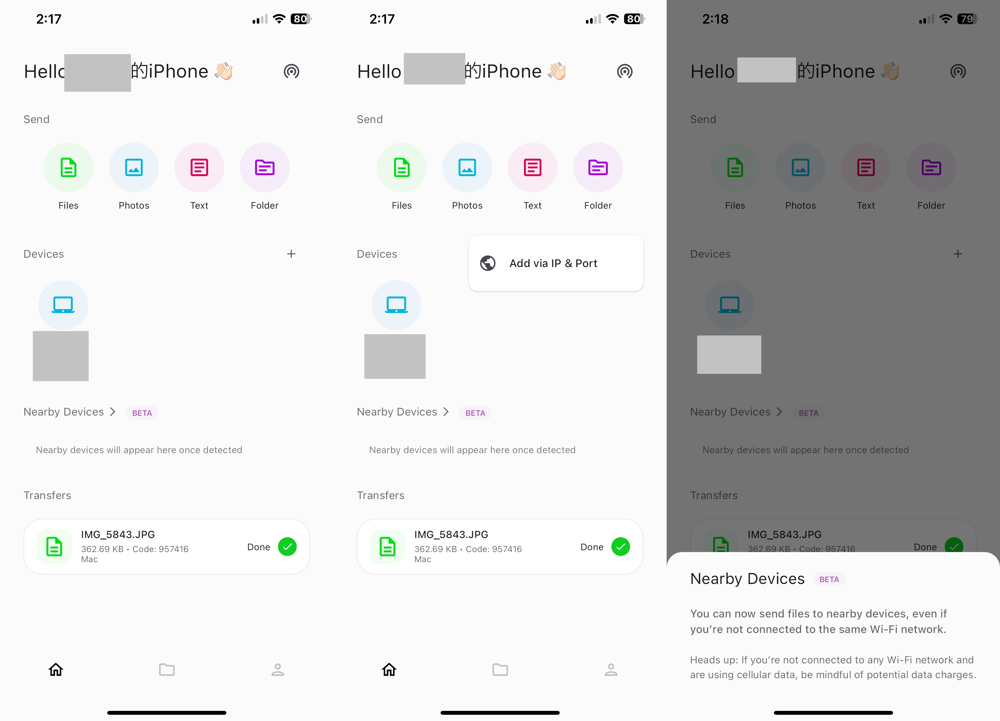
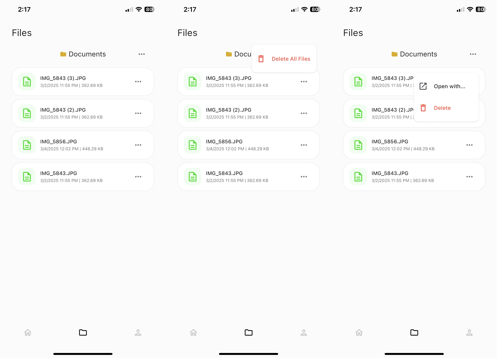
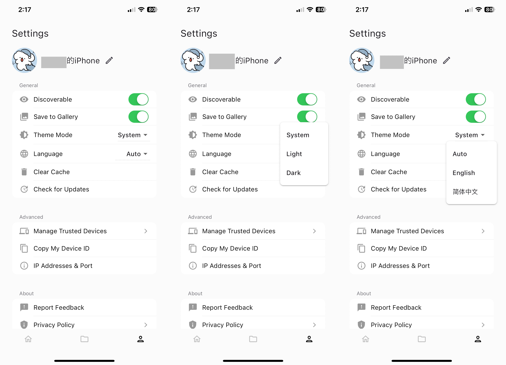
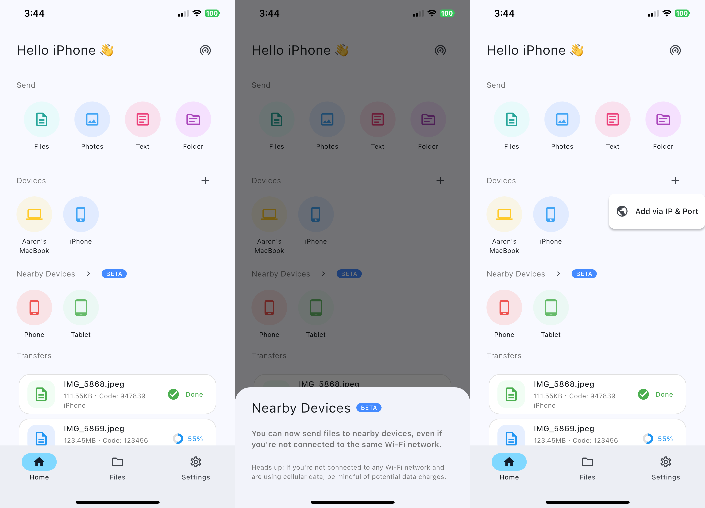
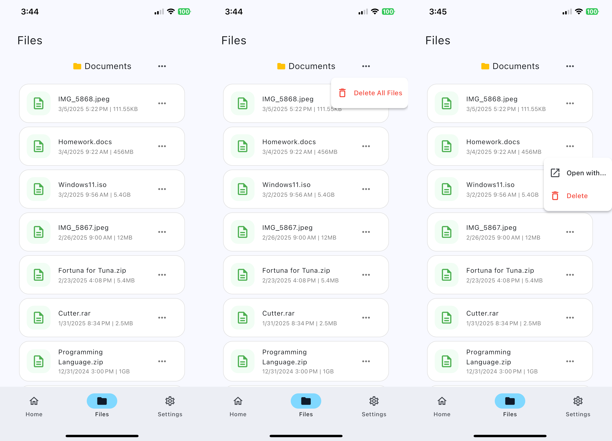
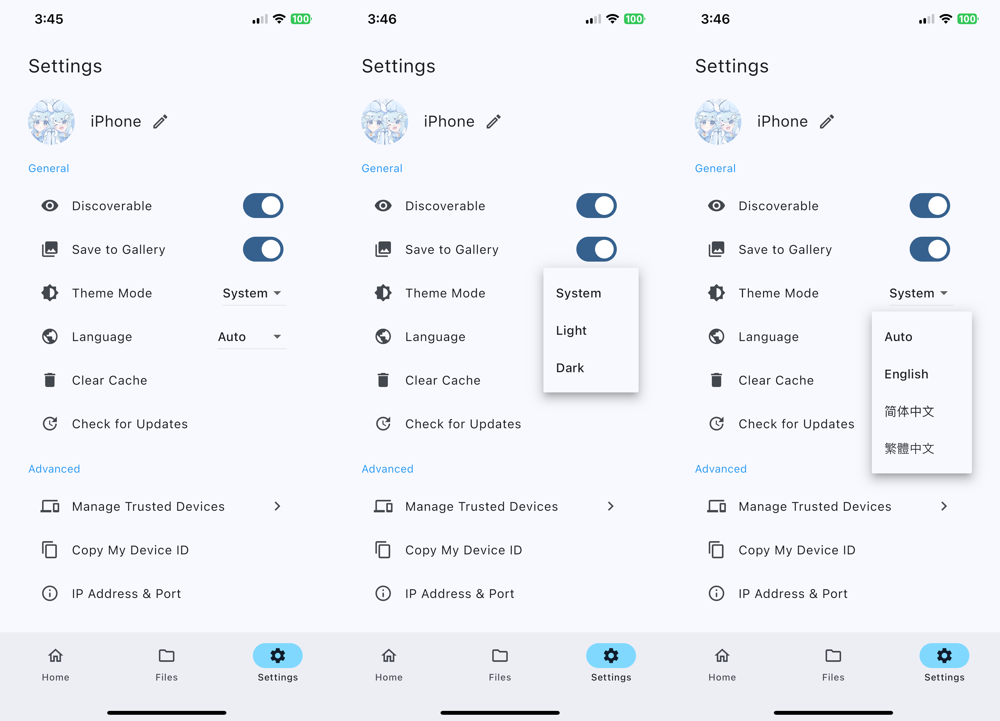
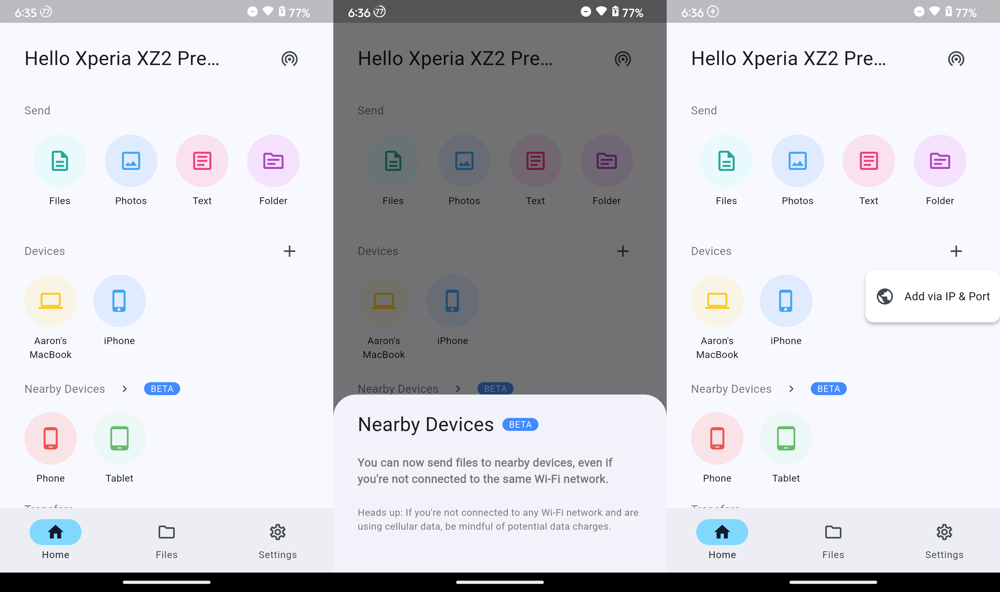
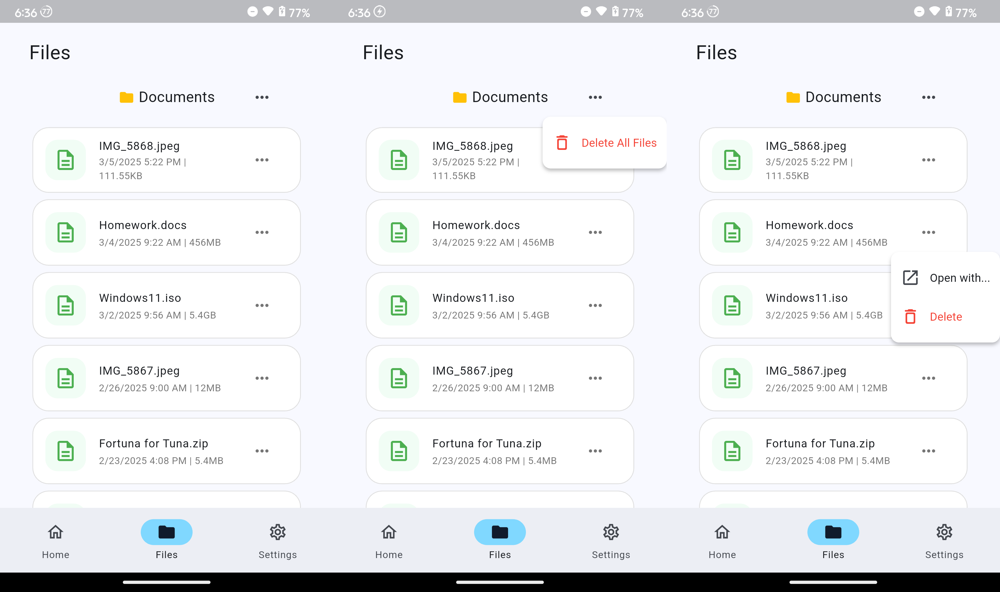
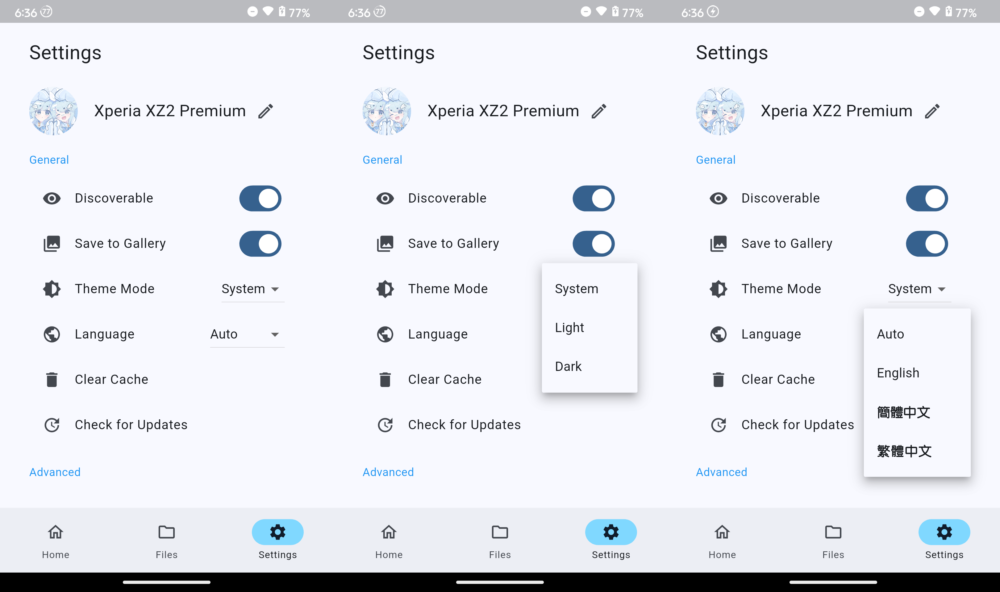
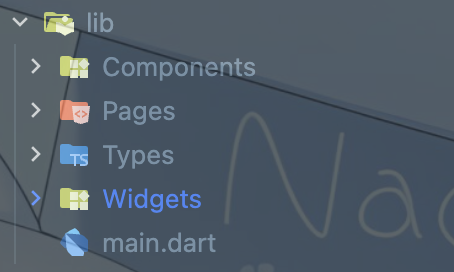

這次的話是第二次的 Flutter 課程作業，作業可以兩個挑一個，一個是打造吸睛的 about 頁面，一個是模仿上架的 App，個人因為 about page 不知道要做什麼，而且本人有 Windows 電腦，所以一直都要面對需要將 iPhone 檔案傳至 Windows 電腦的狀況，後來遇到了一個 Youtuber 推薦了 Landrop App，讓使用者可以輕鬆跨平台傳送檔案，個人用了也覺得非常不錯，所以這次作業就決定模仿一下 Landrop App 的介面。

而這次的作業雖然是只要一個頁面就好，但......因為作業規定必須使用的 widget 中有一個 widget 在僅模仿一個 page 的狀況下無法做到，故這次基本上把三個 tab 量的 page 全部刻了。

## Original App Interface




## My App Interface
### iOS (Device: iPhone 12 Pro Max)




### Android (Device: Sony Xperia XZ2 Premium, Lineage OS 21)




## Directory Structure
首先來看這次資料夾結構的部分，因為這次元件量其實是不少的，所以這次只好在目前上課還沒教到的狀況下，直接開始對所有的專案檔案進行分類存放。資料夾分類如下：
* `Components`：放置小型元件 (e.g. Circle IconButton, ListTile Card)
* `Pages`：放置頁面 (那些真正完整的頁面)
* `Types`：放置類型 (e.g. custom enumerations)
* `Widgets`：放置頁面上部分體積較大的 widget


## Code Explanation
:::note
以下 `collapsed lines` 請不用展開，程式碼部分稍後全部都會進行解析，折疊部分之所以摺疊起來是希望各位在閱讀時可以先專注於特定部分，而不是與分析無關或重複的部分。
:::
### Base
首先是基底的部分，我們要先建立 App 的根 Widget：
```dart title="main.dart" collapse={2-4,22-31,38-87} {17}
import 'package:flutter/material.dart';
import 'Pages/FilesPage.dart';
import 'Pages/HomePage.dart';
import 'Pages/SettingsPage.dart';

void main() {
  runApp(const MyApp());
}

class MyApp extends StatelessWidget {
  const MyApp({super.key});

  // This widget is the root of your application.
  @override
  Widget build(BuildContext context) {
    return MaterialApp(
      debugShowCheckedModeBanner: false,
      title: 'LanDrop',
      theme: ThemeData(
        useMaterial3: true,
        colorScheme: ColorScheme.fromSeed(seedColor: Colors.blue),
        menuTheme: const MenuThemeData(
          style: MenuStyle(
            shape: WidgetStatePropertyAll(
              RoundedRectangleBorder(
                borderRadius: BorderRadius.all(Radius.circular(10)),
              ),
            ),
            backgroundColor: WidgetStatePropertyAll(Colors.white),
          ),
        ),
      ),
      home: const NavigationWidget(),
    );
  }
}

class NavigationWidget extends StatefulWidget {
  const NavigationWidget({super.key});

  @override
  State<NavigationWidget> createState() => _NavigationWidgetState();
}

class _NavigationWidgetState extends State<NavigationWidget> {
  int currentPageIndex = 0;

  @override
  Widget build(BuildContext context) {
    return Scaffold(
      bottomNavigationBar: NavigationBar(
        onDestinationSelected: (int index) {
          setState(() {
            currentPageIndex = index;
          });
        },
        indicatorColor: Colors.lightBlueAccent.shade100,
        selectedIndex: currentPageIndex,
        destinations: const <Widget>[
          NavigationDestination(
            selectedIcon: Icon(Icons.home),
            icon: Icon(Icons.home_outlined),
            label: 'Home',
          ),
          NavigationDestination(
            selectedIcon: Icon(Icons.folder),
            icon: Icon(Icons.folder_outlined),
            label: 'Files',
          ),
          NavigationDestination(
            selectedIcon: Icon(Icons.settings),
            icon: Icon(Icons.settings_outlined),
            label: 'Settings',
          ),
        ],
      ),
      body: SafeArea(
        child:
            <Widget>[
              const HomePage(),
              const FilesPage(),
              const SettingsPage(),
            ][currentPageIndex],
      ),
    );
  }
}
```
注意第 `17` 行，該行可以在 App 處於 debug 模式下，關閉畫面右上角的 debug 標籤。

其餘部分的話就是設定主題，例如顏色、標題等。
### AppBar & PageView
再來就是底部的 AppBar。
```dart title="main.dart" collapse={1-1,6-36} {"3.":52-56} {"4.":59-75} {"5.":77-84}
import 'package:flutter/material.dart';
import 'Pages/FilesPage.dart';
import 'Pages/HomePage.dart';
import 'Pages/SettingsPage.dart';

void main() {
  runApp(const MyApp());
}

class MyApp extends StatelessWidget {
  const MyApp({super.key});

  // This widget is the root of your application.
  @override
  Widget build(BuildContext context) {
    return MaterialApp(
      debugShowCheckedModeBanner: false,
      title: 'LanDrop',
      theme: ThemeData(
        useMaterial3: true,
        colorScheme: ColorScheme.fromSeed(seedColor: Colors.blue),
        menuTheme: const MenuThemeData(
          style: MenuStyle(
            shape: WidgetStatePropertyAll(
              RoundedRectangleBorder(
                borderRadius: BorderRadius.all(Radius.circular(10)),
              ),
            ),
            backgroundColor: WidgetStatePropertyAll(Colors.white),
          ),
        ),
      ),
      home: const NavigationWidget(),
    );
  }
}

class NavigationWidget extends StatefulWidget {
  const NavigationWidget({super.key});

  @override
  State<NavigationWidget> createState() => _NavigationWidgetState();
}

class _NavigationWidgetState extends State<NavigationWidget> {
  int currentPageIndex = 0;

  @override
  Widget build(BuildContext context) {
    return Scaffold(
      bottomNavigationBar: NavigationBar(
        onDestinationSelected: (int index) {
          setState(() {
            currentPageIndex = index;
          });
        },
        indicatorColor: Colors.lightBlueAccent.shade100,
        selectedIndex: currentPageIndex,
        destinations: const <Widget>[
          NavigationDestination(
            selectedIcon: Icon(Icons.home),
            icon: Icon(Icons.home_outlined),
            label: 'Home',
          ),
          NavigationDestination(
            selectedIcon: Icon(Icons.folder),
            icon: Icon(Icons.folder_outlined),
            label: 'Files',
          ),
          NavigationDestination(
            selectedIcon: Icon(Icons.settings),
            icon: Icon(Icons.settings_outlined),
            label: 'Settings',
          ),
        ],
      ),
      body: SafeArea(
        child:
            <Widget>[
              const HomePage(),
              const FilesPage(),
              const SettingsPage(),
            ][currentPageIndex],
      ),
    );
  }
}
```
:::note[解析]
1. 因為需要記錄目前所在的頁面，所以其必須為 `StatefulWidget`。
2. 接下來就是透過 `Scaffold` 的 `bottomNavigationBar` 屬性，在頁面中加入 AppBar，AppBar 部分使用 `NavigationBar` widget 建立。
3. 在 `52~56` 行的部分是設定當使用者點選 bar 上的按鈕時，會切換頁面。
4. 而 `59~75` 的部分是設定在 `NavigationBar` 上會顯示的頁面切換按鈕。
5. 最後 `77~84` 是設定顯示頁面主體，這裡透過 `SafeArea` widget 包裝，確保頁面內容不會被系統元件遮擋。然後透過 `currentPageIndex` 來決定顯示哪個頁面。
:::
### Home
首頁頁面的部分，位於 `Pages/HomePage.dart`
```dart title="HomePage.dart" {"1.":14-15} {"2.": 19-25}
import 'package:flutter/material.dart';

import '../Widgets/Home/TopBar.dart';
import '../Widgets/Home/Devices.dart';
import '../Widgets/Home/NearbyDevices.dart';
import '../Widgets/Home/Send.dart';
import '../Widgets/Home/Transfers.dart';

class HomePage extends StatelessWidget {
  const HomePage({super.key});

  @override
  Widget build(BuildContext context) {
    return Padding(
      padding: const EdgeInsets.only(left: 30.0, right: 30.0),
      child: Column(
        children: [
          Topbar(),
          Expanded(
            child: SingleChildScrollView(
              child: Column(
                children: [Send(), Devices(), NearbyDevices(), Transfers()],
              ),
            ),
          ),
        ],
      ),
    );
  }
}
```
:::note[解析]
1. 設定與螢幕邊界的距離。
2. 使用 `SingleChildScrollView` 包裝，使其子 widget 可以滾動。**請注意外部必須有 Expanded widget 包裝，否則無法正常顯示。**
:::
接下來就是各個 Widget，全數皆在 `Widgets/Home` 資料夾中。

首先是 TopBar 部分，用於顯示 TopBar 區塊的版面。
```dart title="TopBar.dart"
import 'package:device_friendly_name/device_friendly_name.dart';
import 'package:flutter/material.dart';

class Topbar extends StatefulWidget {
  const Topbar({super.key});

  @override
  State<Topbar> createState() => _TopbarState();
}

class _TopbarState extends State<Topbar> {
  Future<String> _getDeviceName() async {
    final String deviceName =
        await DeviceFriendlyName().getDeviceFriendlyName() ?? "User";
    return deviceName;
  }

  bool discoverTurnedOn = true;

  @override
  Widget build(BuildContext context) {
    return Padding(
      padding: const EdgeInsets.only(top: 20.0),
      child: Row(
        mainAxisAlignment: MainAxisAlignment.spaceBetween,
        children: [
          FutureBuilder(
            future: _getDeviceName(),
            builder: (context, snapshot) {
              if (snapshot.hasData) {
                return SizedBox(
                  width: MediaQuery.of(context).size.width * 0.6,
                  child: Text(
                    "Hello ${snapshot.data} 👋",
                    style: TextStyle(fontSize: 24),
                    overflow: TextOverflow.ellipsis,
                    maxLines: 1,
                    softWrap: false,
                  ),
                );
              }
              return Text("Hello, User 👋", style: TextStyle(fontSize: 24));
            },
          ),
          IconButton(
            icon: Icon(
              discoverTurnedOn
                  ? Icons.wifi_tethering
                  : Icons.wifi_tethering_off,
            ),
            onPressed: () {
              setState(() {
                discoverTurnedOn = !discoverTurnedOn;
              });
            },
          ),
        ],
      ),
    );
  }
}
```
因為 `device_friendly_name` 模組需要透過非同步的方式去抓取裝置名稱，故需要使用 `StatefulWidget` 和 `FutureBuilder`，透過非同步的方式，將裝置名稱顯示在畫面上，且由於避免裝置名稱過長造成 widget 溢出，故顯示裝置名稱的 widget 需要使用 `SizedBox` 包起來，並指定當長度超過螢幕寬度的 60% 時將內容自動截斷。間隔部分只設定頂部間隔，因為左右已經在 `HomePage` 中設定。

其次是 Send 部分，用於顯示 Send 區塊的版面。
```dart title="Send.dart" collapse={28-45}
import 'package:flutter/material.dart';
import '../../Components/CircleButton.dart';

class Send extends StatelessWidget {
  const Send({super.key});

  @override
  Widget build(BuildContext context) {
    return Padding(
      padding: const EdgeInsets.only(top: 30.0),
      child: Column(
        crossAxisAlignment: CrossAxisAlignment.start,
        children: [
          Text(
            "Send",
            style: TextStyle(fontSize: 14, color: Colors.grey.shade600),
          ),
          SizedBox(height: 20),
          Row(
            mainAxisAlignment: MainAxisAlignment.spaceAround,
            children: [
              CircleButton(
                backgroundColor: Colors.tealAccent,
                iconColor: Colors.teal,
                icon: Icons.description_outlined,
                text: "Files",
              ),
              CircleButton(
                backgroundColor: Colors.blueAccent,
                iconColor: Colors.blue,
                icon: Icons.photo_outlined,
                text: "Photos",
              ),
              CircleButton(
                backgroundColor: Colors.pinkAccent,
                iconColor: Colors.pink,
                icon: Icons.article_outlined,
                text: "Text",
              ),
              CircleButton(
                backgroundColor: Colors.purpleAccent,
                iconColor: Colors.purple,
                icon: Icons.topic_outlined,
                text: "Folder",
              ),
            ],
          ),
        ],
      ),
    );
  }
}
```
按鈕的部分是採用 `Row` 來進行排版，而中間間隔的部分則交由 `Row` 自行去計算，讓按鈕間隔在不同裝置上看起來都舒適，`CircleButton` 為 custom component，稍後會展示。

其次是 Devices 部分，用於顯示 Devices 區塊的版面。
```dart title="Devices.dart"
import 'package:flutter/material.dart';

import '../../Components/CircleButton.dart';

class Devices extends StatelessWidget {
  const Devices({super.key});

  @override
  Widget build(BuildContext context) {
    return Padding(
      padding: const EdgeInsets.only(top: 30.0),
      child: Column(
        crossAxisAlignment: CrossAxisAlignment.start,
        children: [
          Row(
            mainAxisAlignment: MainAxisAlignment.spaceBetween,
            children: [
              Text(
                "Devices",
                style: TextStyle(fontSize: 14, color: Colors.grey.shade600),
              ),
              MenuAnchor(
                menuChildren: <Widget>[
                  MenuItemButton(
                    leadingIcon: Icon(Icons.public),
                    onPressed: () {},
                    child: Text("Add via IP & Port"),
                  ),
                ],
                builder: (context, controller, child) {
                  return IconButton(
                    onPressed: () {
                      if (controller.isOpen) {
                        controller.close();
                      } else {
                        controller.open();
                      }
                    },
                    icon: Icon(Icons.add),
                  );
                },
              ),
            ],
          ),
          SizedBox(height: 5),
          Row(
            crossAxisAlignment: CrossAxisAlignment.start,
            children: [
              CircleButton(
                backgroundColor: Colors.amberAccent,
                iconColor: Colors.amber,
                icon: Icons.computer_outlined,
                text: "Aaron's MacBook",
              ),
              SizedBox(width: 20),
              CircleButton(
                backgroundColor: Colors.blueAccent,
                iconColor: Colors.blue,
                icon: Icons.phone_iphone_outlined,
                text: "iPhone",
              ),
            ],
          ),
        ],
      ),
    );
  }
}
```
因為按鈕與文字所在位置分別為頭和尾，故可以維持使用 `Row` 佈局，以達到更好的版面效果。而 `MenuAnchor` 的部分是下拉式選單，因為有設定偏好 Material 3 的風格，所以使用 `MenuAnchor`。而關於外觀的部分則已經在 `main.dart` 中設定：
```dart title="main.dart" collapse={1-18,33-87} {22-31}
import 'package:flutter/material.dart';
import 'Pages/FilesPage.dart';
import 'Pages/HomePage.dart';
import 'Pages/SettingsPage.dart';

void main() {
  runApp(const MyApp());
}

class MyApp extends StatelessWidget {
  const MyApp({super.key});

  // This widget is the root of your application.
  @override
  Widget build(BuildContext context) {
    return MaterialApp(
      debugShowCheckedModeBanner: false,
      title: 'LanDrop',
      theme: ThemeData(
        useMaterial3: true,
        colorScheme: ColorScheme.fromSeed(seedColor: Colors.blue),
        menuTheme: const MenuThemeData(
          style: MenuStyle(
            shape: WidgetStatePropertyAll(
              RoundedRectangleBorder(
                borderRadius: BorderRadius.all(Radius.circular(10)),
              ),
            ),
            backgroundColor: WidgetStatePropertyAll(Colors.white),
          ),
        ),
      ),
      home: const NavigationWidget(),
    );
  }
}

class NavigationWidget extends StatefulWidget {
  const NavigationWidget({super.key});

  @override
  State<NavigationWidget> createState() => _NavigationWidgetState();
}

class _NavigationWidgetState extends State<NavigationWidget> {
  int currentPageIndex = 0;

  @override
  Widget build(BuildContext context) {
    return Scaffold(
      bottomNavigationBar: NavigationBar(
        onDestinationSelected: (int index) {
          setState(() {
            currentPageIndex = index;
          });
        },
        indicatorColor: Colors.lightBlueAccent.shade100,
        selectedIndex: currentPageIndex,
        destinations: const <Widget>[
          NavigationDestination(
            selectedIcon: Icon(Icons.home),
            icon: Icon(Icons.home_outlined),
            label: 'Home',
          ),
          NavigationDestination(
            selectedIcon: Icon(Icons.folder),
            icon: Icon(Icons.folder_outlined),
            label: 'Files',
          ),
          NavigationDestination(
            selectedIcon: Icon(Icons.settings),
            icon: Icon(Icons.settings_outlined),
            label: 'Settings',
          ),
        ],
      ),
      body: SafeArea(
        child:
            <Widget>[
              const HomePage(),
              const FilesPage(),
              const SettingsPage(),
            ][currentPageIndex],
      ),
    );
  }
}
```
其次是 NearbyDevices 部分，用於顯示 NearbyDevices 區塊的版面。
```dart title="NearbyDevices.dart" {"1.":26-33}
import 'package:flutter/material.dart';
import 'package:landroppage/Widgets/Home/ModalBottomSheet.dart';

import '../../Components/CircleButton.dart';

class NearbyDevices extends StatelessWidget {
  const NearbyDevices({super.key});

  @override
  Widget build(BuildContext context) {
    return Padding(
      padding: const EdgeInsets.only(top: 10.0),
      child: Column(
        crossAxisAlignment: CrossAxisAlignment.start,
        children: [
          Row(
            mainAxisAlignment: MainAxisAlignment.start,
            children: [
              Text(
                "Nearby Devices",
                style: TextStyle(fontSize: 14, color: Colors.grey.shade600),
              ),
              Transform.scale(
                scale: 0.7,
                child: IconButton(
                  onPressed: () {
                    showModalBottomSheet(
                      context: context,
                      builder: (BuildContext content) {
                        return ModalBottomSheet();
                      },
                    );
                  },
                  icon: Icon(Icons.chevron_right),
                ),
              ),
              Badge(
                label: Text("BETA"),
                backgroundColor: Colors.blueAccent,
                textColor: Colors.white,
                padding: EdgeInsets.symmetric(horizontal: 8),
              ),
            ],
          ),
          SizedBox(height: 5),
          Row(
            crossAxisAlignment: CrossAxisAlignment.start,
            children: [
              CircleButton(
                backgroundColor: Colors.redAccent,
                iconColor: Colors.red,
                icon: Icons.phone_android_outlined,
                text: "Phone",
              ),
              SizedBox(width: 20),
              CircleButton(
                backgroundColor: Colors.greenAccent,
                iconColor: Colors.green,
                icon: Icons.tablet_android_outlined,
                text: "Tablet",
              ),
            ],
          ),
        ],
      ),
    );
  }
}
```
:::note[解析]
1. `26~33` 行：在使用者按下按鈕後，會從畫面底部彈出一個 dialog，顯示關於該功能的一些資訊。
2. `30` 行的 `ModalBottomSheet` 稍後會展示
:::
最後是 Transfers 部分，用於顯示 Transfers 區塊的版面。
```dart title="Transfers.dart" collapse={38-77} {"1.":12-12} {"2.":28-28}
import 'package:flutter/material.dart';

import '../../Components/TransferItem.dart';
import '../../Types/TransferStatus.dart';

class Transfers extends StatelessWidget {
  const Transfers({super.key});

  @override
  Widget build(BuildContext context) {
    return Padding(
      padding: const EdgeInsets.only(top: 20.0, bottom: 20),
      child: Column(
        crossAxisAlignment: CrossAxisAlignment.start,
        children: [
          Row(
            mainAxisAlignment: MainAxisAlignment.start,
            children: [
              Text(
                "Transfers",
                style: TextStyle(fontSize: 14, color: Colors.grey.shade600),
              ),
            ],
          ),
          SizedBox(height: 20),
          ListView(
            shrinkWrap: true,
            physics: NeverScrollableScrollPhysics(),
            children: [
              TransferItem(
                name: "IMG_5868.jpeg",
                size: "111.55KB",
                status: TransferStatus.Done,
                code: "947839",
                device: "iPhone",
                progress: 100,
              ),
              TransferItem(
                name: "IMG_5869.jpeg",
                size: "123.45MB",
                status: TransferStatus.InProgress,
                code: "123456",
                device: "Aaron's Macbook",
                progress: 55,
              ),
              TransferItem(
                name: "ubuntu-24.04-arm.iso",
                size: "1.5GB",
                status: TransferStatus.Failed,
                code: "123456",
                device: "Aaron's Macbook",
                progress: 55,
              ),
              TransferItem(
                name: "Homework.docx",
                size: "456MB",
                status: TransferStatus.Done,
                code: "947839",
                device: "iPhone",
                progress: 100,
              ),
              TransferItem(
                name: "IMG_5890.png",
                size: "429.23MB",
                status: TransferStatus.Pending,
                code: "123456",
                device: "Aaron's Macbook",
                progress: 55,
              ),
              TransferItem(
                name: "Report.ppt",
                size: "372MB",
                status: TransferStatus.InProgress,
                code: "947839",
                device: "iPhone",
                progress: 40,
              ),
            ],
          ),
        ],
      ),
    );
  }
}
```
:::note[解析]
1. `12` 行的 `bottom` 部分是使畫面完全滑到底時，底部可以稍微留白，讓使用者看起來更舒服。
2. `28` 行的 `NeverScrollableScrollPhysics()` 是讓 `ListView` 不可滾動，因為在 parent widget 中已經在外層套了 `SingleChildScrollView`，這裡得設定不能滾動。
3. `37` 行處折疊是因為相同的 widget，有興趣者請自行展開。
:::
### Files
檔案頁面的部分，位於 `Pages/FilesPage.dart`。

由於整個不複雜，故沒有將 widget 拆成不同檔案。
```dart title="FilesPage.dart" {"1.":23-23} {"2.":26-26} {"3.":37-66} collapse={79-123}
import 'package:flutter/material.dart';

import '../Components/FileItem.dart';

class FilesPage extends StatelessWidget {
  const FilesPage({super.key});

  @override
  Widget build(BuildContext context) {
    return Padding(
      padding: const EdgeInsets.only(left: 36.0, right: 36.0),
      child: Column(
        children: [
          const Padding(
            padding: EdgeInsets.only(top: 20.0),
            child: Row(
              mainAxisAlignment: MainAxisAlignment.spaceBetween,
              children: [Text("Files", style: TextStyle(fontSize: 24))],
            ),
          ),
          Padding(
            padding: const EdgeInsets.only(top: 25),
            child: Stack(
              alignment: Alignment.center,
              children: [
                Align(
                  alignment: Alignment.center,
                  child: Row(
                    mainAxisSize: MainAxisSize.min,
                    children: const [
                      Icon(Icons.folder_rounded, color: Colors.amber, size: 20),
                      SizedBox(width: 5),
                      Text("Documents", style: TextStyle(fontSize: 18)),
                    ],
                  ),
                ),
                Positioned(
                  right: 28,
                  child: MenuAnchor(
                    menuChildren: <Widget>[
                      MenuItemButton(
                        leadingIcon: const Icon(
                          Icons.delete_outline_rounded,
                          color: Colors.red,
                        ),
                        onPressed: () {},
                        child: const Text(
                          "Delete All Files",
                          style: TextStyle(color: Colors.red),
                        ),
                      ),
                    ],
                    builder: (context, controller, child) {
                      return IconButton(
                        icon: const Icon(Icons.more_horiz_rounded),
                        onPressed: () {
                          if (controller.isOpen) {
                            controller.close();
                          } else {
                            controller.open();
                          }
                        },
                      );
                    },
                  ),
                ),
              ],
            ),
          ),
          Expanded(
            child: ListView(
              padding: const EdgeInsets.only(top: 20, bottom: 20),
              children: [
                FileItem(
                  name: "IMG_5868.jpeg",
                  size: "111.55KB",
                  time: DateTime.parse("2025-03-05T17:22:41+08:00"),
                ),
                FileItem(
                  name: "Homework.docs",
                  size: "456MB",
                  time: DateTime.parse("2025-03-04T09:22:41+08:00"),
                ),
                FileItem(
                  name: "Windows11.iso",
                  size: "5.4GB",
                  time: DateTime.parse("2025-03-02T09:56:41+08:00"),
                ),
                FileItem(
                  name: "IMG_5867.jpeg",
                  size: "12MB",
                  time: DateTime.parse("2025-02-26T09:00:03+08:00"),
                ),
                FileItem(
                  name: "Fortuna for Tuna.zip",
                  size: "5.4MB",
                  time: DateTime.parse("2025-02-23T16:08:47+08:00"),
                ),
                FileItem(
                  name: "Cutter.rar",
                  size: "2.5MB",
                  time: DateTime.parse("2025-01-31T20:34:26+08:00"),
                ),
                FileItem(
                  name: "Programming Language.zip",
                  size: "1GB",
                  time: DateTime.parse("2024-12-31T15:00:26+08:00"),
                ),
                FileItem(
                  name: "zed-darwin.dmg",
                  size: "328.03MB",
                  time: DateTime.parse("2024-12-17T09:36:13+08:00"),
                ),
                FileItem(
                  name: "vscodium-Mac-arm64.dmg",
                  size: "147.03MB",
                  time: DateTime.parse("2024-12-13T22:16:47+08:00"),
                ),
                FileItem(
                  name: "clop-apple-arm.dmg",
                  size: "326.93MB",
                  time: DateTime.parse("2024-12-09T17:08:15+08:00"),
                ),
              ],
            ),
          ),
        ],
      ),
    );
  }
}
```
:::note[解析]
1. 因為一個 widget 在中間，另一個在右側，故個人感覺相較於使用 `SizedBox` 和 `Row`，用 `Stack` 是比較好的選擇，因為位置會比較精準。
2. 因為是固定在正中間，所以用 `Align` 來進行定位，因為 Stack 大小不知道。
3. 因為知道確切的位置，所以可以使用 `Positioned` 進行定位，而下拉式選單按鈕一樣使用 `MenuAnchor`。
:::
### Settings
設定頁面的部分，位於 `Pages/SettingsPage.dart`。
```dart title="SettingsPage.dart" collapse={53-64,91-120,133-175} {"2.":15-18} {"3.":33-34} {"4.":37-38} {"5.":68-88}
import 'package:flutter/material.dart';
import 'package:landroppage/Types/Language.dart';

import '../Components/SettingsList.dart';
import '../Widgets/Settings/UserInfo.dart';

class SettingsPage extends StatefulWidget {
  const SettingsPage({super.key});

  @override
  State<SettingsPage> createState() => _SettingsPageState();
}

class _SettingsPageState extends State<SettingsPage> {
  bool discoverable = true;
  bool saveToGallery = true;
  ThemeMode themeMode = ThemeMode.system;
  Language language = Language.Auto;

  @override
  Widget build(BuildContext context) {
    return Padding(
      padding: EdgeInsets.only(left: 36.0, right: 36.0, bottom: 20.0),
      child: Column(
        children: [
          const Padding(
            padding: EdgeInsets.only(top: 20.0),
            child: Row(
              mainAxisAlignment: MainAxisAlignment.spaceBetween,
              children: [Text("Settings", style: TextStyle(fontSize: 24))],
            ),
          ),
          Expanded(
            child: SingleChildScrollView(
              child: Column(
                children: [
                  UserInfo(),
                  SettingsList(
                    category: "General",
                    settings: [
                      ListTile(
                        leading: Icon(Icons.visibility),
                        title: Text("Discoverable"),
                        trailing: Switch(
                          value: discoverable,
                          onChanged: (value) {
                            setState(() {
                              discoverable = value;
                            });
                          },
                        ),
                      ),
                      ListTile(
                        leading: Icon(Icons.photo_library),
                        title: Text("Save to Gallery"),
                        trailing: Switch(
                          value: saveToGallery,
                          onChanged: (value) {
                            setState(() {
                              saveToGallery = value;
                            });
                          },
                        ),
                      ),
                      ListTile(
                        leading: Icon(Icons.brightness_medium),
                        title: Text("Theme Mode"),
                        trailing: DropdownButton(
                          items: const [
                            DropdownMenuItem(
                              value: ThemeMode.system,
                              child: Text("System"),
                            ),
                            DropdownMenuItem(
                              value: ThemeMode.light,
                              child: Text("Light"),
                            ),
                            DropdownMenuItem(
                              value: ThemeMode.dark,
                              child: Text("Dark"),
                            ),
                          ],
                          onChanged: (value) {
                            setState(() {
                              themeMode = value!;
                            });
                          },
                          value: themeMode,
                        ),
                      ),
                      ListTile(
                        leading: Icon(Icons.public),
                        title: Text("Language"),
                        trailing: DropdownButton(
                          items: const [
                            DropdownMenuItem(
                              value: Language.Auto,
                              child: Text("Auto"),
                            ),
                            DropdownMenuItem(
                              value: Language.English,
                              child: Text("English"),
                            ),
                            DropdownMenuItem(
                              value: Language.SimplifiedChinese,
                              child: Text("简体中文"),
                            ),
                            DropdownMenuItem(
                              value: Language.TraditionalChinese,
                              child: Text("繁體中文"),
                            ),
                          ],
                          onChanged: (value) {
                            setState(() {
                              language = value!;
                            });
                          },
                          value: language,
                        ),
                      ),
                      ListTile(
                        leading: Icon(Icons.delete),
                        title: Text("Clear Cache"),
                        onTap: () {},
                      ),
                      ListTile(
                        leading: Icon(Icons.update),
                        title: Text("Check for Updates"),
                        onTap: () {},
                      ),
                    ],
                  ),
                  SettingsList(
                    category: "Advanced",
                    settings: [
                      ListTile(
                        leading: Icon(Icons.devices),
                        title: Text("Manage Trusted Devices"),
                        trailing: Icon(Icons.chevron_right),
                        onTap: () {},
                      ),
                      ListTile(
                        leading: Icon(Icons.copy_outlined),
                        title: Text("Copy My Device ID"),
                        onTap: () {},
                      ),
                      ListTile(
                        leading: Icon(Icons.info_outline_rounded),
                        title: Text("IP Address & Port"),
                        onTap: () {},
                      ),
                    ],
                  ),
                  SettingsList(
                    category: "About",
                    settings: [
                      ListTile(
                        leading: Icon(Icons.feedback),
                        title: Text("Report Feedback"),
                        onTap: () {},
                      ),
                      ListTile(
                        leading: Icon(Icons.gpp_maybe),
                        title: Text("Privacy Policy"),
                        trailing: Icon(Icons.chevron_right),
                        onTap: () {},
                      ),
                      ListTile(
                        leading: Icon(Icons.info_rounded),
                        title: Text("About"),
                        trailing: Icon(Icons.chevron_right),
                        onTap: () {},
                      ),
                    ],
                  ),
                ],
              ),
            ),
          ),
        ],
      ),
    );
  }
}
```
:::note[解析]
1. 因為要記錄設定值，故需要使用 `StatefulWidget`
2. 宣告 state 已儲存設定值，`ThemeMode` 和 `Language` 為 enumeration，分別表示顯示主題與顯示語言，稍後會展示。
3. 因為要使部分 widget 可以滾動，故使用 `SingleChildScrollView`，以確保內容可以垂直滾動，`Expanded` 的部分也是一樣，如果不加會無法顯示。
4. 兩個皆為自定義 widget/component，稍後皆會展示
5. `DropdownButton` 部分為下拉式選單，選項部分可透過 `items` 屬性填入，而 `DropdownMenuItem` 是下拉選單的選項。而最後 value 部分下拉式選單的值，並且與對應設定值綁定。
:::
接下來就是 `UserInfo`，檔案在 `Widgets/Settings` 資料夾中。
```dart title="UserInfo.dart" {"2.":25-31}
import 'package:flutter/material.dart';
import 'package:device_friendly_name/device_friendly_name.dart';

class UserInfo extends StatefulWidget {
  const UserInfo({super.key});

  @override
  State<UserInfo> createState() => _UserInfoState();
}

class _UserInfoState extends State<UserInfo> {
  Future<String> _getDeviceName() async {
    final String deviceName =
        await DeviceFriendlyName().getDeviceFriendlyName() ?? "User";
    return deviceName;
  }

  @override
  Widget build(BuildContext context) {
    return Padding(
      padding: EdgeInsets.only(top: 25),
      child: Row(
        mainAxisAlignment: MainAxisAlignment.start,
        children: [
          CircleAvatar(
            backgroundColor: Colors.white,
            radius: 30,
            child: ClipOval(
              child: Image(image: AssetImage("assets/avatar.jpeg")),
            ),
          ),
          SizedBox(width: 20),
          FutureBuilder(
            future: _getDeviceName(),
            builder: (context, snapshot) {
              return Text(
                snapshot.hasData ? snapshot.data! : "User",
                style: TextStyle(fontSize: 20),
              );
            },
          ),
          IconButton(icon: Icon(Icons.edit_outlined), onPressed: () {}),
        ],
      ),
    );
  }
}
```
:::note[解析]
1. 跟 `HomePage` 中的 `TopBar` 一樣，因為要非同步取得裝置名稱，所以此 widget 一樣是 `StatefulWidget`。
2. 因為要符合作業要求使用 `Image` widget，所以才使用這種寫法設定 `CircleAvatar` 中顯示的圖片，在普通狀況下直接將圖片資訊填入 `CircleAvatar` 的 `backgroundImage` 屬性即可，不需要寫得如此彆扭。
:::
### Components
相關檔案皆放置於 `Components` 資料夾中
#### CircleButton
用於顯示那些有顏色底且下方有按鈕描述的圓形 IconButton。
```dart title="CircleButton.dart" {"1.":21-33} {"2.":35-45}
import 'package:flutter/material.dart';

class CircleButton extends StatelessWidget {
  const CircleButton({
    super.key,
    required this.backgroundColor,
    required this.iconColor,
    required this.icon,
    required this.text,
  });

  final MaterialAccentColor backgroundColor;
  final MaterialColor iconColor;
  final IconData icon;
  final String text;

  @override
  Widget build(BuildContext context) {
    return Column(
      children: [
        Container(
          width: 65,
          height: 65,
          decoration: BoxDecoration(
            shape: BoxShape.circle,
            color: backgroundColor.shade100.withAlpha(50),
          ),
          child: IconButton(
            icon: Icon(icon, color: iconColor.shade400),
            iconSize: 30,
            onPressed: () {},
          ),
        ),
        SizedBox(height: 8),
        SizedBox(
          width: 65,
          child: Text(
            text,
            style: TextStyle(fontSize: 12),
            textAlign: TextAlign.center,
            softWrap: true,
            overflow: TextOverflow.visible,
            maxLines: 2,
          ),
        ),
      ],
    );
  }
}
```
:::note[解析]
1. 因為要為 IconButton 加上一個有顏色的底，故外面需要包一個 `Container`，然後透過 `decoration` 屬性設定要加上的底色。
2. 為避免讓按鈕的描述文字在非常長時影響到其他按鈕的位置，故使用 `SizedBox` 包住 `Text`，設定寬度為 `65`，並為 `Text` 加上相關屬性，這樣即使文字過長也會自動換行，不會影響其他按鈕的位置。
:::
#### FileItem
用於顯示檔案列表內的檔案資訊
```dart title="FileItem.dart" {"1.":19-19} {"2.":25-26} {"3.":45-45}
import 'package:flutter/material.dart';
import 'package:intl/intl.dart';

class FileItem extends StatelessWidget {
  const FileItem({
    super.key,
    required this.name,
    required this.size,
    required this.time,
  });

  final String name;
  final String size;
  final DateTime time;

  @override
  Widget build(BuildContext context) {
    return Card.filled(
      clipBehavior: Clip.hardEdge,
      color: Colors.white,
      shape: RoundedRectangleBorder(
        borderRadius: BorderRadius.circular(20),
        side: BorderSide(color: Colors.grey.shade300),
      ),
      child: InkWell(
        onTap: () {},
        child: Padding(
          padding: EdgeInsets.only(top: 5, bottom: 5),
          child: ListTile(
            leading: Container(
              width: 50,
              height: 50,
              decoration: BoxDecoration(
                borderRadius: BorderRadius.circular(15),
                color: Colors.greenAccent.shade100.withAlpha(50),
              ),
              child: Icon(
                Icons.description_outlined,
                color: Colors.green,
                size: 30,
              ),
            ),
            title: Text(name, style: TextStyle(fontSize: 14)),
            subtitle: Text(
              "${(DateFormat.yMd().add_jm().format(time.toLocal()))} | $size",
              style: TextStyle(fontSize: 12, color: Colors.grey.shade600),
            ),
            trailing: MenuAnchor(
              menuChildren: <Widget>[
                MenuItemButton(
                  leadingIcon: Icon(Icons.open_in_new),
                  onPressed: () {},
                  child: Text("Open with..."),
                ),
                MenuItemButton(
                  leadingIcon: Icon(
                    Icons.delete_outline_rounded,
                    color: Colors.red,
                  ),
                  onPressed: () {},
                  child: Text("Delete", style: TextStyle(color: Colors.red)),
                ),
              ],
              builder: (context, controller, child) {
                return IconButton(
                  onPressed: () {
                    if (controller.isOpen) {
                      controller.close();
                    } else {
                      controller.open();
                    }
                  },
                  icon: Icon(Icons.more_horiz, color: Colors.grey.shade600),
                );
              },
            ),
          ),
        ),
      ),
    );
  }
}
```
:::note[解析]
1. 因為下方有 `InkWell`，所以需要設定 `clipBehavior` 為 ` Clip.hardEdge`，否則 `InkWell` 效果會看不到。
2. 使用 `InkWell` 使 `Card` 被點擊時能有一個點擊效果，`onTap` 的 function 即使沒有要做什麼動作也不可省略，否則點擊時不會有任何效果。
3. 使用第三方模組 `intl` 將日期時間格式化成字串，格式為 `mm/dd/yyyy HH:mm PM/AM`。
:::
#### SettingsList
用於顯示分類的設定列表
```dart title="SettingsList.dart" {26-26}
import 'package:flutter/material.dart';

class SettingsList extends StatelessWidget {
  const SettingsList({
    super.key,
    required this.settings,
    required this.category,
  });

  final String category;
  final List<ListTile> settings;

  @override
  Widget build(BuildContext context) {
    return Padding(
      padding: const EdgeInsets.only(top: 20.0),
      child: Column(
        crossAxisAlignment: CrossAxisAlignment.start,
        children: [
          Text(
            category,
            style: TextStyle(fontSize: 14, color: Colors.blue),
          ),
          SizedBox(height: 10),
          ListView(
            physics: NeverScrollableScrollPhysics(),
            shrinkWrap: true,
            children: settings,
          ),
        ],
      ),
    );
  }
}
```
:::note[解析]
一樣為避免 `ListView` 能夠捲動，故一樣將 `physics` 設定為 `NeverScrollableScrollPhysics()`。
:::
#### TransferItem
用於顯示傳輸列表中的檔案
```dart title="TransferItem.dart" {"1.":20-20} {"2.":37-43,49-56,108-124} {"3.":83-105}
import 'package:flutter/material.dart';

import '../Types/TransferStatus.dart';

class TransferItem extends StatelessWidget {
  const TransferItem({
    super.key,
    required this.name,
    required this.size,
    required this.status,
    required this.code,
    required this.device,
    required this.progress,
  });

  final String name;
  final String size;
  final String code;
  final String device;
  final TransferStatus status;
  final int progress;

  @override
  Widget build(BuildContext context) {
    return Card.filled(
      color: Colors.white,
      shape: RoundedRectangleBorder(
        borderRadius: BorderRadius.circular(20),
        side: BorderSide(color: Colors.grey.shade300),
      ),
      child: ListTile(
        leading: Container(
          width: 50,
          height: 50,
          decoration: BoxDecoration(
            borderRadius: BorderRadius.circular(15),
            color: (status == TransferStatus.InProgress
                    ? Colors.blueAccent
                    : (status == TransferStatus.Done
                        ? Colors.greenAccent
                        : (status == TransferStatus.Failed
                            ? Colors.redAccent
                            : Colors.orangeAccent)))
                .shade100
                .withAlpha(50),
          ),
          child: Icon(
            Icons.description_outlined,
            color:
                status == TransferStatus.InProgress
                    ? Colors.blue
                    : (status == TransferStatus.Done
                        ? Colors.green
                        : (status == TransferStatus.Failed
                            ? Colors.red
                            : Colors.orange)),
            size: 30,
          ),
        ),
        title: Text(
          name,
          style: TextStyle(fontSize: 14, fontWeight: FontWeight.w500),
        ),
        subtitle: Padding(
          padding: EdgeInsets.only(top: 2),
          child: Column(
            crossAxisAlignment: CrossAxisAlignment.start,
            children: [
              Text(
                "$size・Code: $code",
                style: TextStyle(fontSize: 12, color: Colors.grey.shade600),
              ),
              Text(
                device,
                style: TextStyle(fontSize: 12, color: Colors.grey.shade600),
              ),
            ],
          ),
        ),
        trailing: Row(
          mainAxisSize: MainAxisSize.min,
          children: [
            (status == TransferStatus.InProgress
                ? CircularProgressIndicator(
                  constraints: BoxConstraints(
                    minWidth: 15,
                    minHeight: 15,
                  ),
                  valueColor: AlwaysStoppedAnimation<Color>(Colors.blue),
                  backgroundColor: Colors.grey.shade300,
                  value: progress / 100,
                )
                : Icon(
                  status == TransferStatus.Done
                      ? Icons.check_circle
                      : (status == TransferStatus.Failed
                          ? Icons.cancel
                          : Icons.schedule_outlined),
                  color:
                      status == TransferStatus.Done
                          ? Colors.green
                          : (status == TransferStatus.Failed
                              ? Colors.red
                              : Colors.orange),
                )),
            SizedBox(width: 10),
            Text(
              status == TransferStatus.InProgress
                  ? "$progress%"
                  : (status == TransferStatus.Done
                      ? "Done"
                      : (status == TransferStatus.Failed
                          ? "Failed"
                          : "Pending")),
              style: TextStyle(
                fontSize: 12,
                color:
                    status == TransferStatus.InProgress
                        ? Colors.blue
                        : (status == TransferStatus.Done
                            ? Colors.green
                            : (status == TransferStatus.Failed
                                ? Colors.red
                                : Colors.orange)),
              ),
            ),
          ],
        ),
      ),
    );
  }
}
```
:::note[解析]
1. `TransferStatus` 為 custom enumeration，稍後會展示，用於表示檔案傳輸的狀態。
2. 利用連續三元運算子，以 `status` 值決定相關屬性
3. 因為 `status` 為 `TransferStatus.InProgress` 時要顯示不同的 widget，故第一個三元運算子在最外層。而 `CircularProgressIndicator` 則用於顯示檔案傳輸的進度，顯示的進度由 `progress` 值決定。
:::
### Types
檔案全部位於 `Types` 資料夾中，全部皆為自訂資料型別。
#### Language
```dart title="Language.dart"
enum Language {
  Auto,
  English,
  TraditionalChinese,
  SimplifiedChinese,
}
```
#### ThemeMode
```dart title="ThemeMode.dart"
enum ThemeMode{
  System,
  Light,
  Dark
}
```
#### TransferStatus
```dart title="TransferStatus.dart"
enum TransferStatus {
  InProgress,
  Done,
  Failed,
  Pending
}
```

## App Exhibition

<div style="position:relative; width:100%; height:0px; padding-bottom:216.216%"><iframe allow="fullscreen" allowfullscreen height="100%" src="https://streamable.com/e/menwkg?loop=0" width="100%" style="border:none; width:100%; height:100%; position:absolute; left:0px; top:0px; overflow:hidden;"></iframe></div>

關於 `MenuAnchor` 沒有動畫的部分請參考此 issue：

https://github.com/flutter/flutter/issues/135025

## Wrapping Up
這次 App 老實說做起來真的有點累，為了要用到全部的 widget，需要一次刻到三個 page，早知道做 about page 就好了。但是其實換個角度想，如果沒有寫出這次的東西，我現在知道的可能會比寫 about page 還要少，所以感覺寫出了這次的作業還是很值得的。裡面雖然有非常多我沒用過的東西，但是其實沒關係，邊用邊學，其實用著用著就知道怎麼用了。
## GitHub Repository
::github{repo="Kayxue/LandropPageImitation"}
