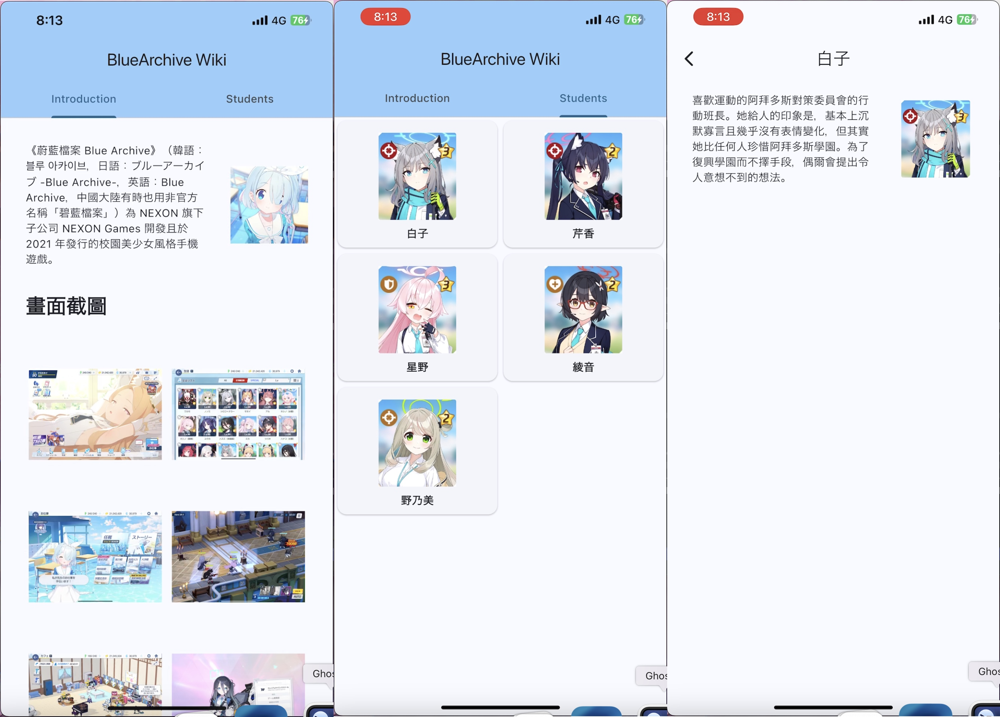
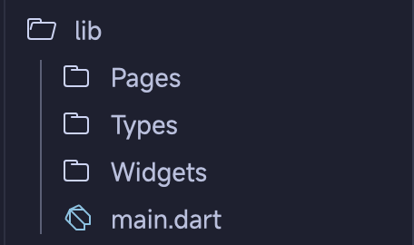

這次是使用 Flutter 製作一個電子書 App。主題的部分原本是想說做一個介紹程式語言的 App，但是因為如果真的做的話，可能需要面對程式碼上色、需要自行撰寫相關介紹的問題。並且因為本人上週剛考完微積分大考，然後再下週又有期中考，如果真的再這樣搞下去的話我期中考其他科目可能不用準備了，準備直接完蛋，所以只好找一個主題稍微做一下，先交差然後準備期中考。

## App Preview
畫面右下角有一點奇怪的東西，那個是在電腦上從影片截圖時碰到底部工作列造成的，在使用 App 時不會那些奇怪的東西。

這次學生的部分只放阿拜多斯的，放全部的話因為圖片處理很耗時間，所以就沒放了。

## Directory Structure
基本上還是跟上次差不多的，只是沒有再建立 components 資料夾了。
* `Pages`：所有的頁面，不管是 Tab 或者單個頁面基本上都放在這。
* `Types`：自訂資料型別
* `Widgets`：畫面上的元件，只是因為很少，所以這次裡面沒有再依頁面分資料夾了

## Code Explanation
這次與上兩篇一樣，重複或類似的內容、非該解析所關注的點會進行折疊。
### Base App
整個 App 的基底，改的部分只有標題、主題色與顯示的標題
```dart title="main.dart" collapse={25-68,1-2} {17,19,21}
import 'package:bluearchiveintroduction/Pages/Introduction.dart';
import 'package:bluearchiveintroduction/Pages/Students.dart';
import 'package:flutter/material.dart';

void main() {
  runApp(const MyApp());
}

class MyApp extends StatelessWidget {
  const MyApp({super.key});

  // This widget is the root of your application.
  @override
  Widget build(BuildContext context) {
    return MaterialApp(
      debugShowCheckedModeBanner: false,
      title: 'BlueArchive Wiki',
      theme: ThemeData(
        colorScheme: ColorScheme.fromSeed(seedColor: Colors.lightBlue),
      ),
      home: const MyHomePage(title: 'BlueArchive Wiki'),
    );
  }
}

class MyHomePage extends StatefulWidget {
  const MyHomePage({super.key, required this.title});

  final String title;

  @override
  State<MyHomePage> createState() => _MyHomePageState();
}

class _MyHomePageState extends State<MyHomePage>
    with SingleTickerProviderStateMixin {
  late TabController _tabController;

  @override
  void initState() {
    super.initState();
    _tabController = TabController(vsync: this, length: 2);
  }

  @override
  void dispose() {
    _tabController.dispose();
    super.dispose();
  }

  @override
  Widget build(BuildContext context) {
    return Scaffold(
      appBar: AppBar(
        backgroundColor: Theme.of(context).colorScheme.inversePrimary,
        title: Text(widget.title),
        bottom: TabBar(
          tabs: [Tab(text: 'Introduction'), Tab(text: 'Students')],
          controller: _tabController,
        ),
      ),
      body: TabBarView(
        controller: _tabController,
        children: [SingleChildScrollView(child: Introduction()), Students()],
      ),
    );
  }
}
```
### Base View
整個主畫面的基底，負責顯示 TabBar，並且決定要顯示哪一個頁面。
```dart title="main.dart" collapse={3-25} {"1.":36,39-43,45-49} {"2.":55} {"3.":64}
import 'package:bluearchiveintroduction/Pages/Introduction.dart';
import 'package:bluearchiveintroduction/Pages/Students.dart';
import 'package:flutter/material.dart';

void main() {
  runApp(const MyApp());
}

class MyApp extends StatelessWidget {
  const MyApp({super.key});

  // This widget is the root of your application.
  @override
  Widget build(BuildContext context) {
    return MaterialApp(
      debugShowCheckedModeBanner: false,
      title: 'BlueArchive Wiki',
      theme: ThemeData(
        colorScheme: ColorScheme.fromSeed(seedColor: Colors.lightBlue),
      ),
      home: const MyHomePage(title: 'BlueArchive Wiki'),
    );
  }
}

class MyHomePage extends StatefulWidget {
  const MyHomePage({super.key, required this.title});

  final String title;

  @override
  State<MyHomePage> createState() => _MyHomePageState();
}

class _MyHomePageState extends State<MyHomePage>
    with SingleTickerProviderStateMixin {
  late TabController _tabController;

  @override
  void initState() {
    super.initState();
    _tabController = TabController(vsync: this, length: 2);
  }

  @override
  void dispose() {
    _tabController.dispose();
    super.dispose();
  }

  @override
  Widget build(BuildContext context) {
    return Scaffold(
      appBar: AppBar(
        backgroundColor: Theme.of(context).colorScheme.inversePrimary,
        title: Text(widget.title),
        bottom: TabBar(
          tabs: [Tab(text: 'Introduction'), Tab(text: 'Students')],
          controller: _tabController,
        ),
      ),
      body: TabBarView(
        controller: _tabController,
        children: [SingleChildScrollView(child: Introduction()), Students()],
      ),
    );
  }
}
```
:::note[Explanation]
1. 由於協調 `TabBar` 和 `TabBarView` 的 `TabController` 需要一個 `TickerProvider`，所以需要為此 widget 加一個 `SingleTickerProviderStateMixin` 為此 widget 提供一個 `Ticker`，並且在 widget 被插入到樹中時初始化。並且在此 widget 在樹中被永久移除時銷毀。
2. 取得應用程式主題中的 `inversePrimary` 來當作 `AppBar` 的底色。
3. 捲動部分因為一個是要捲動整個頁面，另一個則是交給 `ListView`，所以第一個有加 `SingleChildScrollView`，第二個沒有。
:::
### Introduction Page
介紹蔚藍檔案的頁面，以下檔案位於 `Pages` 資料夾中。
```dart title="Introduction.dart" collapse={45-49} {"1.":15-22} {"2.":37-51}
import 'package:bluearchiveintroduction/Widgets/ScreenShot.dart';
import 'package:flutter/material.dart';

class Introduction extends StatelessWidget {
  const Introduction({super.key});

  @override
  Widget build(BuildContext context) {
    return Padding(
      padding: EdgeInsets.only(left: 32.0, right: 32.0, top: 32.0),
      child: Column(
        children: [
          Row(
            children: [
              Expanded(
                child: Text(
                  "《蔚藍檔案 Blue Archive》（韓語：블루 아카이브，日語：ブルーアーカイブ -Blue Archive-，英語：Blue Archive，中國大陸有時也用非官方名稱「碧藍檔案」）為 NEXON 旗下子公司 NEXON Games 開發且於 2021 年發行的校園美少女風格手機遊戲。",
                  overflow: TextOverflow.ellipsis,
                  softWrap: true,
                  maxLines: 20,
                ),
              ),
              SizedBox(width: 32.0),
              Image.asset('assets/images/icon.jpg', width: 100, height: 100),
            ],
          ),
          SizedBox(height: 32.0),
          Row(
            children: [
              Text(
                "畫面截圖",
                style: TextStyle(fontSize: 26, fontWeight: FontWeight.bold),
              ),
            ],
          ),
          SizedBox(height: 32.0),
          GridView.count(
            shrinkWrap: true,
            crossAxisCount: 2,
            crossAxisSpacing: 5,
            mainAxisSpacing: 5,
            physics: NeverScrollableScrollPhysics(),
            children: [
              Screenshot(name: "IMG_3905.PNG", width: 100),
              Screenshot(name: "IMG_3906.PNG", width: 100),
              Screenshot(name: "IMG_3907.PNG", width: 100),
              Screenshot(name: "IMG_3908.PNG", width: 100),
              Screenshot(name: "IMG_3909.PNG", width: 100),
              Screenshot(name: "IMG_3904.PNG", width: 100),
            ],
          ),
        ],
      ),
    );
  }
}
```
:::note[Explanation]
1. 因為有可能會文字溢出，所以需要設定自動多行顯示，最大行數為 `20`，那個是為了讓內容能完整顯示。
2. 因應作業要求使用 `GridView`，故在此使用 `GridView` 顯示畫面截圖，每列兩個，並且設定禁止捲動（因為已經設定捲動整個頁面）。
:::
接下來就是顯示畫面截圖的 widget，為了簡化使用所以特別宣告了一個 `Screenshot` widget，讓自己在使用時會比較方便。檔案位於 `Widgets` 資料夾下。
```dart title="Screenshot.dart"
import 'package:flutter/material.dart';

class Screenshot extends StatelessWidget {
  final String name;
  final double width;

  const Screenshot({super.key, required this.name, required this.width});

  @override
  Widget build(BuildContext context) {
    return Container(
      padding: EdgeInsets.all(4.0),
      width: width,
      child: Image.asset('assets/screenshots/$name'),
    );
  }
}
```
沒錯就那麼一點點東西而已，因為只是單純顯示某個資料夾下的圖片，所以整個 widget 不會有什麼複雜的結構。
### Students List Page
專門顯示學生清單的頁面，而頁面上會以每列兩個 `StudentTile` 的方式列出學生的圖片和名字，點選各個學生的 `StudentTile` 可以查看學生的簡單介紹。頁面檔案位於 `Pages` 資料夾中。
```dart title="Students.dart" collapse={14-36}
import 'package:bluearchiveintroduction/Widgets/StudentList.dart';

import '../Types/Student.dart';
import 'package:flutter/material.dart';

class Students extends StatelessWidget {
  final List<Student> students = [
    Student(
      name: "白子",
      description:
          "喜歡運動的阿拜多斯對策委員會的行動班長。她給人的印象是，基本上沉默寡言且幾乎沒有表情變化，但其實她比任何人珍惜阿拜多斯學園。為了復興學園而不擇手段，偶爾會提出令人意想不到的想法。",
      imgName: "siroko",
    ),
    Student(
      name: "芹香",
      description:
          "阿拜多斯對策委員會的難纏會計。很愛碎碎念，毫不猶豫地表露自己的感情。「這種學園最好快點完蛋！」就像她的口頭禪似的。雖然老是把這句話掛在嘴上，其實她為了償還學園的債務而暗中打工，對學園是很有愛的。",
      imgName: "serika",
    ),
    Student(
      name: "星野",
      description:
          "阿拜多斯高中的原學生會副會長學生會會長，現在是對策委員會委員長的懶惰蟲少女。喜歡用大叔的口吻說話。比起公務，她更愛惡作劇。因此她平常老是被委員會的委員們訓。不過一旦任務開始，她就會為了保護其他學生站到最前線奮戰。",
      imgName: "hosino",
    ),
    Student(
      name: "綾音",
      description: "阿拜多斯對策委員會的誠實書記。重視基本理論與規定的原則主義者，正為了復興阿拜多斯高中而踏實地努力着。",
      imgName: "ayane",
    ),
    Student(
      name: "野乃美",
      description:
          "阿拜多斯高中所屬，對策委員會的一員。感情豐富且品性善良，是讓有着許多極端性格成員的對策委員會團結一致的精神支柱。雖然沒有怎麼表露出來，但她是富裕人家的千金，大部分的對策委員會零食費都來自她的零用錢。",
      imgName: "nonomi",
    ),
  ];

  Students({super.key});

  @override
  Widget build(BuildContext context) {
    return StudentList(students);
  }
}
```
這次因為 `StudentList` 較為複雜，所以就就沒有選擇放在這裡，而是選擇直接新建一個 widget，這一個檔案主要是放基底學生資料的。`Student` 是自訂的資料型別，用來儲存學生的基本資訊，等一下會介紹。

接下來就是 `StudentList`，用來顯示學生的資料，檔案位於 `Widgets` 資料夾中。
```dart title="StudentList.dart" {"1.":11} {"2.":16} {"3.":18-21} {"4.":27}
import 'dart:math';

import 'package:flutter/material.dart';

import '../Types/Student.dart';
import 'StudentTile.dart';

class StudentList extends StatelessWidget {
  final List<Student> students;

  const StudentList(this.students, {super.key});

  @override
  Widget build(BuildContext context) {
    return ListView.builder(
      itemCount: students.length ~/ 2 + 1,
      itemBuilder: (context, index) {
        List<Student> temp = students.sublist(
          index * 2,
          min(index * 2 + 2, students.length),
        );
        return Row(
          children:
              temp
                  .map(
                    (stu) => SizedBox(
                      width: MediaQuery.sizeOf(context).width / 2,
                      child: StudentTile(stu),
                    ),
                  )
                  .toList(),
        );
      },
    );
  }
}
```
:::note[Explanation]
1. 因為 students 是必填，並且基本上即使在參數沒填屬性，也會知道要填什麼，所以就沒有為其具名。
2. 決定總共有幾項，為了讓其可以根據新增個數變動，所以採用計算的方式，`~/` 的部分是整數除法，並且為了讓資料只有一筆時也可以顯示，所以後面需要個 `+1`（因為只有 1 個時，`1 ~/ 2 = 0`）
3. 先決定要顯示的學生，因為 index 是指 `ListView` 中的第幾項，所以需要將 index 稍作轉換才會抓到正確的學生資料。後面需要用 `min` 是因為為避免結束位置超出 `List` 長度，故需要取計算出來的值與 `List` 長度中的最小值。
4. 使 `StudentTile` 的寬度大小可以根據螢幕寬度自行調整，`MediaQuery.sizeOf(context).width` 可取得螢幕的寬度。
:::
接下來就是學生清單中的每一項。
```dart title="StudentTile.dart" {16-25}
import 'package:flutter/material.dart';

import '../Pages/StudentDetail.dart';
import '../Types/Student.dart';

class StudentTile extends StatelessWidget {
  final Student student;

  const StudentTile(this.student, {super.key});

  @override
  Widget build(BuildContext context) {
    return Card(
      clipBehavior: Clip.hardEdge,
      child: InkWell(
        splashColor: Colors.grey.withAlpha(30),
        onTap:
            () => {
              Navigator.push(
                context,
                MaterialPageRoute(
                  builder: (context) => StudentDetail(student: student),
                ),
              ),
            },
        child: Column(
          children: [
            Padding(
              padding: EdgeInsets.only(top: 16),
              child: SizedBox(
                width: 100,
                child: Image.asset(
                  "assets/students/${student.imgName}.jpg",
                  fit: BoxFit.contain,
                ),
              ),
            ),
            Padding(
              padding: EdgeInsets.only(top: 8, bottom: 8),
              child: Text(
                student.name,
                style: TextStyle(fontWeight: FontWeight.bold),
              ),
            ),
          ],
        ),
      ),
    );
  }
}
```
標記處的部分是設定點下去的漣漪效果，將效果的顏色設定為灰色，並且在點下去之後會跳出一個新的頁面顯示學生的資訊。
### Student Detail Page
用於顯示學生的相關資料，頁面檔案位於 `Pages` 資料夾中。
```dart title="StudentDetail.dart"
import 'package:flutter/material.dart';

import '../Types/Student.dart';

class StudentDetail extends StatelessWidget {
  final Student student;

  const StudentDetail({super.key, required this.student});

  @override
  Widget build(BuildContext context) {
    return Scaffold(
      appBar: AppBar(title: Text(student.name)),
      body: Padding(
        padding: const EdgeInsets.only(left: 32, right: 32, top: 16),
        child: Column(
          children: [
            Row(
              children: [
                Expanded(
                  child: Text(
                    student.description,
                    overflow: TextOverflow.ellipsis,
                    softWrap: true,
                    maxLines: 20,
                  ),
                ),
                SizedBox(width: 32.0),
                Image.asset(
                  'assets/students/${student.imgName}.jpg',
                  width: 100,
                  height: 100,
                ),
              ],
            ),
          ],
        ),
      ),
    );
  }
}
```
介面基本上相當的簡單，標題顯示學生名字，然後頁面顯示學生的其他資訊。這裡因為排版與時間關係，所以只放一部分的資訊。

最後就是學生資訊的部分，檔案位於 `Types` 資料夾中。
```dart title="Student.dart"
class Student {
  final String name;
  final String description;
  final String imgName;

  Student({
    required this.name,
    required this.description,
    required this.imgName,
  });
}
```
沒有什麼成員方法，因為目前沒有需要動學生資料的部分，單純像結構一樣單純封裝資料。

## App Exhibition
<div style="position:relative; width:100%; height:0px; padding-bottom:216.216%"><iframe allow="fullscreen" allowfullscreen height="100%" src="https://streamable.com/e/63hw2r?" width="100%" style="border:none; width:100%; height:100%; position:absolute; left:0px; top:0px; overflow:hidden;"></iframe></div>

## Wrapping Up
這次的話是挑蔚藍檔案，然後參考了別人的排版。因為自己也不知道怎麼排會比較舒服，對於這種應用程式我也是第一次做，怎麼排比較好看我也不知道，所以就參考了別人的排版，感覺樣子其實還不錯。不得不說排版真的是需要不少經驗才有辦法知道說怎樣排才有辦法非常好看。

不過這次也是我第一次利用撰寫前一篇 Flutter 系列文章時所架出來的環境，並且加上 Zed 編輯器撰寫出一個 Flutter App。雖然說 debug 有需要 hot reload 時，會需要先自己輸入指令找要在哪個裝置上執行，再透過指令使用可以在你儲存檔案時自動 hot reload 的模組來執行 App，還有就是你資源改名時他不會重新去讀新資源，但撇開那些不談，其實開發體驗已經可以說是非常舒服的了。雖然說 Zed 對於 Flutter 支援或許還有一段路要走，但是在完全支援之後，或許 Zed 也會是開發 Flutter 應用程式的一個好選擇。

關於如何使用 Zed 編輯器撰寫 Flutter App，可以參考上一篇系列文章

[/posts/flutterzed/](/posts/flutterzed/)

## GitHub Repository
::github{repo="Kayxue/BlueArchiveIntroduction"}
