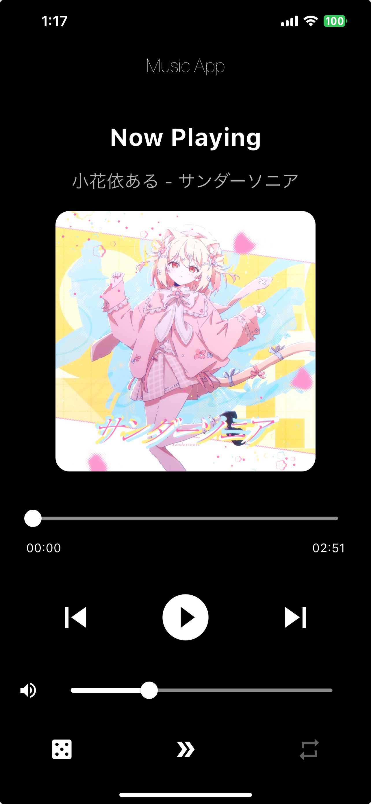

這次的作業是寫一個音樂播放器，雖然說可能沒有做得太精緻，但是還是盡量把功能做好。儘管沒有提供網路上搜尋音樂然後就可以直接播放的功能，但基本上還是有因為要減少應用程式的體積，還有在通知欄控制音樂播放，所以有將音樂先下載，然後臨時在網路上架一個小伺服器，讓音樂可以播放的同時，讓應用程式體積可以更小。

:::caution
雖然說下方文章內容會有該小伺服器連結，但該網站上的資源與歌曲皆為流行歌，故在此僅供寫作業用，請勿使用該網站資源進行營利等其他行為。
:::
## Preview
這次圖只有一張，如下圖所示：

沒錯，乾淨又簡單
## Code Explanation
因為這次時間比較緊，所以採用 AI 去做了介面。又因為 VSCodium 的 GitHub Copilot 程式碼編輯功能不知道跑去哪了，而 Zed 編輯器的 AI 程式碼編輯一次又只能請它改你選取的區域，所以這次檔案只有一個主檔案跟一個宣告資料類型的檔案。widget 我也懶得分檔案了，反正 widget 都一次性。

### Data Model
用以記錄歌曲的相關資料
```dart title="song.dart"
class Song {
  final String title;
  final String artist;
  final String imageName;
  final String audioName;

  Song({
    required this.title,
    required this.artist,
    required this.imageName,
    required this.audioName,
  });
}
```

### Entrance
這裡主要就是做一些初始設定，比如在 App 中調音量時不會顯示系統的音量調整，並且初始化背景播放、通知控制等相關的東西。
```dart title="main.dart" collapse={1-4,6-6,8-9,17-420}
import 'dart:async';
import 'dart:collection';
import 'dart:math';

import 'package:flutter/material.dart';
import 'package:just_audio/just_audio.dart';
import 'package:just_audio_background/just_audio_background.dart';
import 'package:musicplayer/song.dart';
import 'package:rxdart/rxdart.dart';
import 'package:volume_controller/volume_controller.dart';

Future<void> main() async {
  VolumeController.instance.showSystemUI = false;
  await JustAudioBackground.init();
  runApp(const MyApp());
}

class MyApp extends StatelessWidget {
  const MyApp({super.key});

  @override
  Widget build(BuildContext context) {
    return MaterialApp(
      title: 'Music App',
      theme: ThemeData(
        colorScheme: ColorScheme.fromSeed(seedColor: Colors.blue),
        scaffoldBackgroundColor: Colors.black,
        textTheme: const TextTheme(
          bodyMedium: TextStyle(color: Colors.white),
          headlineMedium: TextStyle(color: Colors.white),
        ),
      ),
      debugShowCheckedModeBanner: false,
      home: const MyHomePage(title: 'Music App'),
    );
  }
}

class MyHomePage extends StatefulWidget {
  const MyHomePage({super.key, required this.title});

  final String title;

  @override
  State<MyHomePage> createState() => _MyHomePageState();
}

class _MyHomePageState extends State<MyHomePage> {
  final AudioPlayer _audioPlayer = AudioPlayer();
  late final VolumeController _volumeController;
  late final StreamSubscription<double> _subscription;
  final HashMap<LoopMode, int> loopModeToIndex = HashMap.of({
    LoopMode.off: 0,
    LoopMode.all: 1,
    LoopMode.one: 2,
  });
  final HashMap<int, LoopMode> indexToLoopMode = HashMap.of({
    0: LoopMode.off,
    1: LoopMode.all,
    2: LoopMode.one,
  });
  List<Color> colors = [Colors.grey.shade700, Colors.white, Colors.white];
  List<Icon> icons = [
    const Icon(Icons.repeat),
    const Icon(Icons.repeat),
    const Icon(Icons.repeat_one),
  ];
  List<Song> songs = [
    Song(
      title: 'Numb',
      artist: 'Will Pan',
      imageName: 'IMG_6398.jpg',
      audioName: 'Numb.mp3',
    ),
    Song(
      title: 'Colorful',
      artist: 'Hiiragi Magnetite',
      imageName: 'IMG_6399.jpg',
      audioName: 'カラフル.mp3',
    ),
    Song(
      title: 'もしも',
      artist: 'ナナツカゼ',
      imageName: 'IMG_6400.jpg',
      audioName: 'What If.mp3',
    ),
    Song(
      title: 'サンダーソニア',
      artist: '小花依ある',
      imageName: 'IMG_6412.jpg',
      audioName: 'サンダーソニア.mp3',
    ),
    Song(
      title: 'I Am I Can',
      artist: 'Nine Chen',
      imageName: 'IMG_6413.jpg',
      audioName: 'I am I can.mp3',
    ),
  ];
  LoopMode prevLoopMode = LoopMode.off;
  double _volumeValue = 0;
  Duration _currentPosition = Duration.zero;
  bool changingPosition = false;

  _MyHomePageState() {
    _audioPlayer.setVolume(1.0);
    _audioPlayer.setLoopMode(LoopMode.off);
    _audioPlayer.setShuffleModeEnabled(false);
    _audioPlayer.setAudioSources(
      songs.map((song) {
        return AudioSource.uri(
          Uri.parse(
            'https://homeworkfileserver.onrender.com/music/${song.audioName}',
          ),
          tag: MediaItem(
            id: song.audioName,
            title: song.title,
            artist: song.artist,
            artUri: Uri.parse(
              'https://homeworkfileserver.onrender.com/image/${song.imageName}',
            ),
          ),
        );
      }).toList(),
      initialIndex: 0,
      initialPosition: Duration.zero,
      preload: true,
    );
    _audioPlayer.sequenceStateStream.listen((state) {
      if (state.currentIndex != null) {
        setState(() {});
      }
    });
    _audioPlayer.playerStateStream.listen((state) async {
      if (state.processingState == ProcessingState.completed) {
        if (!_audioPlayer.hasNext &&
            _audioPlayer.loopMode == LoopMode.off &&
            _audioPlayer.shuffleModeEnabled == false) {
          await _audioPlayer.seek(Duration.zero, index: 0);
          await _audioPlayer.stop();
        }
      }
      setState(() {});
    });
    _volumeController = VolumeController.instance;

    _subscription = _volumeController.addListener((volume) {
      setState(() => _volumeValue = volume);
    }, fetchInitialVolume: true);
  }

  Stream<DurationState> get _durationStateStream =>
      Rx.combineLatest2<Duration, Duration?, DurationState>(
        _audioPlayer.positionStream,
        _audioPlayer.durationStream,
        (position, duration) =>
            DurationState(position: position, total: duration ?? Duration.zero),
      );

  @override
  void dispose() {
    _audioPlayer.dispose();
    super.dispose();
  }

  void _playPauseAudio() async {
    if (_audioPlayer.playing) {
      await _audioPlayer.pause();
    } else {
      await _audioPlayer.play();
    }
  }

  void _setVolume(double volume) async {
    await _volumeController.setVolume(volume);
    setState(() {});
  }

  @override
  Widget build(BuildContext context) {
    return Scaffold(
      appBar: AppBar(
        backgroundColor: Colors.black,
        title: Text(widget.title, style: const TextStyle(color: Colors.white)),
      ),
      body: Column(
        mainAxisAlignment: MainAxisAlignment.center,
        children: [
          const Padding(
            padding: EdgeInsets.all(16.0),
            child: Text(
              'Now Playing',
              style: TextStyle(
                fontSize: 28,
                fontWeight: FontWeight.bold,
                color: Colors.white,
              ),
            ),
          ),
          Padding(
            padding: EdgeInsets.symmetric(horizontal: 16.0),
            child: Text(
              '${songs[_audioPlayer.currentIndex ?? 0].artist} - ${songs[_audioPlayer.currentIndex ?? 0].title}',
              style: TextStyle(fontSize: 20, color: Colors.white70),
              textAlign: TextAlign.center,
            ),
          ),
          const SizedBox(height: 20),
          SizedBox(
            width: 300,
            height: 300,
            child: ClipRRect(
              borderRadius: BorderRadius.circular(16.0),
              child: Image.network(
                "https://homeworkfileserver.onrender.com/image/${songs[_audioPlayer.currentIndex ?? 0].imageName}",
                fit: BoxFit.cover,
              ),
            ),
          ),
          const SizedBox(height: 30),
          StreamBuilder<DurationState>(
            stream: _durationStateStream,
            builder: (context, snapshot) {
              final durationState = snapshot.data;
              final position = durationState?.position ?? Duration.zero;
              final total = durationState?.total ?? Duration.zero;

              return Column(
                children: [
                  SizedBox(
                    width: 400,
                    child: Slider(
                      value:
                          changingPosition
                              ? _currentPosition.inSeconds.toDouble()
                              : min(
                                total.inSeconds.toDouble(),
                                position.inSeconds.toDouble(),
                              ),
                      max: total.inSeconds.toDouble(),
                      onChangeStart: (value) {
                        changingPosition = true;
                        _currentPosition = position;
                      },
                      onChanged: (value) {
                        _currentPosition = Duration(seconds: value.toInt());
                      },
                      onChangeEnd: (value) async {
                        await _audioPlayer.seek(
                          Duration(seconds: value.toInt()),
                        );
                        changingPosition = false;
                      },
                      activeColor: Colors.white,
                      inactiveColor: Colors.white54,
                    ),
                  ),
                  SizedBox(
                    width: 400,
                    child: Padding(
                      padding: const EdgeInsets.symmetric(horizontal: 16.0),
                      child: Row(
                        mainAxisAlignment: MainAxisAlignment.spaceBetween,
                        children: [
                          Text(
                            _formatDuration(
                              changingPosition ? _currentPosition : position,
                            ),
                            style: const TextStyle(color: Colors.white),
                          ),
                          Text(
                            _formatDuration(total),
                            style: const TextStyle(color: Colors.white),
                          ),
                        ],
                      ),
                    ),
                  ),
                ],
              );
            },
          ),
          const SizedBox(height: 30),
          Row(
            mainAxisAlignment: MainAxisAlignment.spaceEvenly,
            children: [
              IconButton(
                icon: const Icon(Icons.skip_previous, color: Colors.white),
                iconSize: 48,
                onPressed: () async {
                  if (_audioPlayer.hasPrevious) {
                    await _audioPlayer.seekToPrevious();
                  } else {
                    await _audioPlayer.seek(
                      Duration.zero,
                      index: songs.length - 1,
                    );
                  }
                },
              ),
              IconButton(
                icon: Icon(
                  _audioPlayer.playing
                      ? Icons.pause_circle_filled
                      : Icons.play_circle_filled,
                  color: Colors.white,
                ),
                iconSize: 64,
                onPressed: _playPauseAudio,
              ),
              IconButton(
                icon: const Icon(Icons.skip_next, color: Colors.white),
                iconSize: 48,
                onPressed: () async {
                  if (_audioPlayer.hasNext) {
                    await _audioPlayer.seekToNext();
                  } else {
                    await _audioPlayer.seek(Duration.zero, index: 0);
                  }
                },
              ),
            ],
          ),
          const SizedBox(height: 20),
          SizedBox(
            width: 400,
            child: Row(
              mainAxisAlignment: MainAxisAlignment.spaceAround,
              children: [
                const Icon(Icons.volume_up, color: Colors.white),
                SizedBox(
                  width: 350,
                  child: Slider(
                    value: _volumeValue,
                    min: 0.0,
                    max: 1.0,
                    onChanged: _setVolume,
                    activeColor: Colors.white,
                    inactiveColor: Colors.white54,
                  ),
                ),
              ],
            ),
          ),
          const SizedBox(height: 20),
          Padding(
            padding: EdgeInsets.only(bottom: 20),
            child: Row(
              mainAxisAlignment: MainAxisAlignment.spaceAround,
              children: [
                IconButton(
                  onPressed: () async {
                    await _audioPlayer.seek(
                      null,
                      index: Random().nextInt(songs.length),
                    );
                  },
                  icon: Icon(Icons.casino),
                  color: Colors.white,
                  iconSize: 30,
                ),
                IconButton(
                  onPressed: () async {
                    await _audioPlayer.setShuffleModeEnabled(
                      !_audioPlayer.shuffleModeEnabled,
                    );
                    if (_audioPlayer.shuffleModeEnabled) {
                      prevLoopMode = _audioPlayer.loopMode;
                      await _audioPlayer.setLoopMode(LoopMode.all);
                    } else {
                      await _audioPlayer.setLoopMode(prevLoopMode);
                    }
                    setState(() {});
                  },
                  icon: Icon(
                    _audioPlayer.shuffleModeEnabled
                        ? Icons.shuffle
                        : Icons.double_arrow,
                  ),
                  color: Colors.white,
                  iconSize: 30,
                ),
                IconButton(
                  onPressed:
                      _audioPlayer.shuffleModeEnabled
                          ? null
                          : (() async {
                            int loopMode =
                                loopModeToIndex[_audioPlayer.loopMode]!;
                            loopMode = (loopMode + 1) % 3;
                            await _audioPlayer.setLoopMode(
                              indexToLoopMode[loopMode]!,
                            );
                            setState(() {});
                          }),
                  icon: icons[loopModeToIndex[_audioPlayer.loopMode]!],
                  color: colors[loopModeToIndex[_audioPlayer.loopMode]!],
                  iconSize: 30,
                ),
              ],
            ),
          ),
        ],
      ),
    );
  }

  String _formatDuration(Duration duration) {
    final minutes = duration.inMinutes.remainder(60).toString().padLeft(2, '0');
    final seconds = duration.inSeconds.remainder(60).toString().padLeft(2, '0');
    return '$minutes:$seconds';
  }
}

class DurationState {
  final Duration position;
  final Duration total;

  DurationState({required this.position, required this.total});
}
```

### Base Widget and States
整個基底 widget、常值、狀態和一些運作中會需要的東西。例如用來播放音樂的 `_audioPlayer`，還有跟系統音量控制有關的 `_volumeController` 和 `_subscription`。
```dart title="main.dart" collapse={4-5,7-7,9-9,11-37,104-412,414-420} {"1":52-61} {"2":62-67} {"3":102-103}
import 'dart:async';
import 'dart:collection';
import 'dart:math';

import 'package:flutter/material.dart';
import 'package:just_audio/just_audio.dart';
import 'package:just_audio_background/just_audio_background.dart';
import 'package:musicplayer/song.dart';
import 'package:rxdart/rxdart.dart';
import 'package:volume_controller/volume_controller.dart';

Future<void> main() async {
  VolumeController.instance.showSystemUI = false;
  await JustAudioBackground.init();
  runApp(const MyApp());
}

class MyApp extends StatelessWidget {
  const MyApp({super.key});

  @override
  Widget build(BuildContext context) {
    return MaterialApp(
      title: 'Music App',
      theme: ThemeData(
        colorScheme: ColorScheme.fromSeed(seedColor: Colors.blue),
        scaffoldBackgroundColor: Colors.black,
        textTheme: const TextTheme(
          bodyMedium: TextStyle(color: Colors.white),
          headlineMedium: TextStyle(color: Colors.white),
        ),
      ),
      debugShowCheckedModeBanner: false,
      home: const MyHomePage(title: 'Music App'),
    );
  }
}

class MyHomePage extends StatefulWidget {
  const MyHomePage({super.key, required this.title});

  final String title;

  @override
  State<MyHomePage> createState() => _MyHomePageState();
}

class _MyHomePageState extends State<MyHomePage> {
  final AudioPlayer _audioPlayer = AudioPlayer();
  late final VolumeController _volumeController;
  late final StreamSubscription<double> _subscription;
  final HashMap<LoopMode, int> loopModeToIndex = HashMap.of({
    LoopMode.off: 0,
    LoopMode.all: 1,
    LoopMode.one: 2,
  });
  final HashMap<int, LoopMode> indexToLoopMode = HashMap.of({
    0: LoopMode.off,
    1: LoopMode.all,
    2: LoopMode.one,
  });
  List<Color> colors = [Colors.grey.shade700, Colors.white, Colors.white];
  List<Icon> icons = [
    const Icon(Icons.repeat),
    const Icon(Icons.repeat),
    const Icon(Icons.repeat_one),
  ];
  List<Song> songs = [
    Song(
      title: 'Numb',
      artist: 'Will Pan',
      imageName: 'IMG_6398.jpg',
      audioName: 'Numb.mp3',
    ),
    Song(
      title: 'Colorful',
      artist: 'Hiiragi Magnetite',
      imageName: 'IMG_6399.jpg',
      audioName: 'カラフル.mp3',
    ),
    Song(
      title: 'もしも',
      artist: 'ナナツカゼ',
      imageName: 'IMG_6400.jpg',
      audioName: 'What If.mp3',
    ),
    Song(
      title: 'サンダーソニア',
      artist: '小花依ある',
      imageName: 'IMG_6412.jpg',
      audioName: 'サンダーソニア.mp3',
    ),
    Song(
      title: 'I Am I Can',
      artist: 'Nine Chen',
      imageName: 'IMG_6413.jpg',
      audioName: 'I am I can.mp3',
    ),
  ];
  LoopMode prevLoopMode = LoopMode.off;
  double _volumeValue = 0;
  Duration _currentPosition = Duration.zero;
  bool changingPosition = false;

  _MyHomePageState() {
    _audioPlayer.setVolume(1.0);
    _audioPlayer.setLoopMode(LoopMode.off);
    _audioPlayer.setShuffleModeEnabled(false);
    _audioPlayer.setAudioSources(
      songs.map((song) {
        return AudioSource.uri(
          Uri.parse(
            'https://homeworkfileserver.onrender.com/music/${song.audioName}',
          ),
          tag: MediaItem(
            id: song.audioName,
            title: song.title,
            artist: song.artist,
            artUri: Uri.parse(
              'https://homeworkfileserver.onrender.com/image/${song.imageName}',
            ),
          ),
        );
      }).toList(),
      initialIndex: 0,
      initialPosition: Duration.zero,
      preload: true,
    );
    _audioPlayer.sequenceStateStream.listen((state) {
      if (state.currentIndex != null) {
        setState(() {});
      }
    });
    _audioPlayer.playerStateStream.listen((state) async {
      if (state.processingState == ProcessingState.completed) {
        if (!_audioPlayer.hasNext &&
            _audioPlayer.loopMode == LoopMode.off &&
            _audioPlayer.shuffleModeEnabled == false) {
          await _audioPlayer.seek(Duration.zero, index: 0);
          await _audioPlayer.stop();
        }
      }
      setState(() {});
    });
    _volumeController = VolumeController.instance;

    _subscription = _volumeController.addListener((volume) {
      setState(() => _volumeValue = volume);
    }, fetchInitialVolume: true);
  }

  Stream<DurationState> get _durationStateStream =>
      Rx.combineLatest2<Duration, Duration?, DurationState>(
        _audioPlayer.positionStream,
        _audioPlayer.durationStream,
        (position, duration) =>
            DurationState(position: position, total: duration ?? Duration.zero),
      );

  @override
  void dispose() {
    _audioPlayer.dispose();
    super.dispose();
  }

  void _playPauseAudio() async {
    if (_audioPlayer.playing) {
      await _audioPlayer.pause();
    } else {
      await _audioPlayer.play();
    }
  }

  void _setVolume(double volume) async {
    await _volumeController.setVolume(volume);
    setState(() {});
  }

  @override
  Widget build(BuildContext context) {
    return Scaffold(
      appBar: AppBar(
        backgroundColor: Colors.black,
        title: Text(widget.title, style: const TextStyle(color: Colors.white)),
      ),
      body: Column(
        mainAxisAlignment: MainAxisAlignment.center,
        children: [
          const Padding(
            padding: EdgeInsets.all(16.0),
            child: Text(
              'Now Playing',
              style: TextStyle(
                fontSize: 28,
                fontWeight: FontWeight.bold,
                color: Colors.white,
              ),
            ),
          ),
          Padding(
            padding: EdgeInsets.symmetric(horizontal: 16.0),
            child: Text(
              '${songs[_audioPlayer.currentIndex ?? 0].artist} - ${songs[_audioPlayer.currentIndex ?? 0].title}',
              style: TextStyle(fontSize: 20, color: Colors.white70),
              textAlign: TextAlign.center,
            ),
          ),
          const SizedBox(height: 20),
          SizedBox(
            width: 300,
            height: 300,
            child: ClipRRect(
              borderRadius: BorderRadius.circular(16.0),
              child: Image.network(
                "https://homeworkfileserver.onrender.com/image/${songs[_audioPlayer.currentIndex ?? 0].imageName}",
                fit: BoxFit.cover,
              ),
            ),
          ),
          const SizedBox(height: 30),
          StreamBuilder<DurationState>(
            stream: _durationStateStream,
            builder: (context, snapshot) {
              final durationState = snapshot.data;
              final position = durationState?.position ?? Duration.zero;
              final total = durationState?.total ?? Duration.zero;

              return Column(
                children: [
                  SizedBox(
                    width: 400,
                    child: Slider(
                      value:
                          changingPosition
                              ? _currentPosition.inSeconds.toDouble()
                              : min(
                                total.inSeconds.toDouble(),
                                position.inSeconds.toDouble(),
                              ),
                      max: total.inSeconds.toDouble(),
                      onChangeStart: (value) {
                        changingPosition = true;
                        _currentPosition = position;
                      },
                      onChanged: (value) {
                        _currentPosition = Duration(seconds: value.toInt());
                      },
                      onChangeEnd: (value) async {
                        await _audioPlayer.seek(
                          Duration(seconds: value.toInt()),
                        );
                        changingPosition = false;
                      },
                      activeColor: Colors.white,
                      inactiveColor: Colors.white54,
                    ),
                  ),
                  SizedBox(
                    width: 400,
                    child: Padding(
                      padding: const EdgeInsets.symmetric(horizontal: 16.0),
                      child: Row(
                        mainAxisAlignment: MainAxisAlignment.spaceBetween,
                        children: [
                          Text(
                            _formatDuration(
                              changingPosition ? _currentPosition : position,
                            ),
                            style: const TextStyle(color: Colors.white),
                          ),
                          Text(
                            _formatDuration(total),
                            style: const TextStyle(color: Colors.white),
                          ),
                        ],
                      ),
                    ),
                  ),
                ],
              );
            },
          ),
          const SizedBox(height: 30),
          Row(
            mainAxisAlignment: MainAxisAlignment.spaceEvenly,
            children: [
              IconButton(
                icon: const Icon(Icons.skip_previous, color: Colors.white),
                iconSize: 48,
                onPressed: () async {
                  if (_audioPlayer.hasPrevious) {
                    await _audioPlayer.seekToPrevious();
                  } else {
                    await _audioPlayer.seek(
                      Duration.zero,
                      index: songs.length - 1,
                    );
                  }
                },
              ),
              IconButton(
                icon: Icon(
                  _audioPlayer.playing
                      ? Icons.pause_circle_filled
                      : Icons.play_circle_filled,
                  color: Colors.white,
                ),
                iconSize: 64,
                onPressed: _playPauseAudio,
              ),
              IconButton(
                icon: const Icon(Icons.skip_next, color: Colors.white),
                iconSize: 48,
                onPressed: () async {
                  if (_audioPlayer.hasNext) {
                    await _audioPlayer.seekToNext();
                  } else {
                    await _audioPlayer.seek(Duration.zero, index: 0);
                  }
                },
              ),
            ],
          ),
          const SizedBox(height: 20),
          SizedBox(
            width: 400,
            child: Row(
              mainAxisAlignment: MainAxisAlignment.spaceAround,
              children: [
                const Icon(Icons.volume_up, color: Colors.white),
                SizedBox(
                  width: 350,
                  child: Slider(
                    value: _volumeValue,
                    min: 0.0,
                    max: 1.0,
                    onChanged: _setVolume,
                    activeColor: Colors.white,
                    inactiveColor: Colors.white54,
                  ),
                ),
              ],
            ),
          ),
          const SizedBox(height: 20),
          Padding(
            padding: EdgeInsets.only(bottom: 20),
            child: Row(
              mainAxisAlignment: MainAxisAlignment.spaceAround,
              children: [
                IconButton(
                  onPressed: () async {
                    await _audioPlayer.seek(
                      null,
                      index: Random().nextInt(songs.length),
                    );
                  },
                  icon: Icon(Icons.casino),
                  color: Colors.white,
                  iconSize: 30,
                ),
                IconButton(
                  onPressed: () async {
                    await _audioPlayer.setShuffleModeEnabled(
                      !_audioPlayer.shuffleModeEnabled,
                    );
                    if (_audioPlayer.shuffleModeEnabled) {
                      prevLoopMode = _audioPlayer.loopMode;
                      await _audioPlayer.setLoopMode(LoopMode.all);
                    } else {
                      await _audioPlayer.setLoopMode(prevLoopMode);
                    }
                    setState(() {});
                  },
                  icon: Icon(
                    _audioPlayer.shuffleModeEnabled
                        ? Icons.shuffle
                        : Icons.double_arrow,
                  ),
                  color: Colors.white,
                  iconSize: 30,
                ),
                IconButton(
                  onPressed:
                      _audioPlayer.shuffleModeEnabled
                          ? null
                          : (() async {
                            int loopMode =
                                loopModeToIndex[_audioPlayer.loopMode]!;
                            loopMode = (loopMode + 1) % 3;
                            await _audioPlayer.setLoopMode(
                              indexToLoopMode[loopMode]!,
                            );
                            setState(() {});
                          }),
                  icon: icons[loopModeToIndex[_audioPlayer.loopMode]!],
                  color: colors[loopModeToIndex[_audioPlayer.loopMode]!],
                  iconSize: 30,
                ),
              ],
            ),
          ),
        ],
      ),
    );
  }

  String _formatDuration(Duration duration) {
    final minutes = duration.inMinutes.remainder(60).toString().padLeft(2, '0');
    final seconds = duration.inSeconds.remainder(60).toString().padLeft(2, '0');
    return '$minutes:$seconds';
  }
}

class DurationState {
  final Duration position;
  final Duration total;

  DurationState({required this.position, required this.total});
}
```
:::note[Explanation]
1. 因為 Dart 中的窮舉不像 TypeScript 中擁有直接雙向映射，enchanced enum 個人感覺還是有點麻煩，所以直接使用雙 `HashMap` 進行處理會比較快。
2. 用以切換循環模式按鈕樣式
3. 儲存目前是否在切換歌曲播放秒數和要切換到歌曲秒數
:::
### Methods
```dart title="main.dart" collapse={2-3,7-8,12-46,49-104,179-406} {"1":106-144} {"2":145-149} {"3":152-158} {"4":409-410}
import 'dart:async';
import 'dart:collection';
import 'dart:math';

import 'package:flutter/material.dart';
import 'package:just_audio/just_audio.dart';
import 'package:just_audio_background/just_audio_background.dart';
import 'package:musicplayer/song.dart';
import 'package:rxdart/rxdart.dart';
import 'package:volume_controller/volume_controller.dart';

Future<void> main() async {
  VolumeController.instance.showSystemUI = false;
  await JustAudioBackground.init();
  runApp(const MyApp());
}

class MyApp extends StatelessWidget {
  const MyApp({super.key});

  @override
  Widget build(BuildContext context) {
    return MaterialApp(
      title: 'Music App',
      theme: ThemeData(
        colorScheme: ColorScheme.fromSeed(seedColor: Colors.blue),
        scaffoldBackgroundColor: Colors.black,
        textTheme: const TextTheme(
          bodyMedium: TextStyle(color: Colors.white),
          headlineMedium: TextStyle(color: Colors.white),
        ),
      ),
      debugShowCheckedModeBanner: false,
      home: const MyHomePage(title: 'Music App'),
    );
  }
}

class MyHomePage extends StatefulWidget {
  const MyHomePage({super.key, required this.title});

  final String title;

  @override
  State<MyHomePage> createState() => _MyHomePageState();
}

class _MyHomePageState extends State<MyHomePage> {
  final AudioPlayer _audioPlayer = AudioPlayer();
  late final VolumeController _volumeController;
  late final StreamSubscription<double> _subscription;
  final HashMap<LoopMode, int> loopModeToIndex = HashMap.of({
    LoopMode.off: 0,
    LoopMode.all: 1,
    LoopMode.one: 2,
  });
  final HashMap<int, LoopMode> indexToLoopMode = HashMap.of({
    0: LoopMode.off,
    1: LoopMode.all,
    2: LoopMode.one,
  });
  List<Color> colors = [Colors.grey.shade700, Colors.white, Colors.white];
  List<Icon> icons = [
    const Icon(Icons.repeat),
    const Icon(Icons.repeat),
    const Icon(Icons.repeat_one),
  ];
  List<Song> songs = [
    Song(
      title: 'Numb',
      artist: 'Will Pan',
      imageName: 'IMG_6398.jpg',
      audioName: 'Numb.mp3',
    ),
    Song(
      title: 'Colorful',
      artist: 'Hiiragi Magnetite',
      imageName: 'IMG_6399.jpg',
      audioName: 'カラフル.mp3',
    ),
    Song(
      title: 'もしも',
      artist: 'ナナツカゼ',
      imageName: 'IMG_6400.jpg',
      audioName: 'What If.mp3',
    ),
    Song(
      title: 'サンダーソニア',
      artist: '小花依ある',
      imageName: 'IMG_6412.jpg',
      audioName: 'サンダーソニア.mp3',
    ),
    Song(
      title: 'I Am I Can',
      artist: 'Nine Chen',
      imageName: 'IMG_6413.jpg',
      audioName: 'I am I can.mp3',
    ),
  ];
  LoopMode prevLoopMode = LoopMode.off;
  double _volumeValue = 0;
  Duration _currentPosition = Duration.zero;
  bool changingPosition = false;

  _MyHomePageState() {
    _audioPlayer.setVolume(1.0);
    _audioPlayer.setLoopMode(LoopMode.off);
    _audioPlayer.setShuffleModeEnabled(false);
    _audioPlayer.setAudioSources(
      songs.map((song) {
        return AudioSource.uri(
          Uri.parse(
            'https://homeworkfileserver.onrender.com/music/${song.audioName}',
          ),
          tag: MediaItem(
            id: song.audioName,
            title: song.title,
            artist: song.artist,
            artUri: Uri.parse(
              'https://homeworkfileserver.onrender.com/image/${song.imageName}',
            ),
          ),
        );
      }).toList(),
      initialIndex: 0,
      initialPosition: Duration.zero,
      preload: true,
    );
    _audioPlayer.sequenceStateStream.listen((state) {
      if (state.currentIndex != null) {
        setState(() {});
      }
    });
    _audioPlayer.playerStateStream.listen((state) async {
      if (state.processingState == ProcessingState.completed) {
        if (!_audioPlayer.hasNext &&
            _audioPlayer.loopMode == LoopMode.off &&
            _audioPlayer.shuffleModeEnabled == false) {
          await _audioPlayer.seek(Duration.zero, index: 0);
          await _audioPlayer.stop();
        }
      }
      setState(() {});
    });
    _volumeController = VolumeController.instance;

    _subscription = _volumeController.addListener((volume) {
      setState(() => _volumeValue = volume);
    }, fetchInitialVolume: true);
  }

  Stream<DurationState> get _durationStateStream =>
      Rx.combineLatest2<Duration, Duration?, DurationState>(
        _audioPlayer.positionStream,
        _audioPlayer.durationStream,
        (position, duration) =>
            DurationState(position: position, total: duration ?? Duration.zero),
      );

  @override
  void dispose() {
    _audioPlayer.dispose();
    super.dispose();
  }

  void _playPauseAudio() async {
    if (_audioPlayer.playing) {
      await _audioPlayer.pause();
    } else {
      await _audioPlayer.play();
    }
  }

  void _setVolume(double volume) async {
    await _volumeController.setVolume(volume);
    setState(() {});
  }

  @override
  Widget build(BuildContext context) {
    return Scaffold(
      appBar: AppBar(
        backgroundColor: Colors.black,
        title: Text(widget.title, style: const TextStyle(color: Colors.white)),
      ),
      body: Column(
        mainAxisAlignment: MainAxisAlignment.center,
        children: [
          const Padding(
            padding: EdgeInsets.all(16.0),
            child: Text(
              'Now Playing',
              style: TextStyle(
                fontSize: 28,
                fontWeight: FontWeight.bold,
                color: Colors.white,
              ),
            ),
          ),
          Padding(
            padding: EdgeInsets.symmetric(horizontal: 16.0),
            child: Text(
              '${songs[_audioPlayer.currentIndex ?? 0].artist} - ${songs[_audioPlayer.currentIndex ?? 0].title}',
              style: TextStyle(fontSize: 20, color: Colors.white70),
              textAlign: TextAlign.center,
            ),
          ),
          const SizedBox(height: 20),
          SizedBox(
            width: 300,
            height: 300,
            child: ClipRRect(
              borderRadius: BorderRadius.circular(16.0),
              child: Image.network(
                "https://homeworkfileserver.onrender.com/image/${songs[_audioPlayer.currentIndex ?? 0].imageName}",
                fit: BoxFit.cover,
              ),
            ),
          ),
          const SizedBox(height: 30),
          StreamBuilder<DurationState>(
            stream: _durationStateStream,
            builder: (context, snapshot) {
              final durationState = snapshot.data;
              final position = durationState?.position ?? Duration.zero;
              final total = durationState?.total ?? Duration.zero;

              return Column(
                children: [
                  SizedBox(
                    width: 400,
                    child: Slider(
                      value:
                          changingPosition
                              ? _currentPosition.inSeconds.toDouble()
                              : min(
                                total.inSeconds.toDouble(),
                                position.inSeconds.toDouble(),
                              ),
                      max: total.inSeconds.toDouble(),
                      onChangeStart: (value) {
                        changingPosition = true;
                        _currentPosition = position;
                      },
                      onChanged: (value) {
                        _currentPosition = Duration(seconds: value.toInt());
                      },
                      onChangeEnd: (value) async {
                        await _audioPlayer.seek(
                          Duration(seconds: value.toInt()),
                        );
                        changingPosition = false;
                      },
                      activeColor: Colors.white,
                      inactiveColor: Colors.white54,
                    ),
                  ),
                  SizedBox(
                    width: 400,
                    child: Padding(
                      padding: const EdgeInsets.symmetric(horizontal: 16.0),
                      child: Row(
                        mainAxisAlignment: MainAxisAlignment.spaceBetween,
                        children: [
                          Text(
                            _formatDuration(
                              changingPosition ? _currentPosition : position,
                            ),
                            style: const TextStyle(color: Colors.white),
                          ),
                          Text(
                            _formatDuration(total),
                            style: const TextStyle(color: Colors.white),
                          ),
                        ],
                      ),
                    ),
                  ),
                ],
              );
            },
          ),
          const SizedBox(height: 30),
          Row(
            mainAxisAlignment: MainAxisAlignment.spaceEvenly,
            children: [
              IconButton(
                icon: const Icon(Icons.skip_previous, color: Colors.white),
                iconSize: 48,
                onPressed: () async {
                  if (_audioPlayer.hasPrevious) {
                    await _audioPlayer.seekToPrevious();
                  } else {
                    await _audioPlayer.seek(
                      Duration.zero,
                      index: songs.length - 1,
                    );
                  }
                },
              ),
              IconButton(
                icon: Icon(
                  _audioPlayer.playing
                      ? Icons.pause_circle_filled
                      : Icons.play_circle_filled,
                  color: Colors.white,
                ),
                iconSize: 64,
                onPressed: _playPauseAudio,
              ),
              IconButton(
                icon: const Icon(Icons.skip_next, color: Colors.white),
                iconSize: 48,
                onPressed: () async {
                  if (_audioPlayer.hasNext) {
                    await _audioPlayer.seekToNext();
                  } else {
                    await _audioPlayer.seek(Duration.zero, index: 0);
                  }
                },
              ),
            ],
          ),
          const SizedBox(height: 20),
          SizedBox(
            width: 400,
            child: Row(
              mainAxisAlignment: MainAxisAlignment.spaceAround,
              children: [
                const Icon(Icons.volume_up, color: Colors.white),
                SizedBox(
                  width: 350,
                  child: Slider(
                    value: _volumeValue,
                    min: 0.0,
                    max: 1.0,
                    onChanged: _setVolume,
                    activeColor: Colors.white,
                    inactiveColor: Colors.white54,
                  ),
                ),
              ],
            ),
          ),
          const SizedBox(height: 20),
          Padding(
            padding: EdgeInsets.only(bottom: 20),
            child: Row(
              mainAxisAlignment: MainAxisAlignment.spaceAround,
              children: [
                IconButton(
                  onPressed: () async {
                    await _audioPlayer.seek(
                      null,
                      index: Random().nextInt(songs.length),
                    );
                  },
                  icon: Icon(Icons.casino),
                  color: Colors.white,
                  iconSize: 30,
                ),
                IconButton(
                  onPressed: () async {
                    await _audioPlayer.setShuffleModeEnabled(
                      !_audioPlayer.shuffleModeEnabled,
                    );
                    if (_audioPlayer.shuffleModeEnabled) {
                      prevLoopMode = _audioPlayer.loopMode;
                      await _audioPlayer.setLoopMode(LoopMode.all);
                    } else {
                      await _audioPlayer.setLoopMode(prevLoopMode);
                    }
                    setState(() {});
                  },
                  icon: Icon(
                    _audioPlayer.shuffleModeEnabled
                        ? Icons.shuffle
                        : Icons.double_arrow,
                  ),
                  color: Colors.white,
                  iconSize: 30,
                ),
                IconButton(
                  onPressed:
                      _audioPlayer.shuffleModeEnabled
                          ? null
                          : (() async {
                            int loopMode =
                                loopModeToIndex[_audioPlayer.loopMode]!;
                            loopMode = (loopMode + 1) % 3;
                            await _audioPlayer.setLoopMode(
                              indexToLoopMode[loopMode]!,
                            );
                            setState(() {});
                          }),
                  icon: icons[loopModeToIndex[_audioPlayer.loopMode]!],
                  color: colors[loopModeToIndex[_audioPlayer.loopMode]!],
                  iconSize: 30,
                ),
              ],
            ),
          ),
        ],
      ),
    );
  }

  String _formatDuration(Duration duration) {
    final minutes = duration.inMinutes.remainder(60).toString().padLeft(2, '0');
    final seconds = duration.inSeconds.remainder(60).toString().padLeft(2, '0');
    return '$minutes:$seconds';
  }
}

class DurationState {
  final Duration position;
  final Duration total;

  DurationState({required this.position, required this.total});
}
```
:::note[Explanation]
1. 初始化音樂播放器，並設定初始狀態與歌單。
2. 抓取系統的音量控制器，並監聽音量變化。
3. 將目前位置與總長度的 stream 合併成一個 stream，並且在兩個 stream 內皆有資料時才會進行輸出，此部分為 ReactiveX 相關語法，若此寫法會感覺抽象的話，請參考 [ReactiveX 官網](https://reactivex.io/) 或者閱讀[「打通 RxJS 任督二脈」系列文章](https://ithelp.ithome.com.tw/users/20020617/ironman/2959)了解相關概念。
4. 取得分跟秒，`padLeft` 方法用於檢查字串長度是否為指定長度，若沒有達到，則會在左側填入第二個參數的值直至達到指定長度。
:::

### Widget
```dart title="main.dart" collapse={1-47,49-178,408-412,415-420} {"1":233-239,266-268} {"2":241-253} {"3":367-372} {"4":385-395}
import 'dart:async';
import 'dart:collection';
import 'dart:math';

import 'package:flutter/material.dart';
import 'package:just_audio/just_audio.dart';
import 'package:just_audio_background/just_audio_background.dart';
import 'package:musicplayer/song.dart';
import 'package:rxdart/rxdart.dart';
import 'package:volume_controller/volume_controller.dart';

Future<void> main() async {
  VolumeController.instance.showSystemUI = false;
  await JustAudioBackground.init();
  runApp(const MyApp());
}

class MyApp extends StatelessWidget {
  const MyApp({super.key});

  @override
  Widget build(BuildContext context) {
    return MaterialApp(
      title: 'Music App',
      theme: ThemeData(
        colorScheme: ColorScheme.fromSeed(seedColor: Colors.blue),
        scaffoldBackgroundColor: Colors.black,
        textTheme: const TextTheme(
          bodyMedium: TextStyle(color: Colors.white),
          headlineMedium: TextStyle(color: Colors.white),
        ),
      ),
      debugShowCheckedModeBanner: false,
      home: const MyHomePage(title: 'Music App'),
    );
  }
}

class MyHomePage extends StatefulWidget {
  const MyHomePage({super.key, required this.title});

  final String title;

  @override
  State<MyHomePage> createState() => _MyHomePageState();
}

class _MyHomePageState extends State<MyHomePage> {
  final AudioPlayer _audioPlayer = AudioPlayer();
  late final VolumeController _volumeController;
  late final StreamSubscription<double> _subscription;
  final HashMap<LoopMode, int> loopModeToIndex = HashMap.of({
    LoopMode.off: 0,
    LoopMode.all: 1,
    LoopMode.one: 2,
  });
  final HashMap<int, LoopMode> indexToLoopMode = HashMap.of({
    0: LoopMode.off,
    1: LoopMode.all,
    2: LoopMode.one,
  });
  List<Color> colors = [Colors.grey.shade700, Colors.white, Colors.white];
  List<Icon> icons = [
    const Icon(Icons.repeat),
    const Icon(Icons.repeat),
    const Icon(Icons.repeat_one),
  ];
  List<Song> songs = [
    Song(
      title: 'Numb',
      artist: 'Will Pan',
      imageName: 'IMG_6398.jpg',
      audioName: 'Numb.mp3',
    ),
    Song(
      title: 'Colorful',
      artist: 'Hiiragi Magnetite',
      imageName: 'IMG_6399.jpg',
      audioName: 'カラフル.mp3',
    ),
    Song(
      title: 'もしも',
      artist: 'ナナツカゼ',
      imageName: 'IMG_6400.jpg',
      audioName: 'What If.mp3',
    ),
    Song(
      title: 'サンダーソニア',
      artist: '小花依ある',
      imageName: 'IMG_6412.jpg',
      audioName: 'サンダーソニア.mp3',
    ),
    Song(
      title: 'I Am I Can',
      artist: 'Nine Chen',
      imageName: 'IMG_6413.jpg',
      audioName: 'I am I can.mp3',
    ),
  ];
  LoopMode prevLoopMode = LoopMode.off;
  double _volumeValue = 0;
  Duration _currentPosition = Duration.zero;
  bool changingPosition = false;

  _MyHomePageState() {
    _audioPlayer.setVolume(1.0);
    _audioPlayer.setLoopMode(LoopMode.off);
    _audioPlayer.setShuffleModeEnabled(false);
    _audioPlayer.setAudioSources(
      songs.map((song) {
        return AudioSource.uri(
          Uri.parse(
            'https://homeworkfileserver.onrender.com/music/${song.audioName}',
          ),
          tag: MediaItem(
            id: song.audioName,
            title: song.title,
            artist: song.artist,
            artUri: Uri.parse(
              'https://homeworkfileserver.onrender.com/image/${song.imageName}',
            ),
          ),
        );
      }).toList(),
      initialIndex: 0,
      initialPosition: Duration.zero,
      preload: true,
    );
    _audioPlayer.sequenceStateStream.listen((state) {
      if (state.currentIndex != null) {
        setState(() {});
      }
    });
    _audioPlayer.playerStateStream.listen((state) async {
      if (state.processingState == ProcessingState.completed) {
        if (!_audioPlayer.hasNext &&
            _audioPlayer.loopMode == LoopMode.off &&
            _audioPlayer.shuffleModeEnabled == false) {
          await _audioPlayer.seek(Duration.zero, index: 0);
          await _audioPlayer.stop();
        }
      }
      setState(() {});
    });
    _volumeController = VolumeController.instance;

    _subscription = _volumeController.addListener((volume) {
      setState(() => _volumeValue = volume);
    }, fetchInitialVolume: true);
  }

  Stream<DurationState> get _durationStateStream =>
      Rx.combineLatest2<Duration, Duration?, DurationState>(
        _audioPlayer.positionStream,
        _audioPlayer.durationStream,
        (position, duration) =>
            DurationState(position: position, total: duration ?? Duration.zero),
      );

  @override
  void dispose() {
    _audioPlayer.dispose();
    super.dispose();
  }

  void _playPauseAudio() async {
    if (_audioPlayer.playing) {
      await _audioPlayer.pause();
    } else {
      await _audioPlayer.play();
    }
  }

  void _setVolume(double volume) async {
    await _volumeController.setVolume(volume);
    setState(() {});
  }

  @override
  Widget build(BuildContext context) {
    return Scaffold(
      appBar: AppBar(
        backgroundColor: Colors.black,
        title: Text(widget.title, style: const TextStyle(color: Colors.white)),
      ),
      body: Column(
        mainAxisAlignment: MainAxisAlignment.center,
        children: [
          const Padding(
            padding: EdgeInsets.all(16.0),
            child: Text(
              'Now Playing',
              style: TextStyle(
                fontSize: 28,
                fontWeight: FontWeight.bold,
                color: Colors.white,
              ),
            ),
          ),
          Padding(
            padding: EdgeInsets.symmetric(horizontal: 16.0),
            child: Text(
              '${songs[_audioPlayer.currentIndex ?? 0].artist} - ${songs[_audioPlayer.currentIndex ?? 0].title}',
              style: TextStyle(fontSize: 20, color: Colors.white70),
              textAlign: TextAlign.center,
            ),
          ),
          const SizedBox(height: 20),
          SizedBox(
            width: 300,
            height: 300,
            child: ClipRRect(
              borderRadius: BorderRadius.circular(16.0),
              child: Image.network(
                "https://homeworkfileserver.onrender.com/image/${songs[_audioPlayer.currentIndex ?? 0].imageName}",
                fit: BoxFit.cover,
              ),
            ),
          ),
          const SizedBox(height: 30),
          StreamBuilder<DurationState>(
            stream: _durationStateStream,
            builder: (context, snapshot) {
              final durationState = snapshot.data;
              final position = durationState?.position ?? Duration.zero;
              final total = durationState?.total ?? Duration.zero;

              return Column(
                children: [
                  SizedBox(
                    width: 400,
                    child: Slider(
                      value:
                          changingPosition
                              ? _currentPosition.inSeconds.toDouble()
                              : min(
                                total.inSeconds.toDouble(),
                                position.inSeconds.toDouble(),
                              ),
                      max: total.inSeconds.toDouble(),
                      onChangeStart: (value) {
                        changingPosition = true;
                        _currentPosition = position;
                      },
                      onChanged: (value) {
                        _currentPosition = Duration(seconds: value.toInt());
                      },
                      onChangeEnd: (value) async {
                        await _audioPlayer.seek(
                          Duration(seconds: value.toInt()),
                        );
                        changingPosition = false;
                      },
                      activeColor: Colors.white,
                      inactiveColor: Colors.white54,
                    ),
                  ),
                  SizedBox(
                    width: 400,
                    child: Padding(
                      padding: const EdgeInsets.symmetric(horizontal: 16.0),
                      child: Row(
                        mainAxisAlignment: MainAxisAlignment.spaceBetween,
                        children: [
                          Text(
                            _formatDuration(
                              changingPosition ? _currentPosition : position,
                            ),
                            style: const TextStyle(color: Colors.white),
                          ),
                          Text(
                            _formatDuration(total),
                            style: const TextStyle(color: Colors.white),
                          ),
                        ],
                      ),
                    ),
                  ),
                ],
              );
            },
          ),
          const SizedBox(height: 30),
          Row(
            mainAxisAlignment: MainAxisAlignment.spaceEvenly,
            children: [
              IconButton(
                icon: const Icon(Icons.skip_previous, color: Colors.white),
                iconSize: 48,
                onPressed: () async {
                  if (_audioPlayer.hasPrevious) {
                    await _audioPlayer.seekToPrevious();
                  } else {
                    await _audioPlayer.seek(
                      Duration.zero,
                      index: songs.length - 1,
                    );
                  }
                },
              ),
              IconButton(
                icon: Icon(
                  _audioPlayer.playing
                      ? Icons.pause_circle_filled
                      : Icons.play_circle_filled,
                  color: Colors.white,
                ),
                iconSize: 64,
                onPressed: _playPauseAudio,
              ),
              IconButton(
                icon: const Icon(Icons.skip_next, color: Colors.white),
                iconSize: 48,
                onPressed: () async {
                  if (_audioPlayer.hasNext) {
                    await _audioPlayer.seekToNext();
                  } else {
                    await _audioPlayer.seek(Duration.zero, index: 0);
                  }
                },
              ),
            ],
          ),
          const SizedBox(height: 20),
          SizedBox(
            width: 400,
            child: Row(
              mainAxisAlignment: MainAxisAlignment.spaceAround,
              children: [
                const Icon(Icons.volume_up, color: Colors.white),
                SizedBox(
                  width: 350,
                  child: Slider(
                    value: _volumeValue,
                    min: 0.0,
                    max: 1.0,
                    onChanged: _setVolume,
                    activeColor: Colors.white,
                    inactiveColor: Colors.white54,
                  ),
                ),
              ],
            ),
          ),
          const SizedBox(height: 20),
          Padding(
            padding: EdgeInsets.only(bottom: 20),
            child: Row(
              mainAxisAlignment: MainAxisAlignment.spaceAround,
              children: [
                IconButton(
                  onPressed: () async {
                    await _audioPlayer.seek(
                      null,
                      index: Random().nextInt(songs.length),
                    );
                  },
                  icon: Icon(Icons.casino),
                  color: Colors.white,
                  iconSize: 30,
                ),
                IconButton(
                  onPressed: () async {
                    await _audioPlayer.setShuffleModeEnabled(
                      !_audioPlayer.shuffleModeEnabled,
                    );
                    if (_audioPlayer.shuffleModeEnabled) {
                      prevLoopMode = _audioPlayer.loopMode;
                      await _audioPlayer.setLoopMode(LoopMode.all);
                    } else {
                      await _audioPlayer.setLoopMode(prevLoopMode);
                    }
                    setState(() {});
                  },
                  icon: Icon(
                    _audioPlayer.shuffleModeEnabled
                        ? Icons.shuffle
                        : Icons.double_arrow,
                  ),
                  color: Colors.white,
                  iconSize: 30,
                ),
                IconButton(
                  onPressed:
                      _audioPlayer.shuffleModeEnabled
                          ? null
                          : (() async {
                            int loopMode =
                                loopModeToIndex[_audioPlayer.loopMode]!;
                            loopMode = (loopMode + 1) % 3;
                            await _audioPlayer.setLoopMode(
                              indexToLoopMode[loopMode]!,
                            );
                            setState(() {});
                          }),
                  icon: icons[loopModeToIndex[_audioPlayer.loopMode]!],
                  color: colors[loopModeToIndex[_audioPlayer.loopMode]!],
                  iconSize: 30,
                ),
              ],
            ),
          ),
        ],
      ),
    );
  }

  String _formatDuration(Duration duration) {
    final minutes = duration.inMinutes.remainder(60).toString().padLeft(2, '0');
    final seconds = duration.inSeconds.remainder(60).toString().padLeft(2, '0');
    return '$minutes:$seconds';
  }
}

class DurationState {
  final Duration position;
  final Duration total;

  DurationState({required this.position, required this.total});
}
```
:::note[Explanation]
1. 確認目前使用者是否有在更改播放位置，若有則將時間與滑桿值設定為使用者目前滑到的位置
2. 在滑動滑桿時，使音樂不會停止，讓使用者先滑到想聽的地方並鬆開滑桿後，才將音樂位置移到指定位置。
3. 為了讓打亂歌單循環播放，所以當打亂模式開啟時，強制鎖定成循環播放，待使用者關閉打亂模式後，再恢復原本的播放模式。
4. 依據隨機歌單模式決定切換循環模式鈕是否啟用。在 listener 為 `null` 時，按鈕會被設定為禁用。
:::

## App Exhibition
展示功能：播放音樂、播放暫停、下一首、上一首、歌曲相關訊息展示、隨機播放一首、調整系統音量、自動播放下一首、顯示目前播放時間、滑動調整、打亂歌單、單曲循環、歌單循環
<div style="position:relative; width:100%; height:0px; padding-bottom:216.216%"><iframe allow="fullscreen" allowfullscreen height="100%" src="https://streamable.com/e/rxadze?" width="100%" style="border:none; width:100%; height:100%; position:absolute; left:0px; top:0px; overflow:hidden;"></iframe></div>

展示功能：背景播放與背景控制
<div style="position:relative; width:100%; height:0px; padding-bottom:163.889%"><iframe allow="fullscreen" allowfullscreen height="100%" src="https://streamable.com/e/4c3v6u?" width="100%" style="border:none; width:100%; height:100%; position:absolute; left:0px; top:0px; overflow:hidden;"></iframe></div>

## Wrapping Up
雖然說可能又是有點急就章的一次，但是感謝 AI 幫助，讓我寫介面可以寫那麼快。並且這次我也是見識到了 just_audio 模組有多麼強大，作者已經把東西都抽象好了，你只要接上去就好，不用再去重新實作相關的程式碼，真的是非常的方便。
## GitHub Repository
::github{repo="Kayxue/MusicPlayer"}
