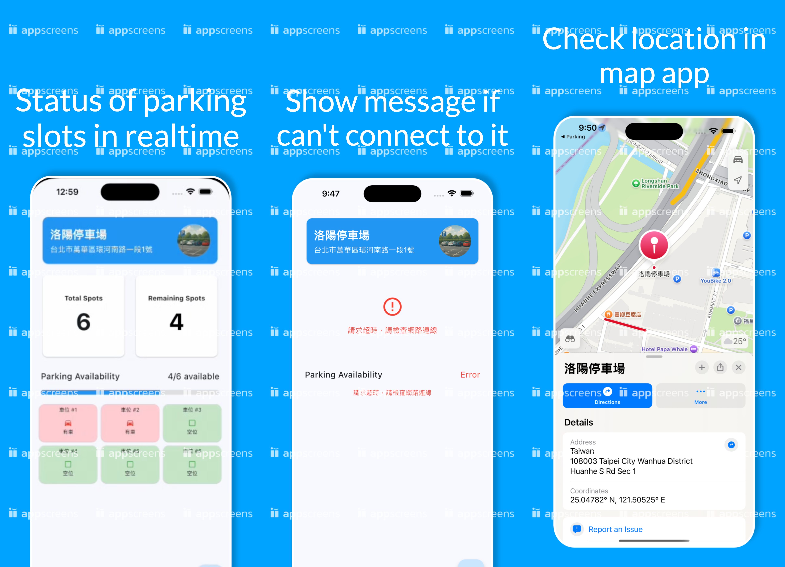

這學期的 Flutter 和 IoT 課程終於結束了，真的是有點不容易。雖然說在做期末專題中途發生了一些曲折，包括在中途因為時間不足以處理完整個大架構的串接，還有因為在大學，考試時間不太固定，所以在時間安排上也經常要進行調整，但是最後還是在願意放下一些東西的狀況下，成功地完成了這次的專題，最後也感謝彼得對於期末專題的開放性是如此大，可以因要跟一些其他課程結合的因素而接受需求變動。
:::note
本文有些圖片內容為報告截圖，因那時不知道物聯網課程 Demo 此專題時誰要上去報告，所以內容雖然皆由本人直接撰寫，但我們這組有僑生成員，故全部皆使用英文撰寫。但是請各位讀者不用擔心，本人會在文中輔以繁體中文解釋相關內容。
:::
## System Structure


原始系統如上圖所示，箭頭旁的文字是該互動所牽涉到的 protocol，因為這學期的物聯網課程是使用 Node-RED 與 oneM2M 為主，所以原本希望說可以保留類似的架構進行製作，並且已經想好大概要怎麼做了，但是因為微積分考試是跟我目前修的所有課程中，考試時間最不同的，所以微積分考試嚴重影響了我做專題的時間。

而在成果發表前的週末，我請了組員幫我處理 Arduino 端的程式碼，並告訴了他如何處理跟 M2M 系統互動的部分，但是結果他直接請了 AI，並且不小心請 AI 把整個裝置 server 都寫出來。我當下也是有點傻了，雖然該組員說他可以請我給關鍵字，讓他請 AI 幫忙改成可以跟 M2M 系統相接，但是我當下完全想不到我要下什麼關鍵字（在 [IoT Final Project 1 - The Beginning](/posts/iotproject) 中，我有提到 M2M 是我自己寫的），所以只好當機立斷，直接變更整個架構，故最終架構如下圖所示：


雖然說真的是非常的簡單，但沒辦法嘛！那天距離成果發表就剩三天，進度目前就這樣，還能再搞出什麼瘋狂的東西？反正關於儲存等其他部分，或許未來在還可以在其他物聯網課程中，將這系統直接拿來用，並進行其他改善，或許也是個不錯的選擇。

## Techniques We Use
這次最終有使用到的有以下技術。

不過在此解釋一下，Docker 旁邊標的 `Deprecated` 是代表我們原本有執行一些使用該技術的手續，但是最後在使用時遇到問題，並且不知道怎麼處理，所以只能先放棄使用，非指 Docker 本身是個已被棄用的東西。


我們使用的技術大概簡述如下：
* **Arduino UNO:** 一個義大利公司產的微控制器開發板
* **JavaScript & Jonhhy-five:** JavaScript 是一個用於網頁的程式語言，但 Node.js 出現後，使其也可以用來開發後端。而 Johnny-five 是一個可以透過 JavaScript 來控制 Arduino 的一個 library。
* **Flutter:** 一個由 Google 公司所開發的礦平台應用程式開發框架。
* **Docker:** 一個可以幫助開發者將其應用程式打包成簡單的 image 並且可直接部署至其他裝置執行的好用工具。

## Sensors We Use​
這次最終有使用到的有以下感應器。


用途簡單說明如下：
* **IR 避障感應器:** 偵測車位狀態、是否有車子要進去或離開停車場
* **20 x 4 顯示器:** 顯示停車場內的車位狀態
* **SG90 迷你伺服馬達:** 控制柵欄升降

## Circuit Diagrams
圖片的原圖來自此網站，只是因為我們本次專案不會採用變壓器供電，所以有將原圖進行修改。

https://www.hackster.io/embeddedlab786/automatic-car-parking-system-95a9dc


## System Exhibition
由於沒有足夠的玩具車，故在此有東西拿玩具代替


## App Exhibition
:::note
因應 Flutter 課程作業需求，但本人平常沒用且沒有付費，所以有浮水印，請見諒。
:::


## App Code Explaination
### Folder Structure
這次因為 Flutter 應用程式跟其他課程結合，所以沒有很複雜，資料夾結構跟之前也是差不多的


### Code Explaination
首先是自訂型別的部分，在抓到資料後，會將資料中的 `data` 部分取出並呼叫 factory function 轉換成 `SlotData` 類別的物件實體。而在資料載入狀態的部分，則會以 `ParkingDataState` 儲存，因其 enhanced enum 不像 Rust 的 enum 可以針對不同窮舉值儲存不同型別值。
```dart title="slotData.dart"
class SlotData {
  List<bool> slots;
  int totalSlots;
  int avaliableSlots;
  bool gateOpen;
  bool systemReady;

  SlotData({
    required this.slots,
    required this.totalSlots,
    required this.avaliableSlots,
    required this.gateOpen,
    required this.systemReady,
  });

  factory SlotData.fromJson(Map<String, dynamic> json) {
    return SlotData(
      slots: List<bool>.from(json['slots'] ?? []),
      totalSlots: json['totalSlots'] ?? 0,
      avaliableSlots: json['avaliableSlots'] ?? 0,
      gateOpen: json['gateOpen'] ?? false,
      systemReady: json['systemReady'] ?? false,
    );
  }

  Map<String, dynamic> toJson() {
    return {
      'slots': slots,
      'totalSlots': totalSlots,
      'avaliableSlots': avaliableSlots,
      'gateOpen': gateOpen,
      'systemReady': systemReady,
    };
  }
}

class ParkingDataState {
  final SlotData? data;
  final bool isLoading;
  final String? error;

  ParkingDataState({this.data, this.isLoading = false, this.error});

  factory ParkingDataState.loading() {
    return ParkingDataState(isLoading: true);
  }

  factory ParkingDataState.error(String error) {
    return ParkingDataState(error: error);
  }

  factory ParkingDataState.success(SlotData data) {
    return ParkingDataState(data: data);
  }
}
```
接下來就是有切開的 Widget，由上而下。
首先是頂部部分的 banner，其可以顯示停車場資訊，點一下可以透過 `maps_launcher` 在手機的地圖軟體中開啟停車場的位置。
```dart title="topbar.dart"
import 'package:flutter/material.dart';
import 'package:maps_launcher/maps_launcher.dart';

class TopBar extends StatelessWidget {
  const TopBar({super.key});

  @override
  Widget build(BuildContext context) {
    return Padding(
      padding: const EdgeInsets.only(top: 20.0, left: 8.0, right: 8.0),
      child: Card(
        color: Colors.blue,
        clipBehavior: Clip.hardEdge,
        child: InkWell(
          splashColor: Colors.grey.withAlpha(40),
          onTap: () {
            MapsLauncher.launchCoordinates(25.04782398,121.50525497, "洛陽停車場");
          },
          child: Container(
            width: double.infinity,
            height: 100,
            padding: const EdgeInsets.symmetric(vertical: 4.0),
            child: const Row(
              mainAxisAlignment: MainAxisAlignment.spaceBetween,
              children: [
                Padding(
                  padding: EdgeInsets.only(left: 16.0),
                  child: Column(
                    mainAxisAlignment: MainAxisAlignment.center,
                    crossAxisAlignment: CrossAxisAlignment.start,
                    children: [
                      Text(
                        "洛陽停車場",
                        style: TextStyle(
                          fontSize: 24,
                          color: Colors.white,
                          fontWeight: FontWeight.bold,
                        ),
                      ),
                      SizedBox(height: 4),
                      Text(
                        "台北市萬華區環河南路一段1號",
                        style: TextStyle(
                          fontSize: 16,
                          fontWeight: FontWeight.w500,
                          color: Colors.white,
                        ),
                      ),
                    ],
                  ),
                ),
                Padding(
                  padding: EdgeInsets.only(right: 16.0),
                  child: CircleAvatar(
                    radius: 35,
                    backgroundImage: AssetImage('assets/Parking_icon.png'),
                  ),
                ),
              ],
            ),
          ),
        ),
      ),
    );
  }
}
```
接下來就是停車場剩餘位置計數器。基本上整個顯示邏輯是先執行抓取資料確認，如果抓到的資料有任何問題或者在抓取中有遇到任何問題的話，進行提早傳回對應情況需要顯示的 widget。如果確認資料都沒有問題後，就進行資料顯示。
```dart title="slotdata.dart"
import 'package:animated_flip_counter/animated_flip_counter.dart';
import 'package:flutter/material.dart';

import '../Types/slotdata.dart';

class SlotDataWidget extends StatelessWidget {
  final ParkingDataState state;

  const SlotDataWidget({super.key, required this.state});

  @override
  Widget build(BuildContext context) {
    if (state.isLoading) {
      return SizedBox(
        height: 200,
        child: Center(
          child: Column(
            mainAxisAlignment: MainAxisAlignment.center,
            children: [
              CircularProgressIndicator(
                strokeWidth: 3,
                valueColor: const AlwaysStoppedAnimation<Color>(Colors.blue),
                backgroundColor: Colors.grey[200],
              ),
              const SizedBox(height: 16),
              const Text("資料載入中...", style: TextStyle(fontSize: 16)),
            ],
          ),
        ),
      );
    }

    if (state.error != null) {
      return SizedBox(
        height: 200,
        child: Center(
          child: Column(
            mainAxisAlignment: MainAxisAlignment.center,
            children: [
              const Icon(Icons.error_outline, color: Colors.red, size: 48),
              const SizedBox(height: 16),
              Text(
                state.error!,
                style: const TextStyle(color: Colors.red, fontSize: 16),
                textAlign: TextAlign.center,
              ),
            ],
          ),
        ),
      );
    }

    final slotData = state.data;
    if (slotData == null) {
      return const SizedBox(
        height: 200,
        child: Center(
          child: Text("No data available", style: TextStyle(fontSize: 16)),
        ),
      );
    }

    return SizedBox(
      height: 200,
      child: GridView(
        gridDelegate: const SliverGridDelegateWithFixedCrossAxisCount(
          crossAxisCount: 2,
          childAspectRatio: 1.0,
        ),
        physics: const NeverScrollableScrollPhysics(),
        children: [
          Padding(
            padding: const EdgeInsets.all(8.0),
            child: Card(
              color: Colors.white,
              shape: RoundedRectangleBorder(
                borderRadius: BorderRadius.circular(10.0),
              ),
              child: Center(
                child: Column(
                  mainAxisAlignment: MainAxisAlignment.center,
                  children: [
                    const Text(
                      "Total Spots",
                      style: TextStyle(fontWeight: FontWeight.bold),
                    ),
                    const SizedBox(height: 4.0),
                    AnimatedFlipCounter(
                      value: slotData.totalSlots,
                      textStyle: const TextStyle(
                        fontWeight: FontWeight.bold,
                        fontSize: 50,
                      ),
                    ),
                  ],
                ),
              ),
            ),
          ),
          Padding(
            padding: const EdgeInsets.all(8.0),
            child: Card(
              color: Colors.white,
              shape: RoundedRectangleBorder(
                borderRadius: BorderRadius.circular(10.0),
              ),
              child: Center(
                child: Column(
                  mainAxisAlignment: MainAxisAlignment.center,
                  children: [
                    const Text(
                      "Remaining Spots",
                      style: TextStyle(fontWeight: FontWeight.bold),
                    ),
                    const SizedBox(height: 4.0),
                    AnimatedFlipCounter(
                      value: slotData.avaliableSlots,
                      textStyle: TextStyle(
                        fontWeight: FontWeight.bold,
                        fontSize: 50,
                        color:
                            slotData.avaliableSlots > 0
                                ? Colors.black
                                : Colors.red,
                      ),
                    ),
                  ],
                ),
              ),
            ),
          ),
        ],
      ),
    );
  }
}
```
接下來就是提供一個進度條來顯示停車場已經被停的車位百分比。關於資料抓取狀態與資料檢查邏輯，基本上跟上一個是完全相同的。
```dart title="slotprogress.dart" collapse={12-83}
import 'package:flutter/material.dart';

import '../Types/slotdata.dart';

class SlotProgress extends StatelessWidget {
  final ParkingDataState state;

  const SlotProgress({super.key, required this.state});

  @override
  Widget build(BuildContext context) {
    if (state.isLoading) {
      return const Padding(
        padding: EdgeInsets.all(8.0),
        child: Column(
          children: [
            Row(
              mainAxisAlignment: MainAxisAlignment.spaceBetween,
              children: [
                Text(
                  "Parking Availability",
                  style: TextStyle(fontSize: 18, fontWeight: FontWeight.w500),
                ),
                Text("Loading...", style: TextStyle(fontSize: 18)),
              ],
            ),
            SizedBox(height: 16),
            LinearProgressIndicator(),
          ],
        ),
      );
    }

    if (state.error != null) {
      return Padding(
        padding: const EdgeInsets.all(8.0),
        child: Column(
          children: [
            const Row(
              mainAxisAlignment: MainAxisAlignment.spaceBetween,
              children: [
                Text(
                  "Parking Availability",
                  style: TextStyle(fontSize: 18, fontWeight: FontWeight.w500),
                ),
                Text(
                  "Error",
                  style: TextStyle(fontSize: 18, color: Colors.red),
                ),
              ],
            ),
            const SizedBox(height: 16),
            Text(
              state.error!,
              style: const TextStyle(color: Colors.red),
              textAlign: TextAlign.center,
            ),
          ],
        ),
      );
    }

    final slotData = state.data;
    if (slotData == null) {
      return const Padding(
        padding: EdgeInsets.all(8.0),
        child: Column(
          children: [
            Row(
              mainAxisAlignment: MainAxisAlignment.spaceBetween,
              children: [
                Text(
                  "Parking Availability",
                  style: TextStyle(fontSize: 18, fontWeight: FontWeight.w500),
                ),
                Text("No data", style: TextStyle(fontSize: 18)),
              ],
            ),
          ],
        ),
      );
    }

    return Padding(
      padding: const EdgeInsets.all(8.0),
      child: Column(
        children: [
          Row(
            mainAxisAlignment: MainAxisAlignment.spaceBetween,
            children: [
              const Text(
                "Parking Availability",
                style: TextStyle(fontSize: 18, fontWeight: FontWeight.w500),
              ),
              Text(
                "${slotData.avaliableSlots}/${slotData.totalSlots} available",
                style: TextStyle(
                  color:
                      slotData.avaliableSlots > 0 ? Colors.black : Colors.red,
                  fontSize: 18,
                ),
              ),
            ],
          ),
          const SizedBox(height: 16),
          ClipRRect(
            borderRadius: BorderRadius.circular(10),
            child: LinearProgressIndicator(
              value: slotData.avaliableSlots / slotData.totalSlots,
              minHeight: 10,
              backgroundColor: Colors.grey[300],
              valueColor: AlwaysStoppedAnimation<Color>(
                slotData.avaliableSlots > 0 ? Colors.blue : Colors.red,
              ),
            ),
          ),
        ],
      ),
    );
  }
}
```
最後就是每一個停車位的狀態，在此使用 GridView 進行每一個停車格的呈現。
```dart title="slotstatus.dart"
import 'package:flutter/material.dart';
import 'package:parking/Types/slotdata.dart';

class SlotStatus extends StatelessWidget {
  const SlotStatus({
    super.key,
    required ParkingDataState state,
  }) : _state = state;

  final ParkingDataState _state;

  @override
  Widget build(BuildContext context) {
    return SizedBox(
      height: 300,
      child: GridView.builder(
        gridDelegate:
            const SliverGridDelegateWithFixedCrossAxisCount(
              crossAxisCount: 3,
              childAspectRatio: 1.5,
            ),
        itemCount: _state.data!.slots.length,
        itemBuilder: (context, index) {
          final occupied = _state.data!.slots[index];
          return Card(
            color:
                occupied ? Colors.red[100] : Colors.green[100],
            child: Padding(
              padding: const EdgeInsets.all(4.0),
              child: Center(
                child: Column(
                  mainAxisAlignment: MainAxisAlignment.center,
                  mainAxisSize: MainAxisSize.min,
                  children: [
                    Expanded(
                      child: Text(
                        '車位 #${index + 1}',
                        style: const TextStyle(fontSize: 11),
                      ),
                    ),
                    const SizedBox(height: 2),
                    Icon(
                      occupied
                          ? Icons.directions_car
                          : Icons.check_box_outline_blank,
                      color:
                          occupied ? Colors.red : Colors.green,
                      size: 18,
                    ),
                    const SizedBox(height: 2),
                    Expanded(
                      child: Text(
                        occupied ? '有車' : '空位',
                        style: const TextStyle(fontSize: 11),
                      ),
                    ),
                  ],
                ),
              ),
            ),
          );
        },
      ),
    );
  }
}
```
最後就是程式的基底。因為前面都跟以前相同，所以就先折了。然後下方 build 各位應該也可以看到整個 `build` function 程式碼變超少，因為全部都搬到其他檔案去了，所也整個乾淨了許多。
```dart title="main.dart" collapse={1-31}
import 'package:flutter/material.dart';
import 'package:parking/Widgets/slotdata.dart';
import 'package:parking/Widgets/slotstatus.dart';
import 'package:parking/Widgets/topbar.dart';
import 'package:parking/Widgets/slotprogress.dart';
import 'package:parking/Types/slotdata.dart';
import 'package:http/http.dart' as http;
import 'dart:convert';
import 'dart:async';
import 'dart:io';

void main() {
  runApp(const MyApp());
}

class MyApp extends StatelessWidget {
  const MyApp({super.key});

  @override
  Widget build(BuildContext context) {
    return MaterialApp(
      debugShowCheckedModeBanner: false,
      title: 'Parking Area Info',
      theme: ThemeData(
        colorScheme: ColorScheme.fromSeed(seedColor: Colors.lightBlue),
      ),
      home: const MyHomePage(title: 'Parking Area Info'),
    );
  }
}

class MyHomePage extends StatefulWidget {
  final String title;

  const MyHomePage({super.key, required this.title});

  @override
  State<MyHomePage> createState() => _MyHomePageState();
}

class _MyHomePageState extends State<MyHomePage> {
  ParkingDataState _state = ParkingDataState.loading();
  final String _apiUrl = 'http://192.168.50.250:3000/api/status';
  final String _wsUrl = 'ws://192.168.50.250:3000/ws';
  WebSocket? _webSocket;
  StreamSubscription? _webSocketSubscription;

  Future<void> _loadData() async {
    setState(() {
      _state = ParkingDataState.loading();
    });

    try {
      // Add timeout to the request
      final response = await http
          .get(Uri.parse(_apiUrl))
          .timeout(
            const Duration(seconds: 5),
            onTimeout: () {
              throw TimeoutException('請求超時，請檢查網路連線');
            },
          );

      if (response.statusCode == 200) {
        final jsonData = json.decode(response.body);
        final data = SlotData.fromJson(jsonData);

        setState(() {
          _state = ParkingDataState.success(data);
        });
      } else {
        throw Exception('伺服器返回錯誤: ${response.statusCode}');
      }
    } on SocketException {
      setState(() {
        _state = ParkingDataState.error('無法連接到伺服器，請檢查網路連線');
      });
    } on TimeoutException catch (e) {
      setState(() {
        _state = ParkingDataState.error(e.message ?? '請求超時');
      });
    } on FormatException {
      setState(() {
        _state = ParkingDataState.error('資料格式錯誤');
      });
    } catch (e) {
      setState(() {
        _state = ParkingDataState.error('發生錯誤: ${e.toString()}');
      });
    }

    if (mounted && _state.error != null) {
      ScaffoldMessenger.of(context).showSnackBar(
        SnackBar(
          content: Text(_state.error!),
          backgroundColor: Colors.red,
          duration: const Duration(seconds: 3),
          action: SnackBarAction(
            label: '重試',
            textColor: Colors.white,
            onPressed: _loadData,
          ),
        ),
      );
    }
  }

  @override
  void initState() {
    super.initState();
    _loadData();
    _connectWebSocket();
  }

  @override
  void dispose() {
    _webSocketSubscription?.cancel();
    _webSocket?.close();
    super.dispose();
  }

  void _connectWebSocket() async {
    try {
      print('Attempting to connect to WebSocket at $_wsUrl');
      final socket = await WebSocket.connect(_wsUrl);
      print('WebSocket connected successfully');
      _webSocket = socket;
      _webSocketSubscription = _webSocket?.listen(
        (data) {
          try {
            print('Received WebSocket data: $data');
            final Map<String, dynamic> jsonData = jsonDecode(data);
            if (jsonData['type'] != "parkingUpdate") {
              print(
                'Received unexpected WebSocket data type: ${jsonData['type']}, ignoring',
              );
              return;
            }
            final updatedData = SlotData.fromJson(jsonData['data']);
            setState(() {
              _state = ParkingDataState.success(updatedData);
            });
          } catch (e) {
            print('Error parsing WebSocket data: $e');
            setState(() {
              _state = ParkingDataState.error('WebSocket數據格式錯誤');
            });
          }
        },
        onError: (error) {
          print('WebSocket error: $error');
          setState(() {
            _state = ParkingDataState.error('WebSocket連接錯誤');
          });
          _reconnectWebSocket();
        },
        onDone: () {
          print('WebSocket connection closed');
          setState(() {
            _state = ParkingDataState.error('WebSocket連接已關閉');
          });
          _reconnectWebSocket();
        },
      );
    } catch (e) {
      print('Error connecting to WebSocket: $e');
      setState(() {
        _state = ParkingDataState.error('無法連接到伺服器');
      });
      _reconnectWebSocket();
    }
  }

  void _reconnectWebSocket() {
    print('Attempting to reconnect WebSocket in 3 seconds...');
    Future.delayed(const Duration(seconds: 3), () {
      if (mounted) {
        _connectWebSocket();
      }
    });
  }

  @override
  Widget build(BuildContext context) {
    return Scaffold(
      body: SafeArea(
        child: RefreshIndicator(
          onRefresh: _loadData,
          child: SingleChildScrollView(
            physics: const AlwaysScrollableScrollPhysics(),
            child: Container(
              height:
                  MediaQuery.of(context).size.height -
                  MediaQuery.of(context).padding.top,
              padding: const EdgeInsets.only(left: 16.0, right: 16.0),
              child: Column(
                children: [
                  const TopBar(),
                  const SizedBox(height: 8),
                  SlotDataWidget(state: _state),
                  const SizedBox(height: 8),
                  SlotProgress(state: _state),
                  const SizedBox(height: 8),
                  if (_state.data != null)
                    SlotStatus(state: _state),
                ],
              ),
            ),
          ),
        ),
      ),
      floatingActionButton: FloatingActionButton(
        onPressed: _loadData,
        tooltip: 'Reload',
        child: const Icon(Icons.refresh),
      ),
    );
  }
}
```
當然關於所有作業要求部分都在這裡，在這歡迎各位去看。而本人也已經盡量達到作業要求，且將因為此 APP 要跟其他課程結合，所以有些作業要求達不到的事告訴 Flutter 課程的彼得，而他也同意了，非常感謝。

https://medium.com/%E5%BD%BC%E5%BE%97%E6%BD%98%E7%9A%84%E8%A9%A6%E7%85%89-%E5%8B%87%E8%80%85%E7%9A%84-100-%E9%81%93-swift-ios-app-%E8%AC%8E%E9%A1%8C/222-%E5%A4%A7%E5%AD%B8%E7%9A%84-flutter-app-%E5%85%A5%E9%96%80%E8%AA%B2%E7%A8%8B%E6%9C%9F%E6%9C%AB%E5%B0%88%E9%A1%8C-6e1c760eecf8

## Final Exhibition
主要系統與 App 主功能展示
<div style="position:relative; width:100%; height:0px; padding-bottom:56.250%"><iframe allow="fullscreen" allowfullscreen height="100%" src="https://streamable.com/e/glfrzf?" width="100%" style="border:none; width:100%; height:100%; position:absolute; left:0px; top:0px; overflow:hidden;"></iframe></div>

App 其他部分展示
<div style="position:relative; width:100%; height:0px; padding-bottom:217.687%"><iframe allow="fullscreen" allowfullscreen height="100%" src="https://streamable.com/e/vioty7?" width="100%" style="border:none; width:100%; height:100%; position:absolute; left:0px; top:0px; overflow:hidden;"></iframe></div>

