這個編輯器其實我已經在些許年前就聽過它了，只是因為該編輯器無法新增編輯器背景，所以才沒有用，不過隨著後來看到了 Rust 程式的強悍，而 Zed 也是使用 Rust 製作的，而且我身邊也有些人也開始雪則使用 Zed 進行程式開發，所以我也下載了下來，用了也覺得不錯。而最近也看到了部落客彼得寫了一篇文章[使用 Zed IDE 的 AI 提示寫文章](https://medium.com/%E5%BD%BC%E5%BE%97%E6%BD%98%E7%9A%84-swift-ios-app-%E9%96%8B%E7%99%BC%E6%95%99%E5%AE%A4/%E4%BD%BF%E7%94%A8-zed-ide-%E7%9A%84-ai-%E6%8F%90%E7%A4%BA%E5%AF%AB%E6%96%87%E7%AB%A0-b6840c01400d)，所以本人覺得這次就來研究如何在 Mac 上使用 Zed 開發 Flutter 程式吧！
## Before You Start
* 由於 Zed 目前 Flutter 沒有那麼好，所以開發體驗相對來說是不如 VSCode 系列編輯器的，並且目前 extension 部分只有 Dart 的 extension，沒有 Flutter 的 extension，所以在專案管理與執行方面等皆需要透過指令的方式進行，若無法接受，請還是先以 VScode 為主，之後支援度較高時再切換即可。
## Install Zed
首先請前往 Zed 官網，並按下 `Download Now` 進行下載

https://zed.dev/


然後點選 `Download Now` 進行下載


下載完後打開檔案，將程式拖入 Applications 資料夾即完成安裝

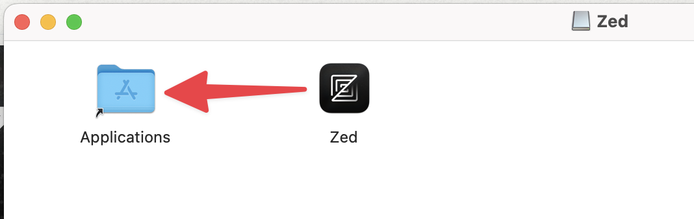

## Install Flutter SDK and Relative Tools
這裡就會沒有像 VSCode 系列編輯器那麼方便了，由於沒有 extension 的輔助，我們需要自己手動安裝

### Flutter SDK
首先先前往這裡的約中間處下載 Flutter SDK 壓縮檔

https://docs.flutter.dev/get-started/install/macos/mobile-ios#install-the-flutter-sdk

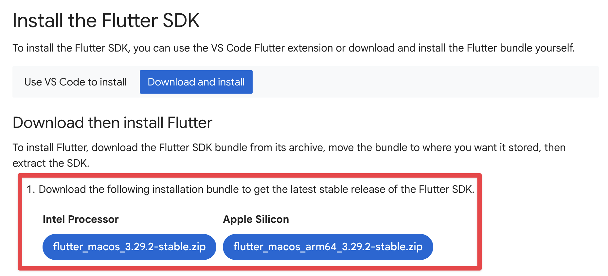

由於 SDK 下載需要一點時間，所以在下載時，我們先建立一個可以安裝 Flutter SDK 的地方，在此本人選擇在 `~/development/` 資料夾下：
```bash title="Terminal"
mkdir ~/development/
```

下載完成後，即可將 Flutter SDK 解壓縮並放進剛剛建立的資料夾下：
```bash title="Terminal"
unzip ~/Downloads/flutter_macos_arm64_3.29.2-stable.zip \
       -d ~/development/
```

:::note
輸入指令時請注意路徑與檔案名
:::

### Add Flutter to PATH
為了以後方便在終端機執行 Flutter 指令，接下來我們就把 Flutter 加入 PATH 吧！

首先我們需要以 vim 開啟 `~/.zshenv`，若沒有該檔案可先建立：
```bash title="Terminal"
vim ~/.zshenv
```

接下來按 `I` 進行插入，並在檔案尾端加入這行
```bash title="Terminal"
export PATH=$HOME/development/flutter/bin:$PATH
```

加入完成後按一下 `Esc`，然後輸入 `:wq` 寫入並退出，之後重啟終端機就完成了

### Install Xcode (iOS)
首先先前往 App Store 下載 Xcode：
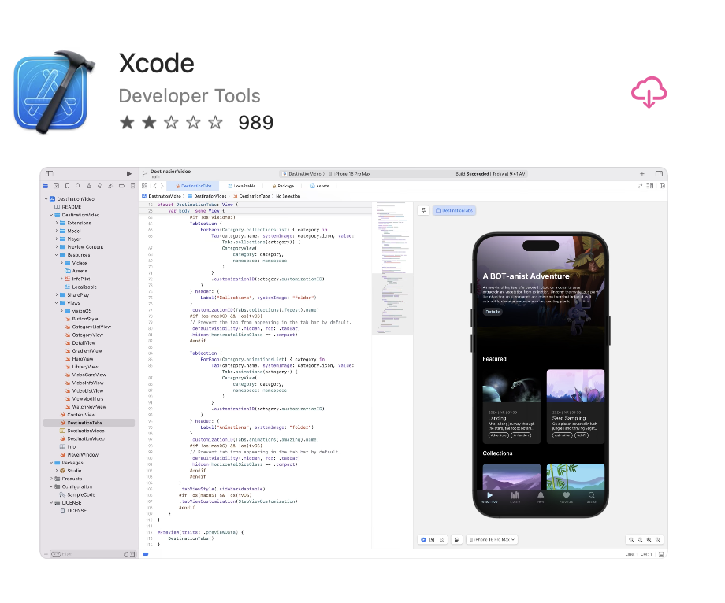
安裝完成後請輸入下方指令進行同意授權與在終端機使用 Xcode 相關設定：
```bash title="Terminal"
sudo sh -c 'xcode-select -s /Applications/Xcode.app/Contents/Developer && xcodebuild -runFirstLaunch'
```
完成之後，請打開 Xcode 並安裝 iOS 支援的相關元件，若您是第一次安裝，則第一次啟動時會有一個視窗，勾選 iOS 後按下下方按鈕，軟體會自動幫你安裝，如果沒有出現該視窗，則可以前往 `Xcode` -> `Settings` -> `Components` 查看，如果該項如下圖所示，則安裝完成，若無請進行安裝。
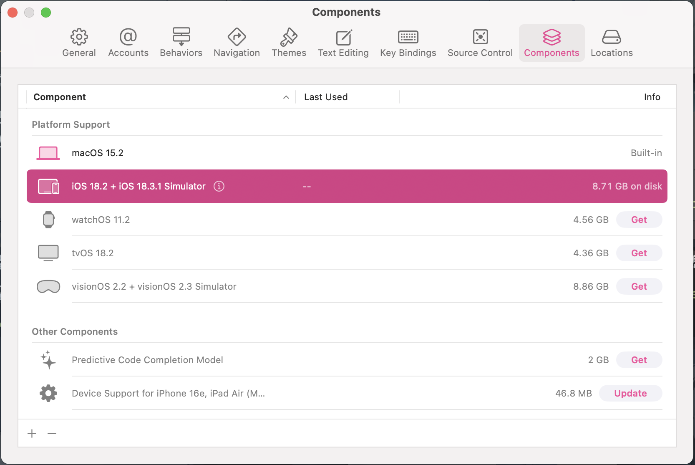

### Update Ruby (iOS)
若您以後有需要使用到 iOS Native Code 的 Flutter Plugin 的話，則需要安裝 CocoaPods。

但在安裝之前，請先透過以下指令查看您電腦上目前的 Ruby 版本：
```bash title="Terminal"
ruby --version
```
如果版本為舊版（例如：2.6.10）請繼續進行以下步驟，若已經是最新版可直接跳過這部分。

首先執行以下指令安裝 rbenv：
```bash title="Terminal"
brew install rbenv
```
安裝完成之後，輸入以下指令進行 rbenv 初始設定：
```bash title="Terminal"
rbenv init
```
查看可安裝的 Ruby 版本：
```bash title="Terminal"
rbenv install -l
```
找到最新的版本後，輸入以下指令安裝：
```bash title="Terminal"
rbenv install 3.4.2
```
安裝好之後，輸入以下兩個指令指定預設 ruby 版本：
```bash title="Terminal"
rbenv global 3.4.2
rbenv shell 3.4.2
```
之後重啟終端機，輸入以下指令確認版本為剛剛裝的版本即完成
```bash title="Terminal"
ruby --version
```
### Install CocoaPods (iOS)
更新完 Ruby 後就可以安裝 CocoaPods 了，請再次確認您的 Ruby 已經更新完畢，否則等一下是有可能會安裝失敗的喔！

首先輸入以下指令安裝 CocoaPods：
```bash title="Terminal"
sudo gem install cocoapods
```
安裝完成後，請再次在 vim 中打開 `~/.zshenv`
```bash title="Terminal"
vim ~/.zshenv
```
然後按 `I` 進入插入模式，然後在檔案尾端加入以下這行
```bash title="Terminal"
export PATH=$HOME/.gem/bin:$PATH
```
完成編輯後一樣按一下 `Esc`，然後輸入 `:wq` 一樣寫入並關閉檔案，並重啟終端機

最後執行一下 `flutter doctor` 指令檢查一下，Xcode 左側出現勾勾即安裝完成
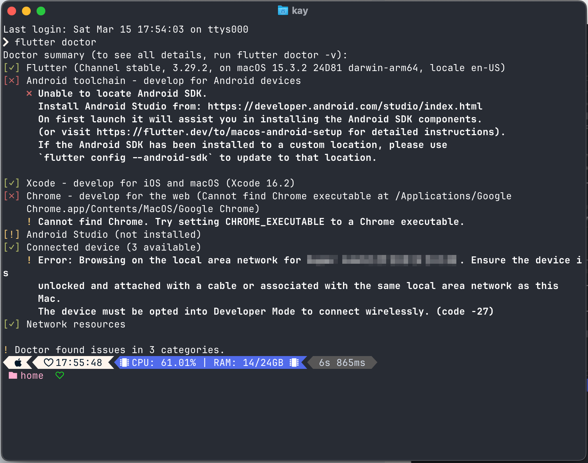
### Install Android Studio (Android)
首先先前往 [Android Developer](https://developer.android.com/studio?hl=zh-tw) 頁面下載：
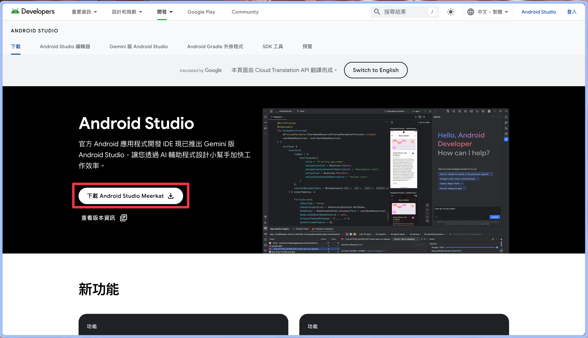
接下來同意上述條款及細則，然後下載
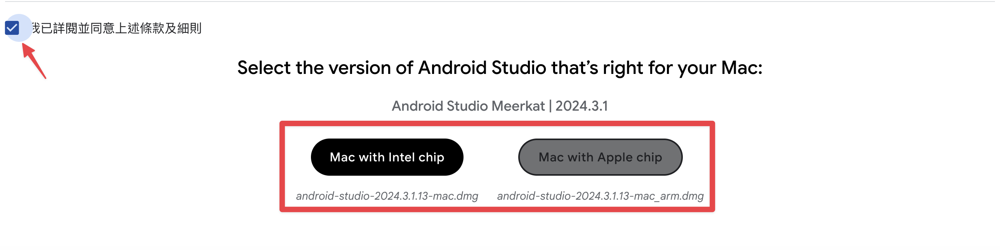
下載完成後點開安裝檔，將 Android Studio 拖入 Application 資料夾即完成安裝
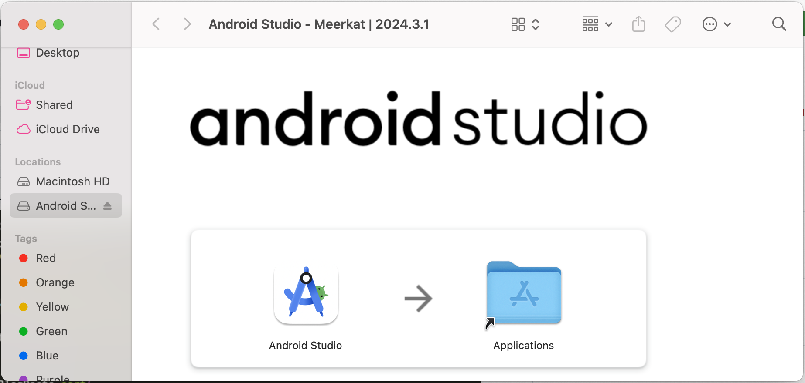
### Install Android Toolchain (Android)
首先開啟 Android Studio，然後按下一步：
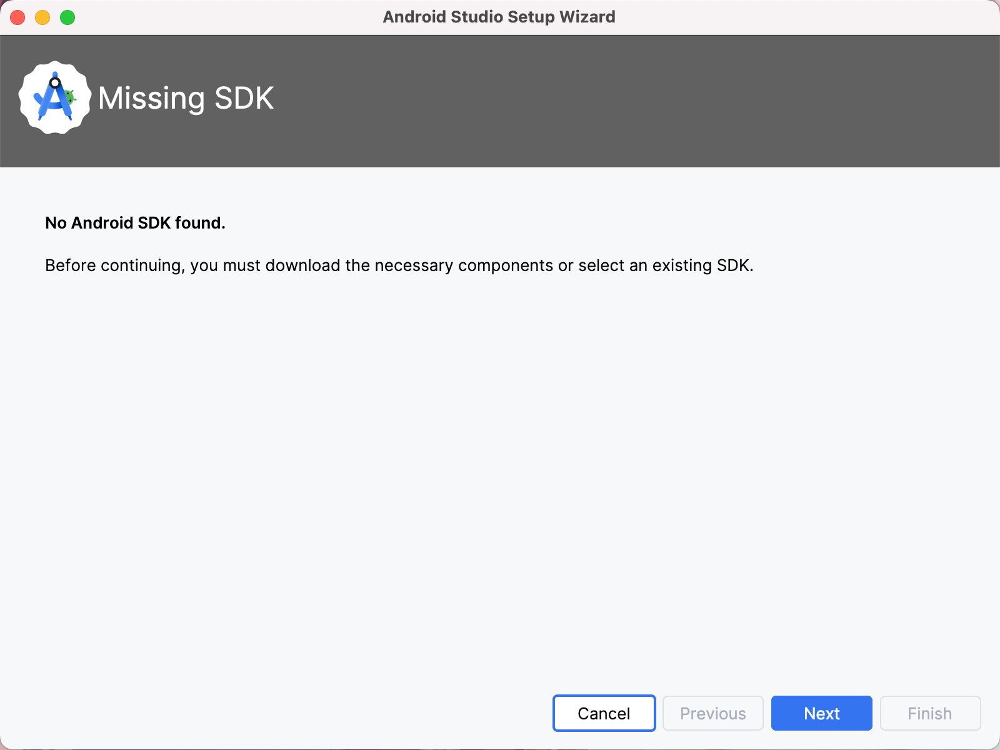
這裡不用動，一樣按下一步
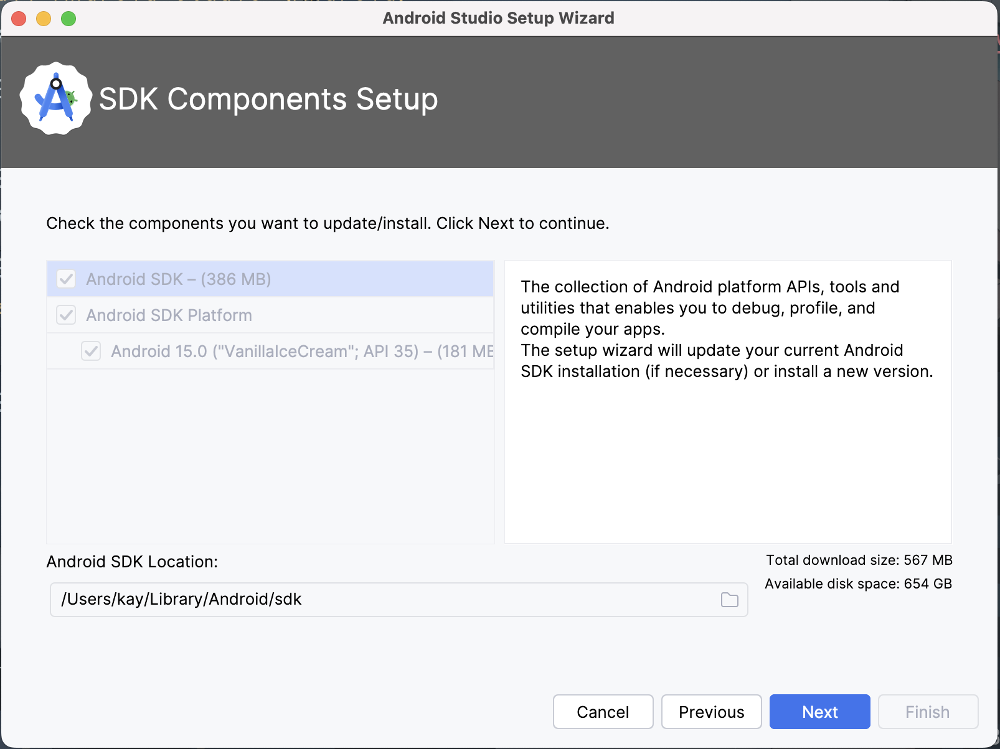
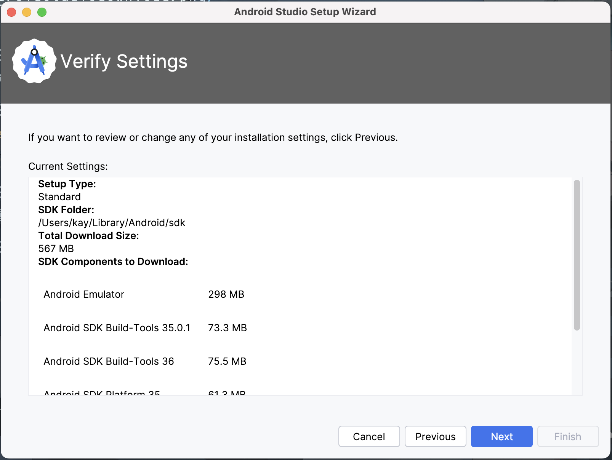
按下右下角的 `Accept` 即可按下 `Finished` 開始安裝相關工具
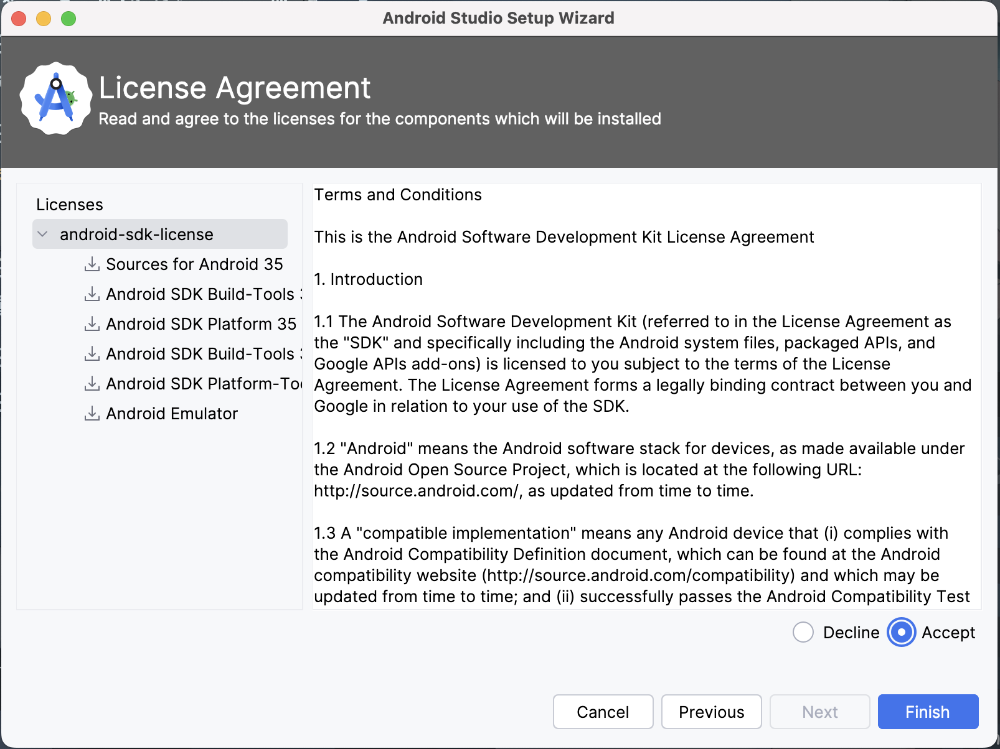
成功安裝完成後按下 `Finished`
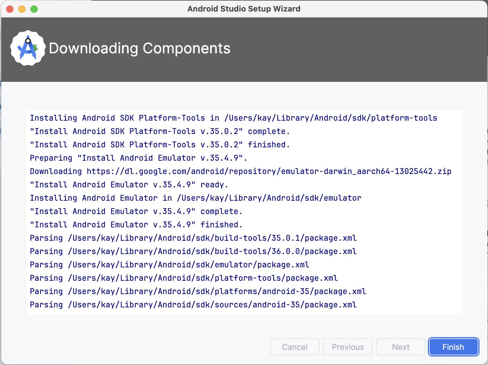
出現 Android Studio 視窗後，按下快速鍵 `Cmd + ,` 打開設定，前往 Android SDK 管理頁面，勾選 `Android SDK Command-line Tools`，然後點 `Apply` 安裝
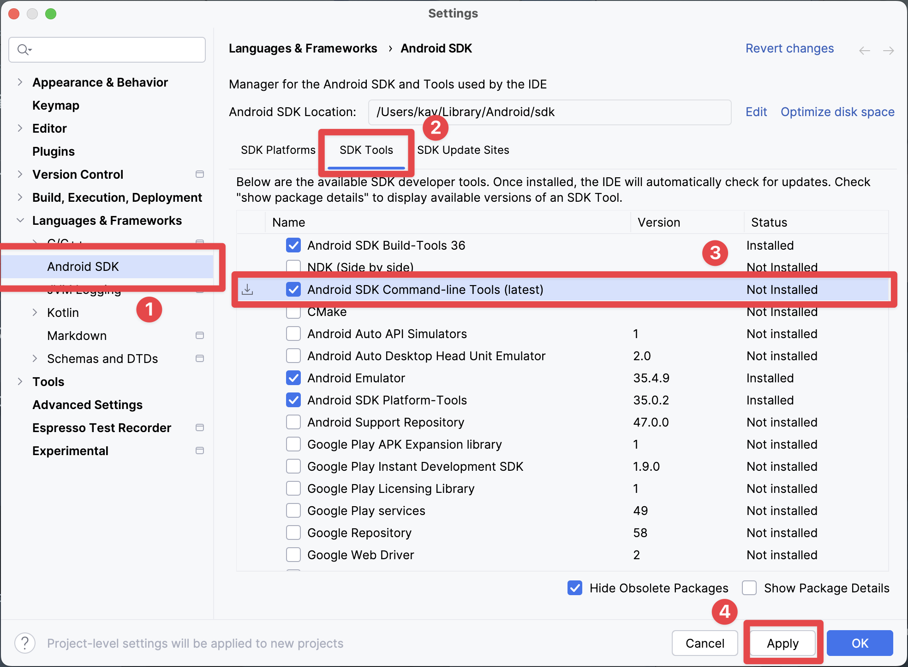
安裝完成後即可關閉 Android Studio，在終端機中輸入以下指令同意相關條款
```bash title="Terminal"
flutter doctor --android-licenses
```
中途狂按 `y` 即可，完成後輸入 `flutter doctor`，確認 `Android toolchain` 左側已打勾即安裝完成
