這個編輯器其實我已經在些許年前就聽過它了，只是因為該編輯器無法新增編輯器背景，所以才沒有用，不過隨著後來看到了 Rust 程式的強悍，而 Zed 也是使用 Rust 製作的，而且我身邊也有些人也開始雪則使用 Zed 進行程式開發，所以我也下載了下來，用了也覺得不錯。而最近也看到了部落客彼得寫了一篇文章[使用 Zed IDE 的 AI 提示寫文章](https://medium.com/%E5%BD%BC%E5%BE%97%E6%BD%98%E7%9A%84-swift-ios-app-%E9%96%8B%E7%99%BC%E6%95%99%E5%AE%A4/%E4%BD%BF%E7%94%A8-zed-ide-%E7%9A%84-ai-%E6%8F%90%E7%A4%BA%E5%AF%AB%E6%96%87%E7%AB%A0-b6840c01400d)，所以本人覺得這次就來研究如何在 Mac 上使用 Zed 開發 Flutter 程式吧！
## Before You Start
* 由於 Zed 目前 Flutter 沒有那麼好，所以開發體驗相對來說是不如 VSCode 系列編輯器的，並且目前 extension 部分只有 Dart 的 extension，沒有 Flutter 的 extension，所以在專案管理與執行方面等皆需要透過指令的方式進行，若無法接受，請還是先以 VScode 為主，之後支援度較高時再切換即可。
## Install Zed
首先請前往 Zed 官網，並按下 `Download Now` 進行下載

https://zed.dev/

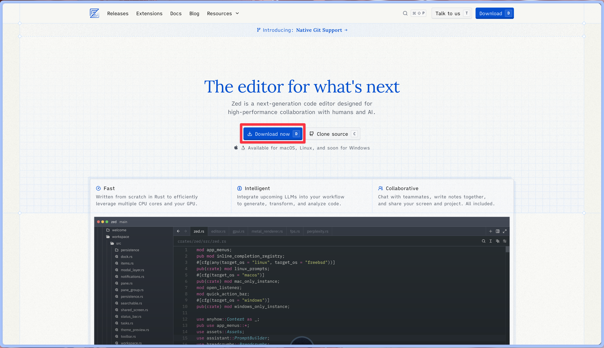

然後點選 `Download Now` 進行下載

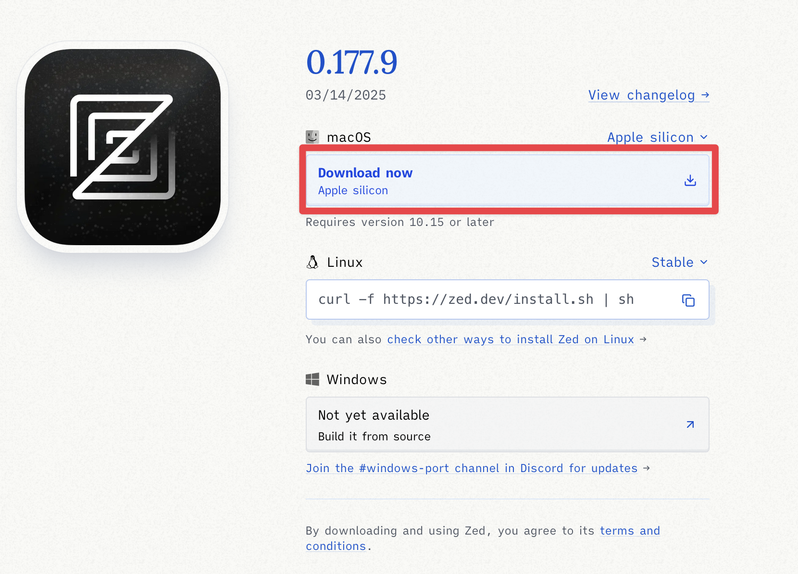

下載完後打開檔案，將程式拖入 Applications 資料夾即完成安裝


## Install Flutter SDK and Relative Tools
這裡就會沒有像 VSCode 系列編輯器那麼方便了，由於沒有 extension 的輔助，我們需要自己手動安裝

### Flutter SDK
首先先前往這裡的約中間處下載 Flutter SDK 壓縮檔

https://docs.flutter.dev/get-started/install/macos/mobile-ios#install-the-flutter-sdk


由於 SDK 下載需要一點時間，所以在下載時，我們先建立一個可以安裝 Flutter SDK 的地方，在此本人選擇在 `~/development/` 資料夾下：
```bash title="Terminal"
mkdir ~/development/
```

下載完成後，即可將 Flutter SDK 解壓縮並放進剛剛建立的資料夾下：
```bash title="Terminal"
unzip ~/Downloads/flutter_macos_arm64_3.29.2-stable.zip \
       -d ~/development/
```

:::note
輸入指令時請注意路徑與檔案名
:::

### Add Flutter to PATH
為了以後方便在終端機執行 Flutter 指令，接下來我們就把 Flutter 加入 PATH 吧！

首先我們需要以 vim 開啟 `~/.zshenv`，若沒有該檔案可先建立：
```bash title="Terminal"
vim ~/.zshenv
```

接下來按 `I` 進行插入，並在檔案尾端加入這行
```bash title="Terminal"
export PATH=$HOME/development/flutter/bin:$PATH
```

加入完成後按一下 `Esc`，然後輸入 `:wq` 寫入並退出，之後重啟終端機就完成了

### Install Xcode (iOS)
首先先前往 App Store 下載 Xcode：

安裝完成後請輸入下方指令進行同意授權與在終端機使用 Xcode 相關設定：
```bash title="Terminal"
sudo sh -c 'xcode-select -s /Applications/Xcode.app/Contents/Developer && xcodebuild -runFirstLaunch'
```
完成之後，請打開 Xcode 並安裝 iOS 支援的相關元件，若您是第一次安裝，則第一次啟動時會有一個視窗，勾選 iOS 後按下下方按鈕，軟體會自動幫你安裝，如果沒有出現該視窗，則可以前往 `Xcode` -> `Settings` -> `Components` 查看，如果該項如下圖所示，則安裝完成，若無請進行安裝。


### Update Ruby (iOS)
若您以後有需要使用到 iOS Native Code 的 Flutter Plugin 的話，則需要安裝 CocoaPods。

但在安裝之前，請先透過以下指令查看您電腦上目前的 Ruby 版本：
```bash title="Terminal"
ruby --version
```
如果版本為舊版（例如：2.6.10）請繼續進行以下步驟，若已經是最新版可直接跳過這部分。

首先執行以下指令安裝 rbenv：
```bash title="Terminal"
brew install rbenv
```
安裝完成之後，輸入以下指令進行 rbenv 初始設定：
```bash title="Terminal"
rbenv init
```
查看可安裝的 Ruby 版本：
```bash title="Terminal"
rbenv install -l
```
找到最新的版本後，輸入以下指令安裝：
```bash title="Terminal"
rbenv install 3.4.2
```
安裝好之後，輸入以下兩個指令指定預設 ruby 版本：
```bash title="Terminal"
rbenv global 3.4.2
rbenv shell 3.4.2
```
之後重啟終端機，輸入以下指令確認版本為剛剛裝的版本即完成
```bash title="Terminal"
ruby --version
```
### Install CocoaPods (iOS)
更新完 Ruby 後就可以安裝 CocoaPods 了，請再次確認您的 Ruby 已經更新完畢，否則等一下是有可能會安裝失敗的喔！

首先輸入以下指令安裝 CocoaPods：
```bash title="Terminal"
sudo gem install cocoapods
```
安裝完成後，請再次在 vim 中打開 `~/.zshenv`
```bash title="Terminal"
vim ~/.zshenv
```
然後按 `I` 進入插入模式，然後在檔案尾端加入以下這行
```bash title="Terminal"
export PATH=$HOME/.gem/bin:$PATH
```
完成編輯後一樣按一下 `Esc`，然後輸入 `:wq` 一樣寫入並關閉檔案，並重啟終端機

最後執行一下 `flutter doctor` 指令檢查一下，Xcode 左側出現勾勾即安裝完成

### Install Android Studio (Android)
首先先前往 [Android Developer](https://developer.android.com/studio?hl=zh-tw) 頁面下載：

接下來同意上述條款及細則，然後下載

下載完成後點開安裝檔，將 Android Studio 拖入 Application 資料夾即完成安裝

### Install Android Toolchain (Android)
首先開啟 Android Studio，然後按下一步：

這裡不用動，一樣按下一步


按下右下角的 `Accept` 即可按下 `Finished` 開始安裝相關工具

成功安裝完成後按下 `Finished`

出現 Android Studio 視窗後，按下快速鍵 `Cmd + ,` 打開設定，前往 Android SDK 管理頁面，勾選 `Android SDK Command-line Tools`，然後點 `Apply` 安裝

安裝完成後即可關閉 Android Studio，在終端機中輸入以下指令同意相關條款
```bash title="Terminal"
flutter doctor --android-licenses
```
中途狂按 `y` 即可，完成後輸入 `flutter doctor`，確認 `Android toolchain` 左側已打勾即安裝完成
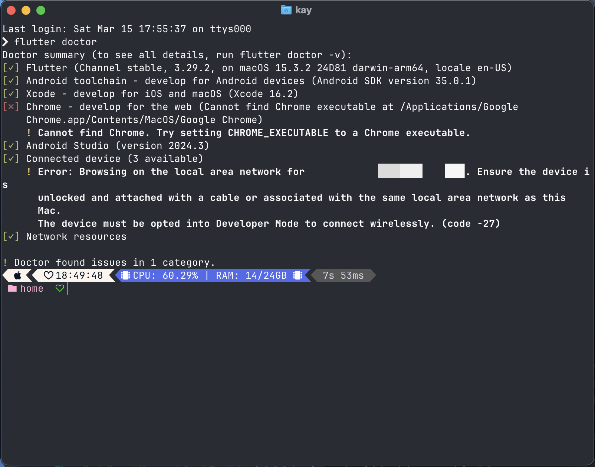

## Start Development
### Create Project
首先我們要先建立專案。以往各位在 VSCode 開發時，基本上都會直接使用 Flutter extension 提供的指令功能直接建立專案，很少會直接使用 Flutter 的終端機指令直接建立專案，但是在 Zed 裡，由於缺乏 Flutter extension，我們只能直接使用終端機指令直接建立專案。首先先開啟終端機，切換到你想儲存專案的資料夾，然後輸入以下指令
```bash title="Terminal"
flutter create myapp
```
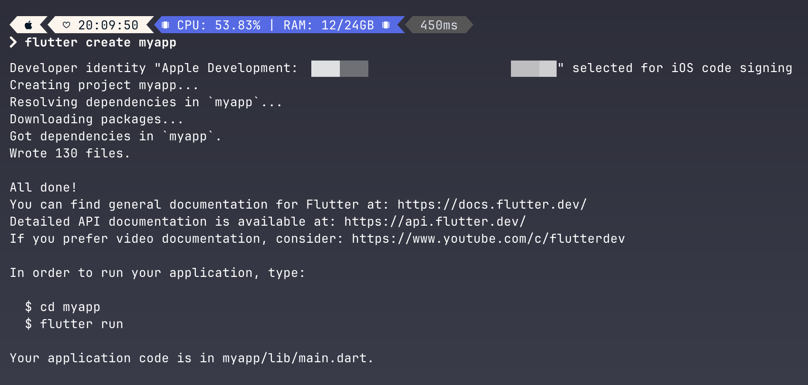

專案建立完成之後請切換到專案資料夾下，然後在 Zed 中開啟專案：
```bash title="Terminal"
cd myapp
zed .
```
### Install Dart Extension
開啟後在左側 dock 打開 `lib/main.dart` 即可開始編輯，不過......是不是好像少了什麼東西？
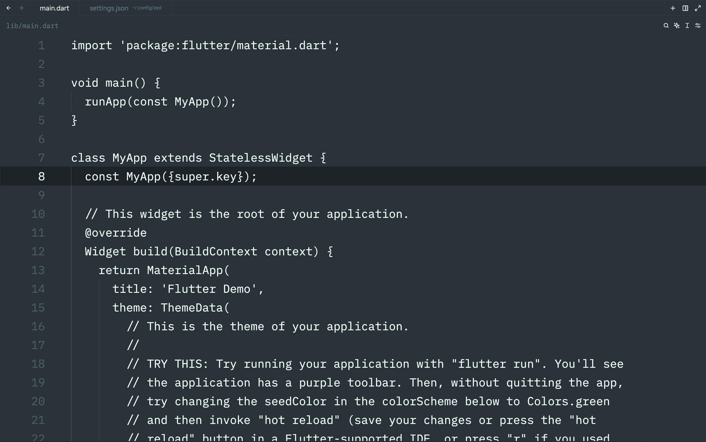
沒錯，就是 Dart extension，因為他預設沒有支援 Dart，所以我們需要安裝 Dart extension。首先我們需要按下 `Cmd + Shift + P`，然後在彈出的列表中找到 `zed: extensions` 按下 `Enter`
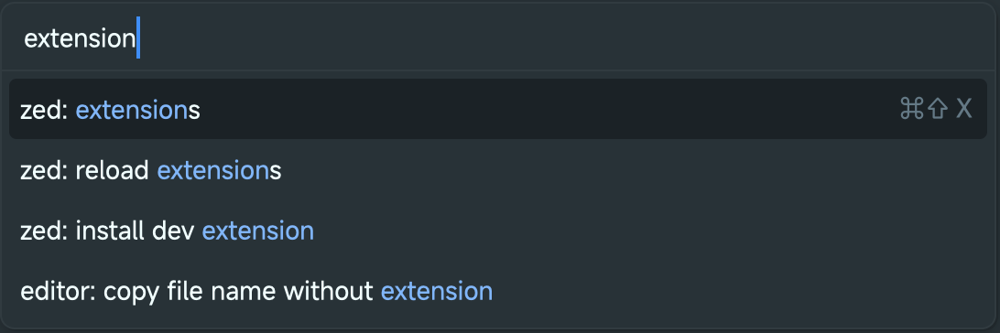
在 Extensions 頁面中的搜尋中輸入關鍵字即可找到 `Dart` 模組，點右側的 `Install` 即可安裝
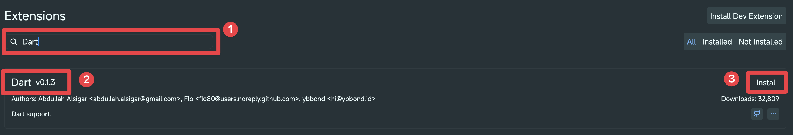
安裝完後回到 `lib/main.dart` 即可看到目前的程式碼已經有顏色了，並且在 `main` 旁邊已經多一個執行的按鈕
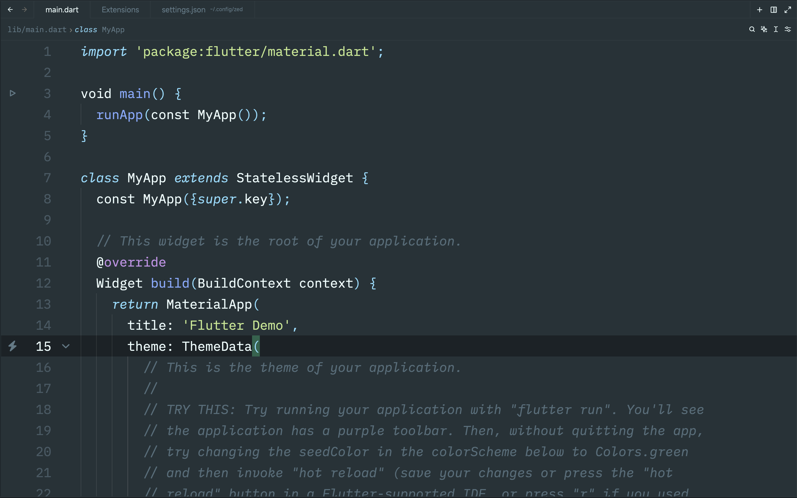
### Run Project
點一下 `void main` 旁的按鈕會出現一個列表，按下 `flutter run` 即可執行專案
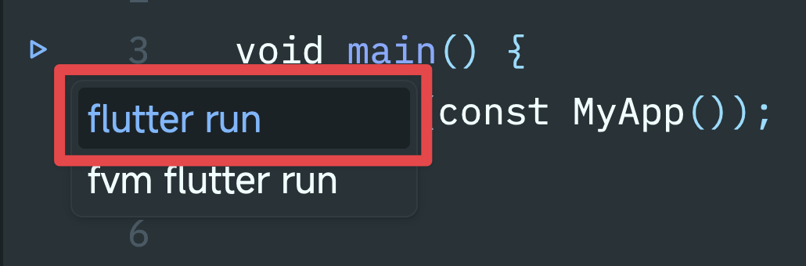
:::note
第二個選項 fvm 是一個可以管裡多個版本的 Flutter 工具，它除了可以為每個專案設定各自使用的 Flutter SDK 版本，也能讓你非常容易的將專案切到新版本的 Flutter SDK 中進行測試。由於篇幅關係，此工具本文不介紹，有興趣者各位可以參考 [fvm 官網](https://fvm.app/)
:::
點擊之後，下方就會出現一個執行視窗，請選擇你要在哪個裝置上執行
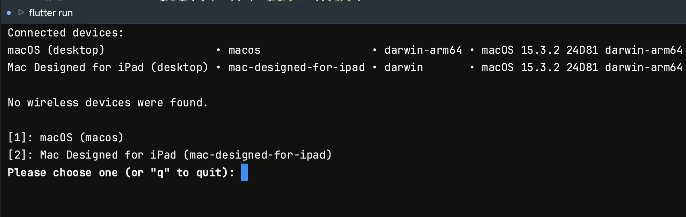
本人在此選擇 macOS，選擇後，程式就成功執行了
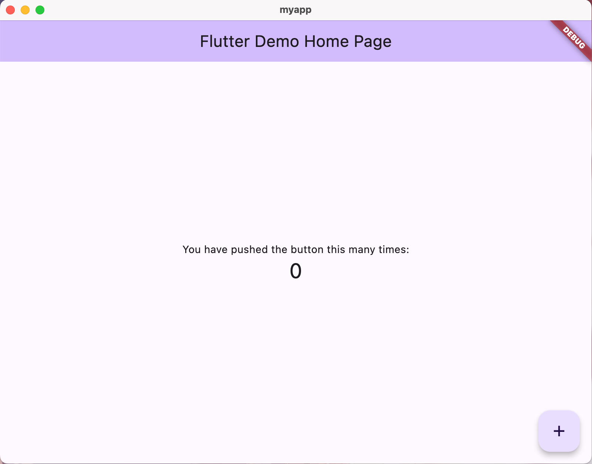

:::note
iOS 的話會需要進行修改 Bundle Identifier 等設定，詳細請參考[官方文件](https://docs.flutter.dev/get-started/install/macos/mobile-ios#configure-your-target-ios-device)
:::

並且在 Zed 中的下方執行視窗中，可以看到你可以執行哪些指令，包括 hot reload、重啟程式、終止等，還有 DevTools 的連結
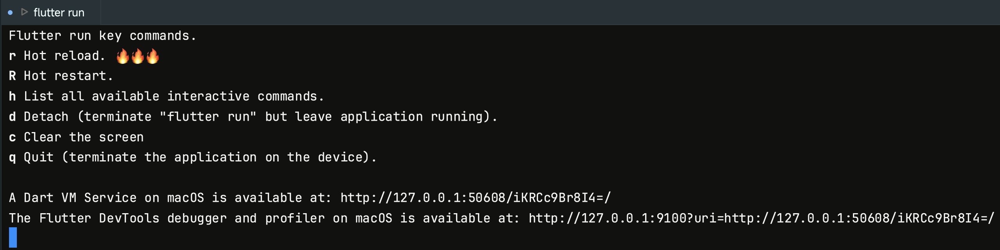
### Fluttermon - Auto Reload When File Saved
有熱載入其實蠻不錯，只是剛剛在執行時各位應該會發現當你修改完檔案並儲存後，必須切回視窗按一下 `r` 進行 hot reload，這其實有點不方便，所以接下來就來補足這缺憾吧！

首先，我們先輸入以下指令安裝 fluttermon：
```bash title="Terminal"
flutter pub global activate fluttermon
```
因為我們是第一次安裝並執行從 pub 下載的可執行模組，故我們需要開啟 `~/.zshrc`，並在裡面加入這行：
```
export PATH="$PATH":"$HOME/.pub-cache/bin"
```
修改並儲存後，在 Zed 中重開一個終端機，先確認可執行的裝置：
```bash title="Terminal"
flutter devices
```
確定好要執行的裝置後，即可輸入以下指令執行 App：
```bash title="Terminal"
fluttermon -d <device-name>
```
在 App 執行後，回到 `lib/main.dart` 檔案，按一下 `Cmd + S` 儲存，就可以看到專案自動 hot reload 了！
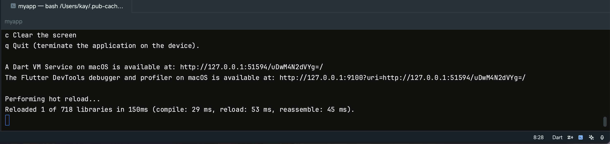

只是需要注意一下的是：如果要執行指令的話（例如：`R` 重啟程式），需要輸入對應指令字母後，按下 `Enter` 才會執行，不會像剛剛按下鍵盤上對應指令字母後就會馬上執行。

### Code With AI
AI 的部分的話有分三種：聊天、補全、直接改。

聊天的話在 Zed 中按 `Cmd + Shift + P` 開啟指令框，找到 `assistant: new chat` 即可開啟聊天框
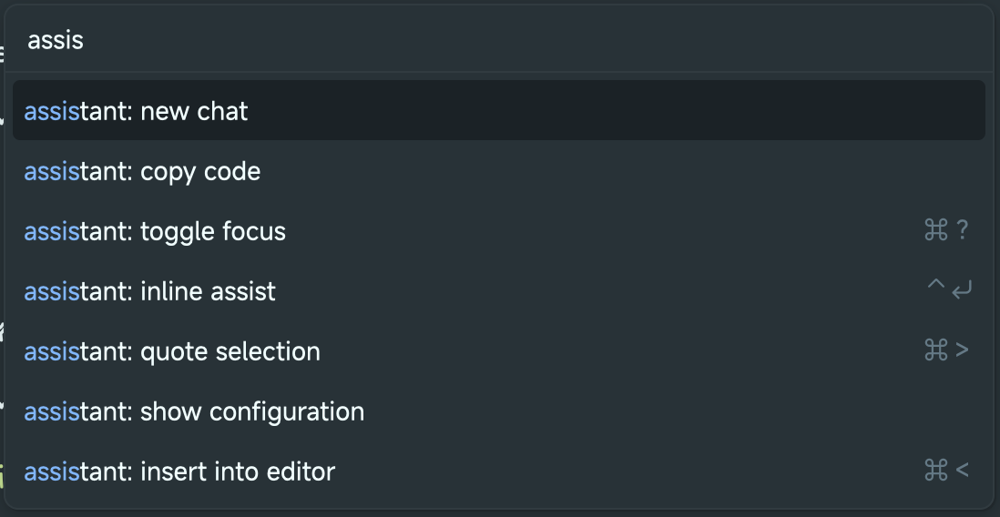
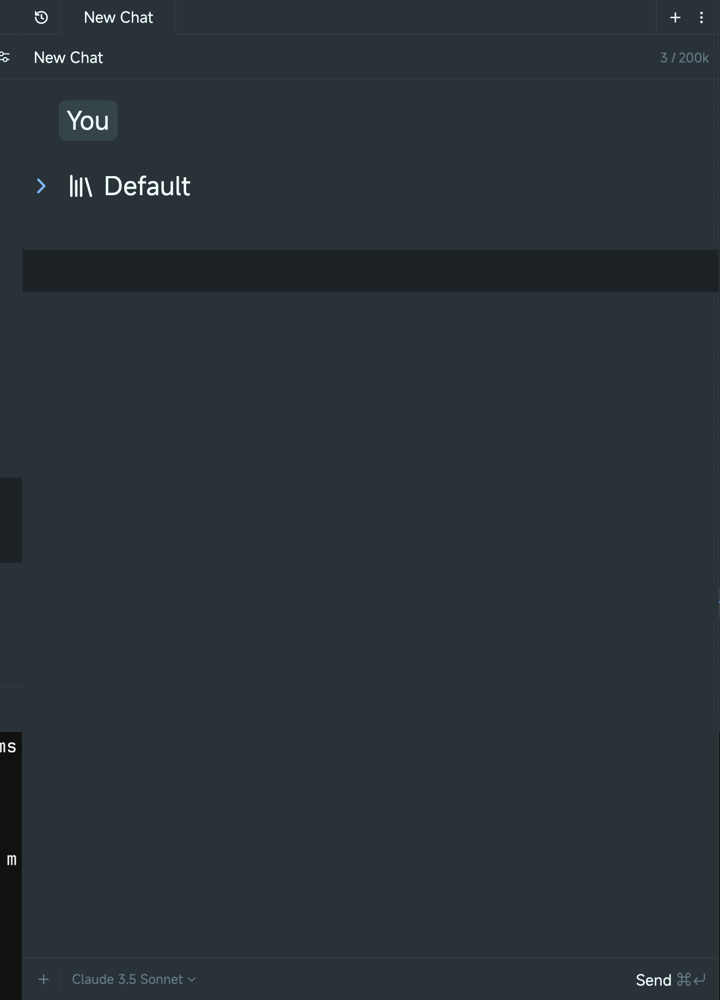

補全的話是你可以寫部分程式碼，或者寫程式碼註解，AI 會幫你生成程式碼，按 `Tab` 或 `Opt + Tab` 即可插入
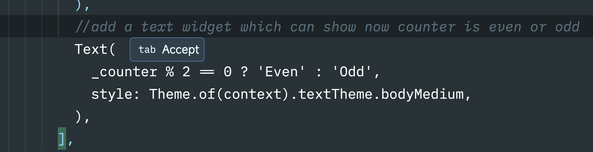

直接改的部分的話是可以請 AI 直接幫你修改程式碼，如果要使用的話，請選擇你想要修改區域，按下快速鍵 `Ctrl + Enter` 即可開啟 inline assistant，然後輸入你想請他改什麼，按下 `Enter` 後他就會幫你自動處理： 
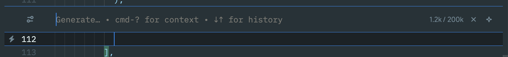
例如我選了一整個 `Scaffold`，然後請他在裡面的 counter 下方加入一個可以顯示現在計數器奇偶的一個 `Text`
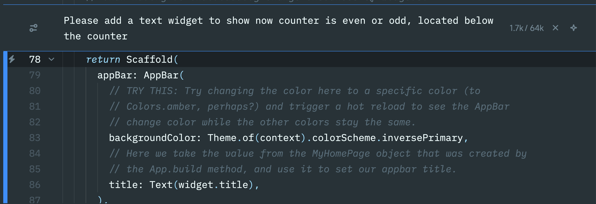
按下 `Enter` 鍵後，他會開始修改，修改過的地方他會用顏色進行標記：
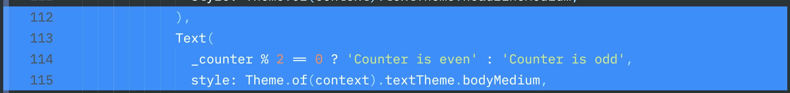
再按下 `Enter` 即可接受變更

## Wrapping Up
由此可見 Zed 其實是一款不錯的編輯器，並且使用下來個人也覺得該編輯器真的是非常的順暢，果真是用 Rust 寫的軟體，而且內建 AI 幫助模式除了聊天外，也有註解、寫程式碼的方式，而且直接改的方式也很好的保護了使用者的隱私，只讓使用者傳他想要傳的程式碼過去，而不是一傳就是傳整個檔案。雖然說對於 Flutter 部分，目前 Zed 沒有提供非常好的支援，但是畢竟現在好像還在測試，所以個人感覺這一部分其實是可以體諒的，相信在 Zed 未來對 Flutter 支援度更好之後，或許就會有更多人使用這款軟體開發 Flutter 了。
