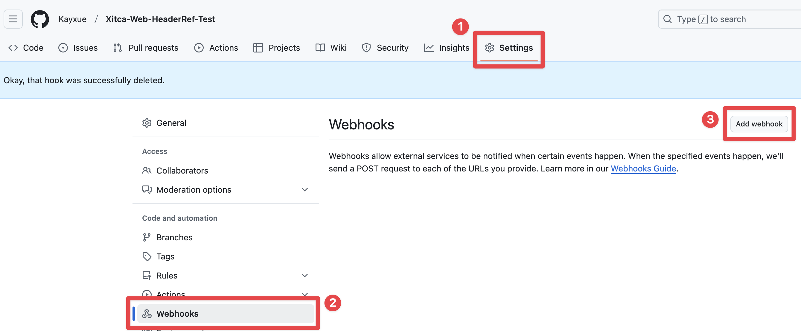
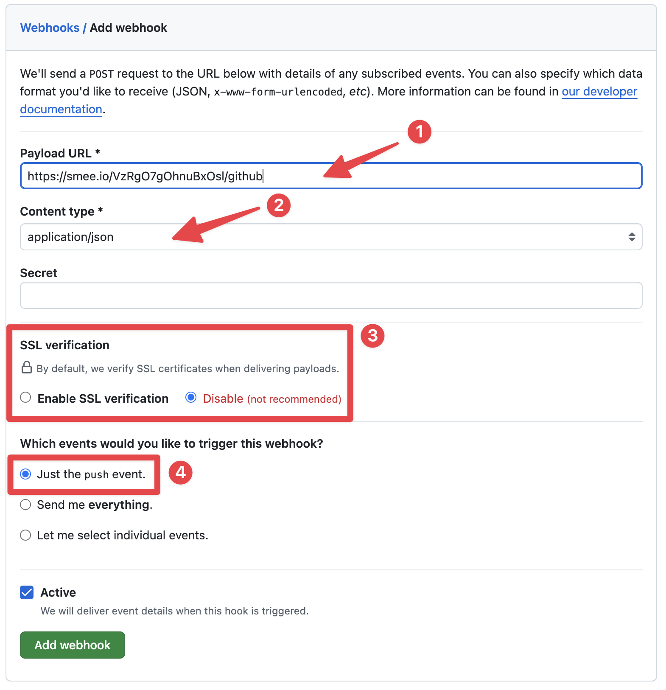
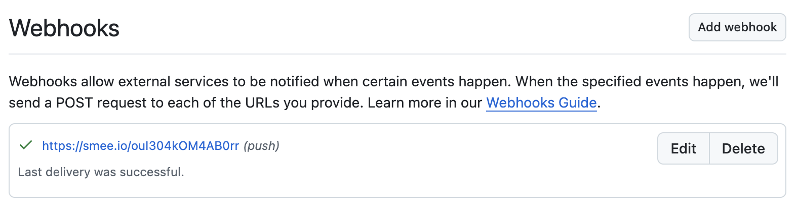
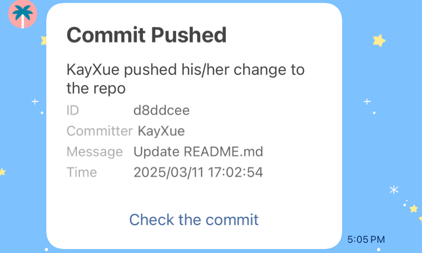

由於去年上學期的軟體工程課程，我們很多組員都還在用 Line 群組進行討論與溝通，因為組員互相不太認識，並且因為其他組員多為學長姐，所以當初寫了這個的初始版本，讓他們可以更方便追蹤專案程式碼撰寫進度，但後來有一天突然好奇如果使用 Rust 來寫會是怎樣一個體驗，所以後來自己決定將初始版本以 Rust 重新撰寫，並結合 GitHub CI 與 Rust 可編譯成 zero-dependency 執行檔的優勢，也順便做出了可直接部署的 Docker Image，除了讓自己未來需要使用時可以使用外，也可以讓需要的人一起使用。
::github{repo="Kayxue/GitHubPushNotificationLineBotRust"}
如果想要看初始版本的也歡迎，初始版本除了可以部署至 [Deno Deploy](https://deno.com/deploy) 外，也可以自行 fork 修改並部署至 Docker，想提 Pull Request 也非常歡迎喔！
::github{repo="Kayxue/GitHubPushNotificationLineBot"}
## Run Directly
1. 安裝 Rust 環境

https://www.rust-lang.org/zh-TW/tools/install

2. 複製此專案
```bash title="Terminal"
git clone https://github.com/Kayxue/GitHubPushNotificationLineBotRust.git
```
3. 切換至專案目錄並在 IDE 中開啟
```bash title="Terminal"
cd GitHubPushNotificationLineBotRust
zed .
```
4. 新增 `.env` 檔案，並填入以下內容，`<LINE_BOT_ACCESS_TOKEN>` 請替換成你自己的 Line Bot Access Token：
```plain title=".env"
ACCESSTOKEN=<LINE_BOT_ACCESS_TOKEN>
```
5. 執行
```bash title="Terminal"
cargo run
```
6. 查看終端機輸出，如果沒有任何錯誤，即可進行端口映射或者 Cloudflare Tunnel 等設定 （此 server 監聽之端口：`3000`）。
## Deploy to Docker
### Supported CPU Architecture
* `linux/amd64`
* `linux/arm64`
### Deploy
請遠端連線至要部署的裝置，並確保已經安裝好 Docker，輸入以下指令即可執行 Docker Image，`<container_name>` 請換成你想要的容器名稱，`<LINE_BOT_ACCESS_TOKEN>` 請替換成你自己的 Line Bot Access Token：
```bash title="Terminal"
docker run --name <container_name> -p 3000:3000 -e ACCESSTOKEN=<LINE_BOT_ACCESS_TOKEN> --restart=unless-stopped -d ghcr.io/kayxue/githubpushnotificationlinebotrust:latest
```
:::note
若是使用 Cloudflare Tunnel，則 `-p 3000:3000` 參數可省略，設定時直接填入容器 ip 和端口 `3000` 即可。若出現 host 端口已經被使用的狀況，請將冒號左側的 `3000` 替換成其他可用的端口。
:::
執行成功後會有一串容器 ID，請使用 `docker container list` 與 `docker container logs <container_id>` 確認容器正常執行後，即可進行端口映射或者 Cloudflare Tunnel 等設定。
## Add Webhook
設定完成後，即可前往需要發送 push notification 的 GitHub 專案頁面，點選 `Settings` -> `Webhooks` -> `Add webhook` 進行新增 Webhook：

在新增 Webhook 頁面，請依以下填入相關資訊：
1. **Payload URL**：`<your_server_url>/github`
2. **Content type**：`application/json`
3. **SSL verification**：請選 `Disable`
4. **Which event would you like to trigger this webhook?**：請選 `Just the push event`

確定填入資料皆正確後，即可按下下方 `Add webhook` 新增 Webhook，確認你剛剛新增的 Webhook 是否成功。

成功之後就可以開始修改你的專案，並且在每一次發生 push 時，都會收到 Line Bot 的通知。

## Contribution
此專案歡迎各位進行貢獻，使專案更加完整，貢獻專案時請遵守 [Code of Conduct](https://www.rust-lang.org/policies/code-of-conduct)。
