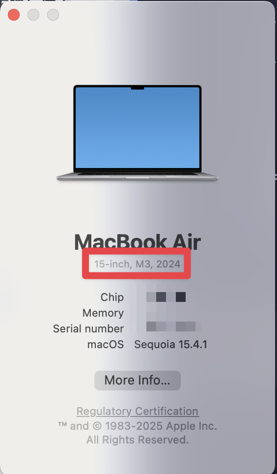
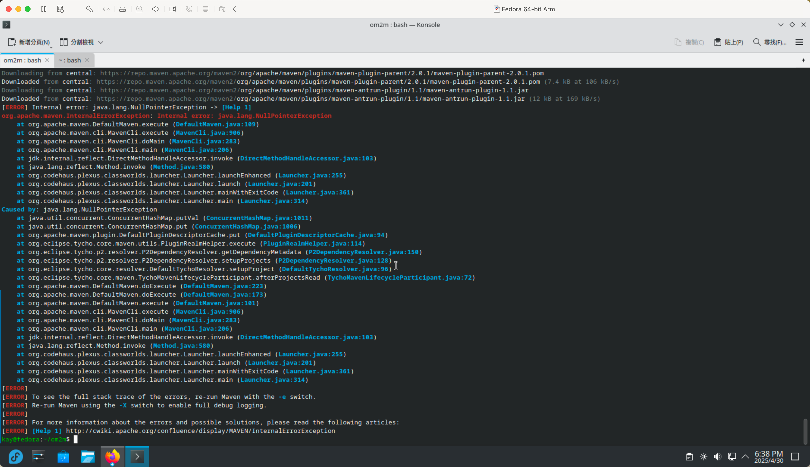
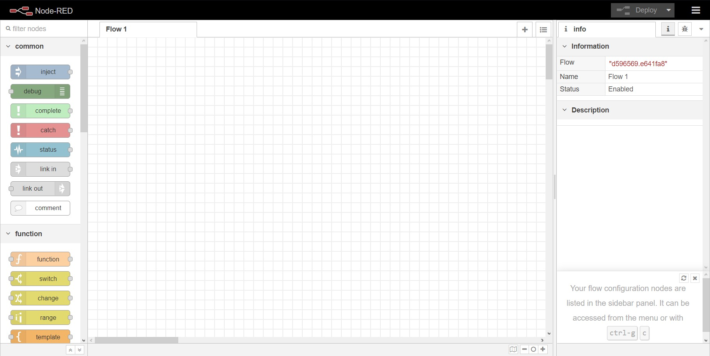
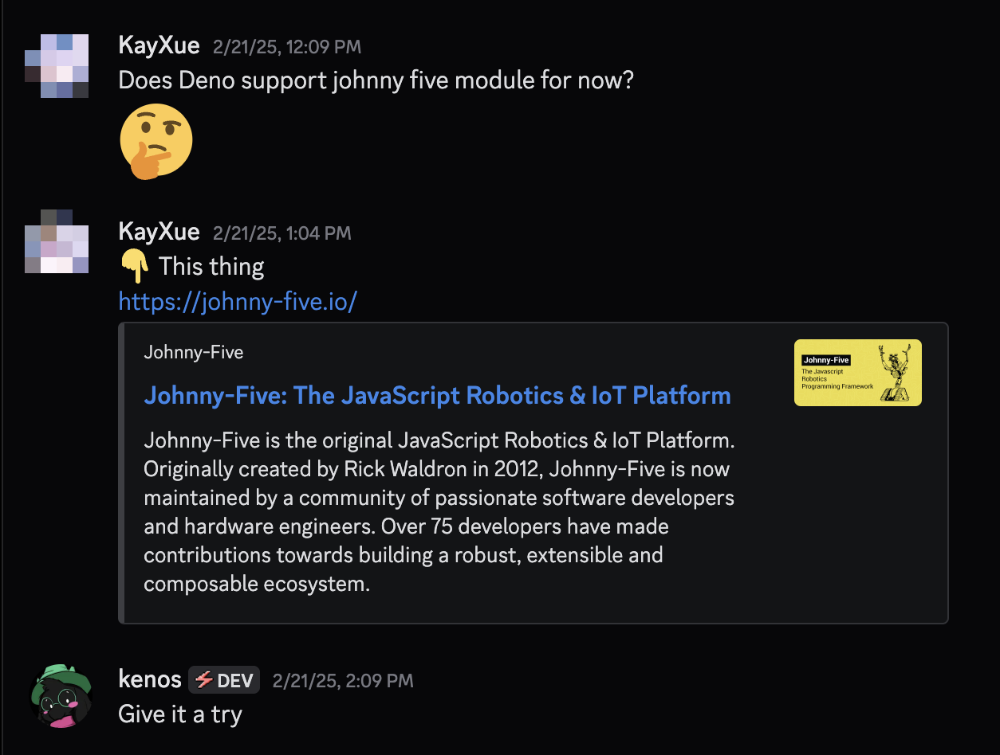
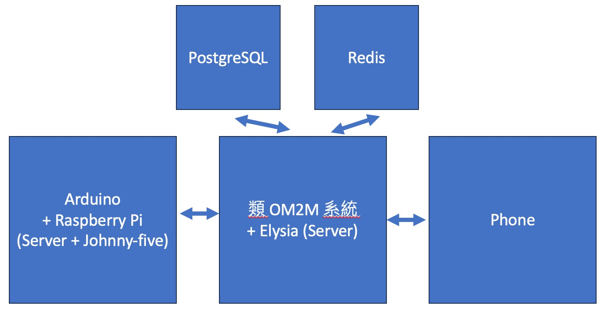

既然 Flutter 課程相關文章已經出現在我的部落格裡了，就順便把這次 IoT 期末專題也記錄一下吧！這次專題，或許又是突破了只用上課所學來完成專題的一次。
## What I Have Learned & My Confusion
從開學到現在，大概目前已經上了六次課，一次大概三小時。大概包括了目前整個 IoT 相關趨勢、M2M 的架構，還有 OM2M 與 Node-Red 相關的東西、使用 App Inventor 2 來讀取手機 GPS 資訊、使用 Arduino 接收感測器資料並送到 OM2M 上。

整體來說，關於實作部分，我是覺得關於觀念部分似乎沒有到很深入，並且也使我留下了不少疑問。比如在送給 OM2M 的資料中，為什麼會有這些東西？又或者說，由於在課程中，我們所燒錄進去的 Arduino 程式，因為我沒什麼碰過這個領域，所以我根本不知道那些程式碼在寫什麼，而且感覺關於 working with network 部分更是令人困惑，個人感覺擴展部分似乎不容易，這要怎麼辦呢？

## No OM2M?
這個章節標題能下得出來的，或許很多人看到都覺得很奇怪吧？OM2M 是全世界 IoT 的標準，那麼流行，我居然不想用？

其實我原本也是想要用的，但是看到這晶片，相信各位已經知道了

即使電腦是 Apple Silicon 晶片，不是也還是可以用嗎？OM2M 不是開源專案，而且用 Java 寫的，能跨平台跑不是嗎？嗯對，Java 能跨平台跑是真的，我曾經嘗試在別的平台上跑 Java project，但這專案......它已經年久失修，目前已經無法建置了。

而這次 IoT 期末專題是 3 人一組，因為我們這組除了我之外，也有一個也是同樣使用 Apple Silicon 晶片的 MacBook。在遇到這個問題後，我只好在報告製作主題前兩週，直接開了小組會議說能不能拋棄 OM2M，因為如果我們兩個都因晶片架構不同而無法使用 OM2M，則製作工作會變成全部壓在一個人身上，這樣非常的不公平，而 OM2M 核心也就 CRUD 系統罷了，真了不起我們可以自己簡單搞一個。最後他們全部都同意了，所以最後就決定寫了一個簡易的 CRUD 系統，雖然說可能跟 OM2M 還是有差異，但至少因為是我們自己寫的，我們知道如何使用它，所以在使用上面會相對比較容易，而且可以額外實作出一些 OM2M 沒有的功能，彌補 OM2M 的不足。

## No Node-Red?
不使用 Node-Red，那麼扯的嗎？

沒錯，因為個人是覺得直接透過撰寫型程式語言（例如 Rust、C++）去寫其實反而比較快，Node-Red 的話雖然說功能強大，只要拖個拼塊，就能做好一個 API 了，並且可以按個按鈕直接部署，但是缺點其實非常明顯。

第一個就是可自訂度低，有些東西模組基本上都是固定了，想換都不太容易；第二個就是「拖拼塊」你要動的是滑鼠，將拼塊從左側列表中找到你想要的，拖出來，然後再連起來，個人是感覺非常耗時。你如果自己寫的話，程式語言還可以自己選，框架自己挑，架構自己決定，這樣不是很舒服嗎？

https://nodered.org/

## No C Syntax-like Arduino Code?
相信各位都知道 Arduino 基本上都是用像 C++ 語言的語法在 Arduino IDE 中寫程式碼，然後燒錄到 Arduino 中執行吧？雖然一般用途 C++ 要寫可能問題不大，但是換到 Arduino 上，變成了 setup 與 loop 兩個 function，並且看了一下 Arduino 有給的模組，主要都是給硬體方面的，對於網路的部分其實比較難去做一個整合的動作。而在這一兩個月我也稍微看了 [IoT 沒那麼難！新手用 JavaScript 入門做自己的玩具！](https://www.books.com.tw/products/0010875992?srsltid=AfmBOorI9pLB9c0ELLlL2m7ehdEcppYfZTIHt1sPhcNpjGweKJfCDXnG)書的內容還有系列文章，了解了 [Johnny-five](https://johnny-five.io/) 這個模組，因為他提供了相關 API 讓使用者可以以 JavaScript/TypeScript 的程式碼風格與方式去操控 Arduino。而我也對 TypeScript 執行後端開發經驗是相對熟悉的，所以這次就決定採用 TypeScript 與 Johnny-five 去操作 Arduino。

當然這次沒意外執行環境會是 Bun，其對於 Johnny-five 的相容性就不得而知了，因為似乎沒有人這樣子玩過。關於 Johnny-five 對於其他 runtime environment 的支援度，其實我也曾經想過這方面的問題，所以我有在 Deno 的官方伺服器上問過這個問題，但我只有得到一個答案......TIAS (Try it and see)，可見似乎沒有人這樣嘗試過

那這次就來玩吧！人生中能有多少像這樣嘗試的歲月？而且基本上語法跟在 Node.js 上執行所寫的程式碼沒有什麼兩樣，切換環境那是一下子的事情。

## No App Inventor?
> Yeah, because I hate drag-and-drop blocks.

就如同前面文章所說，拖拼塊對我來說是一件非常煩的事情，而這學期我也剛好有修彼得潘的 Flutter 課程，感覺 Flutter 其實是蠻不錯的一個跨平台應用程式框架，雖然說是使用 Dart 程式語言，過去我沒有碰過，但是寫到了現在，我感覺使用 Flutter 寫應用程式就有點像你在寫 React，在 widget class 中 declare 你要用到的 state 和 function，然後下方在 build 方法中像 React 一樣構築一個 widget 並傳回。

https://flutter.dev/

## Architecture
當然那時有跟他們討論過，這個是目前暫定的架構，關於某些部分（例如圖中中下的 Elysia）目前也都還是未決定的狀態。

## Wrapping Up
希望這次專題能有非常大的收穫。雖然說基本上很多都用我用過的開發，但是就我也差不多才第二次吧？把不是上課教的工具直接套在期末專題上來說，還是會需要花額外時間去摸索與撰寫程式碼，但我相信這過程會是非常有趣的，並且我也非常期待接下來專題做出來的成果會如何。
