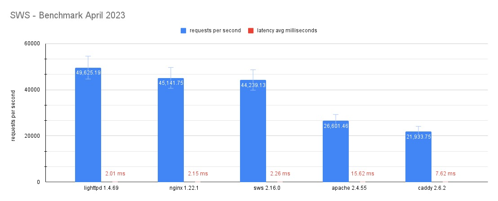

今天要來介紹的是一個 Web Server。因為幾個月前在架這個部落格的時候，雖然覺得 actix-web 配上 actix-files 是一個不錯的選擇，但是他終究是一個後端框架，比較適合的場合是你真的需要寫一個後端的時候，如果真的是要架設一個純檔案伺服器或者完全靜態的網頁伺服器，那或許真的沒有那個必要。

所以當時我開始尋找有什麼 Rust 寫出來的網頁伺服器，沒想到就找到了這個，而這幾個月使用下來果真覺得蠻好用的，除了打包起來很小、使用起來非常容易，並且在執行時佔用資源極低、效能優異，還保留了非常多設定，可以將 server 依據自己的需求來調整。

https://static-web-server.net/

## Features
在這裡只會列舉一些，更多特色請自行前往官網查看。
- 使用專注於安全、效能與並發的 Rust 程式語言撰寫
- 由 [Hyper](https://hyper.rs/) 和 [Tokio](https://tokio.rs/) 等 crates 提供了非常快的 files-serving 與非同步效能
- 單個未壓縮執行檔僅 4MB，並且無需任何依賴，其非常適合在任何 Linux 發行版和 Docker 上執行。
- 對於 text-based web files 的 GZip, Deflate, Brotli or Zstandard (zstd) 壓縮功能（可選）
- HTTP/2 和 TLS 支援
- 可選  Cache-Control headers
- 支援包含 preflight requests 的 CORS
- 自定義 URL rewrites、透過 glob patterns 取代重新導向
- 支援 Docker、Docker Compose，image 部分總共有 Scratch、Alpine Linux 和 Debian 三種可以使用

## Benchmarks
圖片來自官網，雖然是兩年前的了，但還是可以看到，其效能跟 [nginx](https://nginx.org/) 可以說是不相上下。


## Installation and Usage
### Directly Install
您可以直接前往官網下載壓縮檔：

https://static-web-server.net/download-and-install/

Linux 使用者可以透過 binary installer 直接安裝：
```bash
curl --proto '=https' --tlsv1.2 -sSfL https://get.static-web-server.net | sh
```

MacOS 使用者可以透過 Homebrew 安裝：
```zsh
brew tap static-web-server/static-web-server

# Just the binary
brew install static-web-server-bin

# Or build from source
brew install static-web-server
```

Windows 使用者可以透過 scoop 安裝：
```cmd
scoop install static-web-server
```
安裝完成之後，輸入以下指令即可啟動：
```bash
static-web-server
```
### Docker Run
:::tip
你可以在輸入值令時直接以像 `-v $HOME/my-public-dir:/public` 這樣的參數提來直接覆蓋預設的 root directory，也可以在此直接透過 cli 參數進行 Static Web Server 相關設定，設定部分稍後會再解釋。
:::
輸入以下指令即可：
```bash
docker run --rm -it -p 8787:80 joseluisq/static-web-server:<tag> -g info
# Or
docker run --rm -it -p 8787:80 ghcr.io/static-web-server/static-web-server:<tag> -g info
```
`<tag>` 部分會依據你想使用的 image 而不同，對照如下：
* Scratch: `latest`、`<version>`
* Alpine Linux：`<version>-alpine`
* Debian：`<version>-debian`

`<version>` 不知道要填多少的話可以上 [Docker Hub](https://hub.docker.com/r/joseluisq/static-web-server/tags) 查，懶得查的話請直接填 `2`
### Dockerfile
請在你的靜態網站專案下建立 Dockerfile，內容如下，若靜態網站有需要透過建置進行生成（例如 Astro 框架），請在插入以下內容之前寫上建置專案相關指令，並在 `COPY` 指令時記得從前一個 stage 複製靜態網站相關檔案，設定檔如果沒有可以不用複製。`<tag>` 部分如上方清單所示
```dockerfile title="Dockerfile" icon="docker"
FROM joseluisq/static-web-server:<tag>

COPY ./public ./public
COPY ./config.toml ./config.toml

EXPOSE 80
```

### Docker Compose
請在你的靜態網站專案下建立一個設定檔，`<tag>` 的部分如前面列表所示（`environment` 部分所做的設定等一下會再說明）
```yml title="docker-compose.yml"
version: "3.3"

services:
  website:
    image: joseluisq/static-web-server:<tag>
    container_name: "website"
    ports:
      - 80:80
    restart: unless-stopped
    environment:
      # Note: those envs are customizable but also optional
      - SERVER_ROOT=/var/public
      - SERVER_CONFIG_FILE=/etc/config.toml
    volumes:
      - ./public:/var/public
      - ./config.toml:/etc/config.toml
```
然後在專案資料夾下輸入以下指令即可啟動：
```bash
docker-compose up -d
```

## Configuration
### Environment Variables
更改 Static Web Server 相關設定最通用的一種方式就是修改環境變數，這方法不管是 Linux、MacOS 或者 Windows 都可以使用。環境變數基本上跟 command-line arguments 等效，但如果環境變數也有設定，會優先採用 command-line arguments。

裡面個人最常會設定的環境變數如下：
* `SERVER_HOST`、`SERVER_PORT`：host 與端口，預設為 `[::]` 與 `80`
* `SERVER_ROOT`：靜態網站檔案的根目錄，絕對或相對路徑皆可
* `SERVER_DIRECTORY_LISTING`：在請求結尾為 `/` 時啟用 directory listing
* `SERVER_CORS_ALLOW_ORIGINS`：CORS 的允許 origin 列表，預設為空，若要允許任何 host，請修改成 `*`

其餘更多環境變數請參考官網

https://static-web-server.net/configuration/environment-variables/

### TOML
讀取 TOML 設定預設是關閉的，若要開啟，可以透過 `-w, --config-file` 參數或者透過設定 `SERVER_CONFIG_FILE` 環境變數來提供路徑。

以下摘自官網，裡面有所有設定與其預設值：
```toml title="config.toml"
[general]

#### Address & Root dir
host = "::"
port = 80
root = "./public"

#### Logging
log-level = "error"

#### Cache Control headers
cache-control-headers = true

#### Auto Compression
compression = true
compression-level = "default"

#### Error pages
# Note: If a relative path is used then it will be resolved under the root directory.
page404 = "./404.html"
page50x = "./50x.html"

#### HTTP/2 + TLS
http2 = false
http2-tls-cert = ""
http2-tls-key = ""
https-redirect = false
https-redirect-host = "localhost"
https-redirect-from-port = 80
https-redirect-from-hosts = "localhost"

#### CORS & Security headers
# security-headers = true
# cors-allow-origins = ""

#### Directory listing
directory-listing = false

#### Directory listing sorting code
directory-listing-order = 1

#### Directory listing content format
directory-listing-format = "html"

#### Basic Authentication
# basic-auth = ""

#### File descriptor binding
# fd = ""

#### Worker threads
threads-multiplier = 1

#### Grace period after a graceful shutdown
grace-period = 0

#### Page fallback for 404s
# page-fallback = ""

#### Log request Remote Address if available
log-remote-address = false

#### Log real IP from X-Forwarded-For header if available
log-forwarded-for = false

#### IPs to accept the X-Forwarded-For header from. Empty means all
trusted-proxies = []

#### Redirect to trailing slash in the requested directory uri
redirect-trailing-slash = true

#### Check for existing pre-compressed files
compression-static = true

#### Health-check endpoint (GET or HEAD `/health`)
health = false

#### List of index files
# index-files = "index.html, index.htm"
#### Maintenance Mode

maintenance-mode = false
# maintenance-mode-status = 503
# maintenance-mode-file = "./maintenance.html"

### Windows Only

#### Run the web server as a Windows Service
# windows-service = false


[advanced]

#### HTTP Headers customization (examples only)

#### a. Oneline version
# [[advanced.headers]]
# source = "**/*.{js,css}"
# headers = { Access-Control-Allow-Origin = "*" }

#### b. Multiline version
# [[advanced.headers]]
# source = "/index.html"
# [advanced.headers.headers]
# Cache-Control = "public, max-age=36000"
# Content-Security-Policy = "frame-ancestors 'self'"
# Strict-Transport-Security = "max-age=63072000; includeSubDomains; preload"

#### c. Multiline version with explicit key (dotted)
# [[advanced.headers]]
# source = "**/*.{jpg,jpeg,png,ico,gif}"
# headers.Strict-Transport-Security = "max-age=63072000; includeSubDomains; preload"


### URL Redirects (examples only)

# [[advanced.redirects]]
# source = "**/*.{jpg,jpeg}"
# destination = "/images/generic1.png"
# kind = 301

# [[advanced.redirects]]
# source = "/index.html"
# destination = "https://static-web-server.net"
# kind = 302

### URL Rewrites (examples only)

# [[advanced.rewrites]]
# source = "**/*.{png,ico,gif}"
# destination = "/assets/favicon.ico"
## Optional redirection
# redirect = 301

# [[advanced.rewrites]]
# source = "**/*.{jpg,jpeg}"
# destination = "/images/sws.png"

### Virtual Hosting

# [[advanced.virtual-hosts]]
## But if the "Host" header matches this...
# host = "sales.example.com"
## ...then files will be served from here instead
# root = "/var/sales/html"

# [[advanced.virtual-hosts]]
# host = "blog.example.com"
# root = "/var/blog/html"
```
### Command-Line Arguments
輸入以下指令即可查看
```bash
static-web-server -h
```
內容如下，基本上跟環境變數是等效的，但如果環境變數也有設定，會優先採用 command-line arguments。
```txt frame="terminal"
A cross-platform, high-performance and asynchronous web server for static files-serving.

Usage: static-web-server [OPTIONS] [COMMAND]

Commands:
  generate  Generate man pages and shell completions
  help      Print this message or the help of the given subcommand(s)

Options:
  -a, --host <HOST>
          Host address (E.g 127.0.0.1 or ::1) [env: SERVER_HOST=] [default: ::]
  -p, --port <PORT>
          Host port [env: SERVER_PORT=] [default: 80]
  -f, --fd <FD>
          Instead of binding to a TCP port, accept incoming connections to an already-bound TCP socket listener on the specified file descriptor number (usually zero). Requires that the parent process (e.g. inetd, launchd, or systemd) binds an address and port on behalf of static-web-server, before arranging for the resulting file descriptor to be inherited by static-web-server. Cannot be used in conjunction with the port and host arguments. The included systemd unit file utilises this feature to increase security by allowing the static-web-server to be sandboxed more completely [env: SERVER_LISTEN_FD=]
  -n, --threads-multiplier <THREADS_MULTIPLIER>
          Number of worker threads multiplier that'll be multiplied by the number of system CPUs using the formula: `worker threads = number of CPUs * n` where `n` is the value that changes here. When multiplier value is 0 or 1 then one thread per core is used. Number of worker threads result should be a number between 1 and 32,768 though it is advised to keep this value on the smaller side [env: SERVER_THREADS_MULTIPLIER=] [default: 1]
  -b, --max-blocking-threads <MAX_BLOCKING_THREADS>
          Maximum number of blocking threads [env: SERVER_MAX_BLOCKING_THREADS=] [default: 512]
  -d, --root <ROOT>
          Root directory path of static files [env: SERVER_ROOT=] [default: ./public]
      --page50x <PAGE50X>
          HTML file path for 50x errors. If the path is not specified or simply doesn't exist then the server will use a generic HTML error message. If a relative path is used then it will be resolved under the root directory [env: SERVER_ERROR_PAGE_50X=] [default: ./50x.html]
      --page404 <PAGE404>
          HTML file path for 404 errors. If the path is not specified or simply doesn't exist then the server will use a generic HTML error message. If a relative path is used then it will be resolved under the root directory [env: SERVER_ERROR_PAGE_404=] [default: ./404.html]
      --page-fallback <PAGE_FALLBACK>
          A HTML file path (not relative to the root) used for GET requests when the requested path doesn't exist. The fallback page is served with a 200 status code, useful when using client routers. If the path doesn't exist then the feature is not activated [env: SERVER_FALLBACK_PAGE=] [default: ]
  -g, --log-level <LOG_LEVEL>
          Specify a logging level in lower case. Values: error, warn, info, debug or trace [env: SERVER_LOG_LEVEL=] [default: error]
  -c, --cors-allow-origins <CORS_ALLOW_ORIGINS>
          Specify an optional CORS list of allowed origin hosts separated by commas. Host ports or protocols aren't being checked. Use an asterisk (*) to allow any host [env: SERVER_CORS_ALLOW_ORIGINS=] [default: ]
  -j, --cors-allow-headers <CORS_ALLOW_HEADERS>
          Specify an optional CORS list of allowed headers separated by commas. Default "origin, content-type". It requires `--cors-allow-origins` to be used along with [env: SERVER_CORS_ALLOW_HEADERS=] [default: "origin, content-type, authorization"]
      --cors-expose-headers <CORS_EXPOSE_HEADERS>
          Specify an optional CORS list of exposed headers separated by commas. Default "origin, content-type". It requires `--cors-expose-origins` to be used along with [env: SERVER_CORS_EXPOSE_HEADERS=] [default: "origin, content-type"]
  -t, --http2 [<HTTP2>]
          Enable HTTP/2 with TLS support [env: SERVER_HTTP2_TLS=] [default: false] [possible values: true, false]
      --http2-tls-cert <HTTP2_TLS_CERT>
          Specify the file path to read the certificate [env: SERVER_HTTP2_TLS_CERT=]
      --http2-tls-key <HTTP2_TLS_KEY>
          Specify the file path to read the private key [env: SERVER_HTTP2_TLS_KEY=]
      --https-redirect [<HTTPS_REDIRECT>]
          Redirect all requests with scheme "http" to "https" for the current server instance. It depends on "http2" to be enabled [env: SERVER_HTTPS_REDIRECT=] [default: false] [possible values: true, false]
      --https-redirect-host <HTTPS_REDIRECT_HOST>
          Canonical host name or IP of the HTTPS (HTTPS/2) server. It depends on "https_redirect" to be enabled [env: SERVER_HTTPS_REDIRECT_HOST=] [default: localhost]
      --https-redirect-from-port <HTTPS_REDIRECT_FROM_PORT>
          HTTP host port where the redirect server will listen for requests to redirect them to HTTPS. It depends on "https_redirect" to be enabled [env: SERVER_HTTPS_REDIRECT_FROM_PORT=] [default: 80]
      --https-redirect-from-hosts <HTTPS_REDIRECT_FROM_HOSTS>
          List of host names or IPs allowed to redirect from. HTTP requests must contain the HTTP 'Host' header and match against this list. It depends on "https_redirect" to be enabled [env: SERVER_HTTPS_REDIRECT_FROM_HOSTS=] [default: localhost]
      --index-files <INDEX_FILES>
          List of files that will be used as an index for requests ending with the slash character (‘/’). Files are checked in the specified order [env: SERVER_INDEX_FILES=] [default: index.html]
  -x, --compression [<COMPRESSION>]
          Gzip, Deflate, Brotli or Zstd compression on demand determined by the Accept-Encoding header and applied to text-based web file types only [env: SERVER_COMPRESSION=] [default: true] [possible values: true, false]
      --compression-level <COMPRESSION_LEVEL>
          Compression level to apply for Gzip, Deflate, Brotli or Zstd compression [env: SERVER_COMPRESSION_LEVEL=] [default: default] [possible values: fastest, best, default]
      --compression-static [<COMPRESSION_STATIC>]
          Look up the pre-compressed file variant (`.gz`, `.br` or `.zst`) on disk of a requested file and serves it directly if available. The compression type is determined by the `Accept-Encoding` header [env: SERVER_COMPRESSION_STATIC=] [default: false] [possible values: true, false]
  -z, --directory-listing [<DIRECTORY_LISTING>]
          Enable directory listing for all requests ending with the slash character (‘/’) [env: SERVER_DIRECTORY_LISTING=] [default: false] [possible values: true, false]
      --directory-listing-order <DIRECTORY_LISTING_ORDER>
          Specify a default code number to order directory listing entries per `Name`, `Last modified` or `Size` attributes (columns). Code numbers supported: 0 (Name asc), 1 (Name desc), 2 (Last modified asc), 3 (Last modified desc), 4 (Size asc), 5 (Size desc). Default 6 (unordered) [env: SERVER_DIRECTORY_LISTING_ORDER=] [default: 6]
      --directory-listing-format <DIRECTORY_LISTING_FORMAT>
          Specify a content format for directory listing entries. Formats supported: "html" or "json". Default "html" [env: SERVER_DIRECTORY_LISTING_FORMAT=] [default: html] [possible values: html, json]
      --security-headers [<SECURITY_HEADERS>]
          Enable security headers by default when HTTP/2 feature is activated. Headers included: "Strict-Transport-Security: max-age=63072000; includeSubDomains; preload" (2 years max-age), "X-Frame-Options: DENY" and "Content-Security-Policy: frame-ancestors 'self'" [env: SERVER_SECURITY_HEADERS=] [default: false] [possible values: true, false]
  -e, --cache-control-headers [<CACHE_CONTROL_HEADERS>]
          Enable cache control headers for incoming requests based on a set of file types. The file type list can be found on `src/control_headers.rs` file [env: SERVER_CACHE_CONTROL_HEADERS=] [default: true] [possible values: true, false]
      --basic-auth <BASIC_AUTH>
          It provides The "Basic" HTTP Authentication scheme using credentials as "user-id:password" pairs. Password must be encoded using the "BCrypt" password-hashing function [env: SERVER_BASIC_AUTH=] [default: ]
  -q, --grace-period <GRACE_PERIOD>
          Defines a grace period in seconds after a `SIGTERM` signal is caught which will delay the server before to shut it down gracefully. The maximum value is 255 seconds [env: SERVER_GRACE_PERIOD=] [default: 0]
  -w, --config-file <CONFIG_FILE>
          Server TOML configuration file path [env: SERVER_CONFIG_FILE=] [default: ./config.toml]
      --log-remote-address [<LOG_REMOTE_ADDRESS>]
          Log incoming requests information along with its remote address if available using the `info` log level [env: SERVER_LOG_REMOTE_ADDRESS=] [default: false] [possible values: true, false]
      --log-x-real-ip [<LOG_X_REAL_IP>]
          Log the X-Real-IP header for remote IP information [env: SERVER_LOG_X_REAL_IP=] [default: false] [possible values: true, false]
      --log-forwarded-for [<LOG_FORWARDED_FOR>]
          Log the X-Forwarded-For header for remote IP information [env: SERVER_LOG_FORWARDED_FOR=] [default: false] [possible values: true, false]
      --trusted-proxies <TRUSTED_PROXIES>
          List of IPs to use X-Forwarded-For from. The default is to trust all [env: SERVER_TRUSTED_PROXIES=]
      --redirect-trailing-slash [<REDIRECT_TRAILING_SLASH>]
          Check for a trailing slash in the requested directory URI and redirect permanently (308) to the same path with a trailing slash suffix if it is missing [env: SERVER_REDIRECT_TRAILING_SLASH=] [default: true] [possible values: true, false]
      --ignore-hidden-files [<IGNORE_HIDDEN_FILES>]
          Ignore hidden files/directories (dotfiles), preventing them to be served and being included in auto HTML index pages (directory listing) [env: SERVER_IGNORE_HIDDEN_FILES=] [default: false] [possible values: true, false]
      --disable-symlinks [<DISABLE_SYMLINKS>]
          Prevent following files or directories if any path name component is a symbolic link [env: SERVER_DISABLE_SYMLINKS=] [default: false] [possible values: true, false]
      --health [<HEALTH>]
          Add a /health endpoint that doesn't generate any log entry and returns a 200 status code. This is especially useful with Kubernetes liveness and readiness probes [env: SERVER_HEALTH=] [default: false] [possible values: true, false]
      --maintenance-mode [<MAINTENANCE_MODE>]
          Enable the server's maintenance mode functionality [env: SERVER_MAINTENANCE_MODE=] [default: false] [possible values: true, false]
      --maintenance-mode-status <MAINTENANCE_MODE_STATUS>
          Provide a custom HTTP status code when entering into maintenance mode. Default 503 [env: SERVER_MAINTENANCE_MODE_STATUS=] [default: 503]
      --maintenance-mode-file <MAINTENANCE_MODE_FILE>
          Provide a custom maintenance mode HTML file. If not provided then a generic message will be displayed [env: SERVER_MAINTENANCE_MODE_FILE=] [default: ]
  -V, --version
          Print version info and exit
  -h, --help
          Print help (see more with '--help')
```

而 Windows 的話會有以下指令和選項：
```txt frame="terminal"
-s, --windows-service <windows-service>
           Run the web server as a Windows Service [env: SERVER_WINDOWS_SERVICE=]  [default: false]

SUBCOMMANDS:
   help         Prints this message or the help of the given subcommand(s)
   install      Install a Windows Service for the web server
   uninstall    Uninstall the current Windows Service
```
## Dockerfile Examples
### File Server
由於 Scratch image 是沒有辦法透過 `CMD` 下終端機指令的，而它預設 `./public` 資料夾下已經有 `index.html` 檔案，所以為了方便起見，我們換資料夾存放檔案，並且透過 `SERVER_ROOT` 變數將根目錄路徑切換過去，這樣即可保證顯示資料夾目錄。
```dockerfile title="Dockerfile" icon="docker"
FROM joseluisq/static-web-server:2
WORKDIR /
COPY ./assets ./assets
ENV SERVER_PORT=3000
ENV SERVER_CORS_ALLOW_ORIGINS="*"
ENV SERVER_DIRECTORY_LISTING=true
ENV SERVER_ROOT="./assets"

EXPOSE 3000
```
### Astro Static Website
這個其實就是我目前架本部落格在用的 Dockerfile 檔案。由於需要先生成靜態網頁，所以需要採用 multi-stage build 的方式，先安裝相關模組、生成靜態網頁，之後再透過 Static Web Server 的 image 建立新的 stage，並從前一個 stage 將生成的靜態網站檔案複製進預設的根目錄資料夾進行覆蓋。
```dockerfile title="Dockerfile" icon="docker"
FROM oven/bun:alpine AS builder

WORKDIR /app
COPY . .

RUN bun install
RUN bun run build

FROM joseluisq/static-web-server:latest

WORKDIR /

COPY --from=builder /app/dist/ ./public/
```
:::warning
如果您的專案被限制使用 `pnpm`（例如 fuwari），請使用 node image 進行建置，詳細請參考 pnpm 官方文件的 [Working with Docker](https://pnpm.io/docker)
:::
:::note
如果你想要你的 fuwari 專案「脫 pnpm 入 bun」可參考[此文章](/posts/actixstaticsereveastro/)的「Preparation」一節
:::
