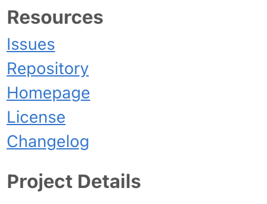
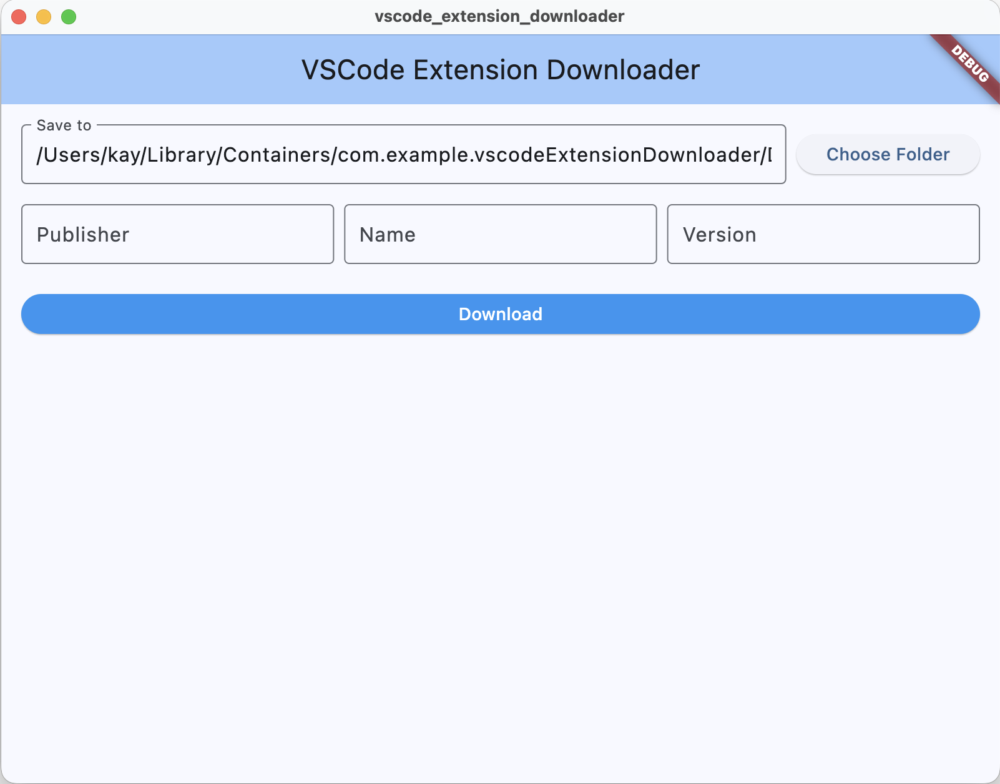
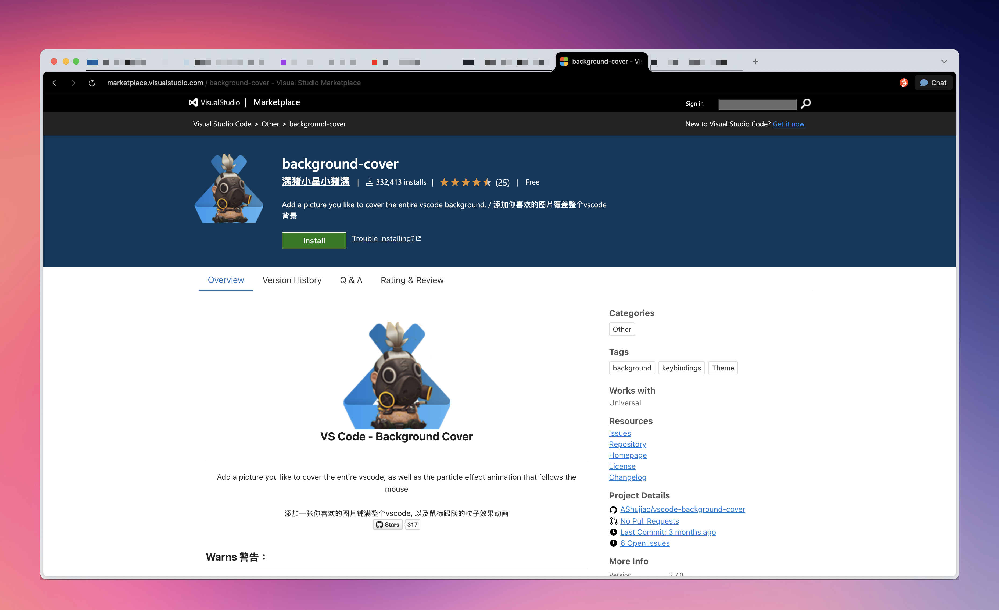
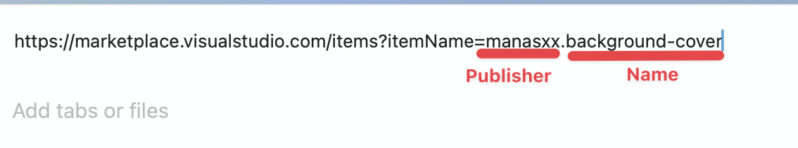
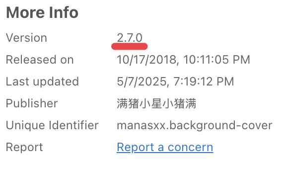
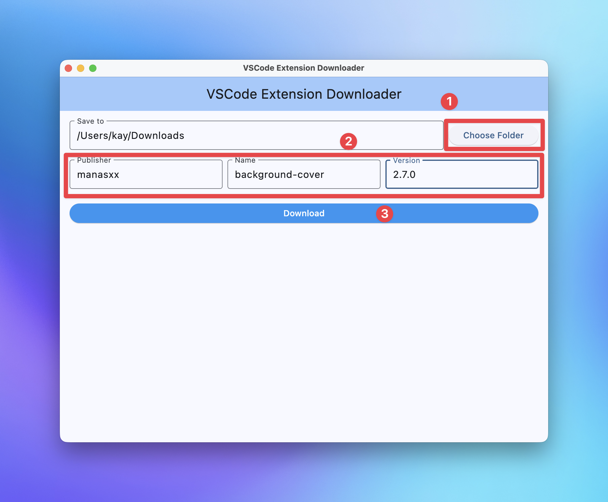
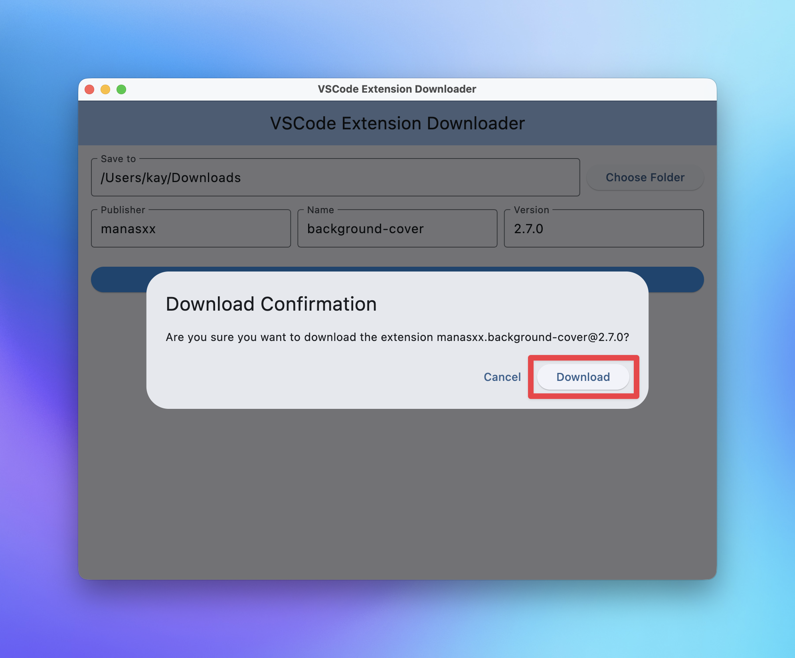
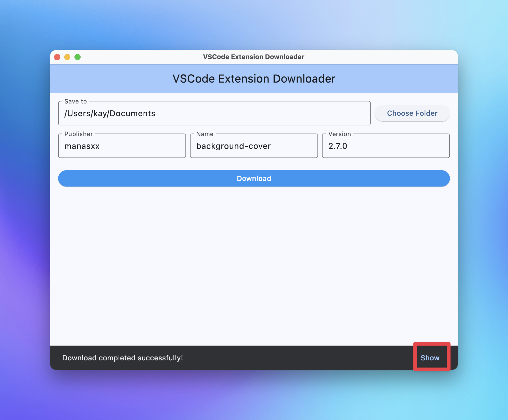
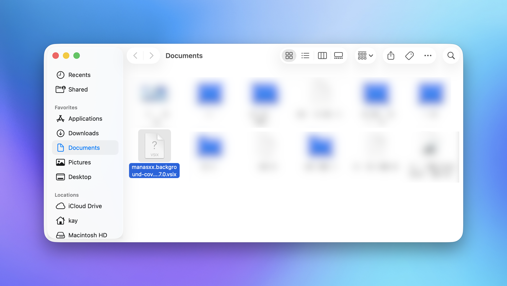

現在我猜不少人都因為 AI 而使用 Cursor 或者擁有 AI 功能的編輯器吧？而使用非微軟官方的 Visual Studio Code 版本，雖然可能可以用到非常猛的 AI 功能，又或者說可以避免被微軟官方收集使用資料，但所要付出的代價也是顯而易見－extension 來源並不是 Visual Studio Marketplace，所以就會造成在搜尋某些擴充時，直接在軟體中的擴充搜尋找會找不到的狀況。

這個問題基本上在網頁版的 Visual Studio Marketplace 都可以得到解決，但在這幾個月本人在上面尋找擴充時發現下載按鈕不見了......

這可就頭大了，微軟這麼做的原因，是希望使用者回流嗎？又或者為了留住目前的使用者？但這些都不是重點，最重點的問題是......那這樣要怎麼辦呢？

還好後來我在網路上有找到 StackOverflow 上有人有留下下載 extension 的連結格式，不然未來如果要直接從 Visual Studio Marketplace 下載 extension 可就費功夫惹～～而本人在此也已經做成了軟體，在此歡迎各位使用外，也歡迎各位進行貢獻讓軟體功能更加完整喔！

## Screenshot

## Usage
1. 在 Visual Studio Marketplace 上找到你想下載的 extension

2. 記下 publisher、name 和 version

3. 打開軟體，選取儲存位置，並在對應欄位中填入對應資訊，完成後按下方按鈕。

:::warning
您對於所選的儲存位置必須有讀寫權限！
:::

4. 確定要下載的 extension 資訊無誤後，按下 `Download` 開始下載

5. 下載完之後，可以點選 `Show` 按鈕，在資料夾內顯示下載好的檔案

6. 此時即可將下載好的擴充安裝至 VSCode 系列編輯器

## Wrapping Up
這次算是 Flutter 課程上完的第一作，其實在上 Flutter 課程之前，我原本是想說使用 Tauri 開發的，但因為碰到 Tauri 的 download 模組出現問題，最後只好改用 Flutter 進行開發，原本以為會需要很久的時間才能做出來，沒想到 pub.dev 上模組蠻多的，想要做到什麼事情，基本上找一下模組通常都有，並且非常容易使用。在此非常感謝 pub.dev 上模組的多樣性，讓此軟體基礎功能可以快速完成。這軟體在製作完後，個人感覺自己下載擴充的速度更快了，不用在那邊自己還要找連結格式，自己將東西慢慢填進去，才可以下載，真的是方便了不少。

## GitHub Repository
